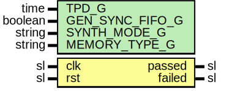

# Entity: FwftCntTbSubModule

- **File**: FwftCntTbSubModule.vhd
## Diagram

## Description

-----------------------------------------------------------------------------
 Company    : SLAC National Accelerator Laboratory
-----------------------------------------------------------------------------
 Description: Simulation sub module for testing the FwftCntTb
-----------------------------------------------------------------------------
 This file is part of 'SLAC Firmware Standard Library'.
 It is subject to the license terms in the LICENSE.txt file found in the
 top-level directory of this distribution and at:
    https://confluence.slac.stanford.edu/display/ppareg/LICENSE.html.
 No part of 'SLAC Firmware Standard Library', including this file,
 may be copied, modified, propagated, or distributed except according to
 the terms contained in the LICENSE.txt file.
-----------------------------------------------------------------------------
## Generics

| Generic name    | Type    | Value      | Description |
| --------------- | ------- | ---------- | ----------- |
| TPD_G           | time    | 1 ns       |             |
| GEN_SYNC_FIFO_G | boolean | false      |             |
| SYNTH_MODE_G    | string  | "inferred" |             |
| MEMORY_TYPE_G   | string  | "block"    |             |
## Ports

| Port name | Direction | Type | Description |
| --------- | --------- | ---- | ----------- |
| clk       | in        | sl   |             |
| rst       | in        | sl   |             |
| passed    | out       | sl   |             |
| failed    | out       | sl   |             |
## Signals

| Name          | Type                         | Description                   |
| ------------- | ---------------------------- | ----------------------------- |
| r             | RegType                      |                               |
| rin           | RegType                      |                               |
| wr_en         | sl                           |  Write Ports (wr_clk domain)  |
| din           | slv(DATA_WIDTH_C-1 downto 0) |                               |
| wr_data_count | slv(ADDR_WIDTH_C-1 downto 0) |                               |
| wr_ack        | sl                           |                               |
| overflow      | sl                           |                               |
| prog_full     | sl                           |                               |
| almost_full   | sl                           |                               |
| full          | sl                           |                               |
| not_full      | sl                           |                               |
| rd_en         | sl                           |  Read Ports (rd_clk domain)   |
| dout          | slv(DATA_WIDTH_C-1 downto 0) |                               |
| rd_data_count | slv(ADDR_WIDTH_C-1 downto 0) |                               |
| valid         | sl                           |                               |
| underflow     | sl                           |                               |
| prog_empty    | sl                           |                               |
| almost_empty  | sl                           |                               |
| empty         | sl                           |                               |
## Constants

| Name         | Type     | Value                                                                                                                                                                                                                                                                                                                               | Description |
| ------------ | -------- | ----------------------------------------------------------------------------------------------------------------------------------------------------------------------------------------------------------------------------------------------------------------------------------------------------------------------------------- | ----------- |
| ADDR_WIDTH_C | positive |  ite(MEMORY_TYPE_G = "distributed",  5,  9)                                                                                                                                                                                                                   |             |
| DATA_WIDTH_C | positive |  ADDR_WIDTH_C+1                                                                                                                                                                                                                                                                                                                     |             |
| REG_INIT_C   | RegType  |  (       passed => '0',        failed => '0',        wr_en  => '0',        din    => (others => '0'),        rd_en  => '0',        state  => IDLE_S) |             |
## Types

| Name      | Type                                                                                                                                                                                                                                                                                          | Description |
| --------- | --------------------------------------------------------------------------------------------------------------------------------------------------------------------------------------------------------------------------------------------------------------------------------------------- | ----------- |
| StateType | ( IDLE_S,  WRITE_S,  WR_WAIT_S,  READ_S,  RD_WAIT_S,  FAILED_S,  PASSED_S)  |             |
| RegType   |                                                                                                                                                                                                                                                                                               |             |
## Processes
- comb: ( dout, full, overflow, r, rd_data_count, rst, underflow,
                   valid, wr_data_count )
- seq: ( clk )
## Instantiations

- U_Fifo: surf.Fifo
