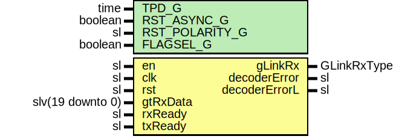

# Entity: GLinkDecoder

## Diagram

## Description

Company    : SLAC National Accelerator Laboratory
Description: Decoder for the Condition Inversion Master Transition coding
used by the GLink Protocol.
This file is part of 'SLAC Firmware Standard Library'.
It is subject to the license terms in the LICENSE.txt file found in the
top-level directory of this distribution and at:
   https://confluence.slac.stanford.edu/display/ppareg/LICENSE.html.
No part of 'SLAC Firmware Standard Library', including this file,
may be copied, modified, propagated, or distributed except according to
the terms contained in the LICENSE.txt file.
## Generics

| Generic name   | Type    | Value | Description                                         |
| -------------- | ------- | ----- | --------------------------------------------------- |
| TPD_G          | time    | 1 ns  |                                                     |
| RST_ASYNC_G    | boolean | false |                                                     |
| RST_POLARITY_G | sl      | '1'   | '1' for active HIGH reset, '0' for active LOW reset |
| FLAGSEL_G      | boolean | false |                                                     |
## Ports

| Port name     | Direction | Type             | Description     |
| ------------- | --------- | ---------------- | --------------- |
| en            | in        | sl               |                 |
| clk           | in        | sl               |                 |
| rst           | in        | sl               |                 |
| gtRxData      | in        | slv(19 downto 0) |                 |
| rxReady       | in        | sl               |                 |
| txReady       | in        | sl               | TX Clock domain |
| gLinkRx       | out       | GLinkRxType      |                 |
| decoderError  | out       | sl               |                 |
| decoderErrorL | out       | sl               |                 |
## Signals

| Name  | Type    | Description |
| ----- | ------- | ----------- |
| r     | RegType |             |
| rin   | RegType |             |
| txRdy | sl      |             |
## Constants

| Name       | Type    | Value                                                                                                                                                                   | Description |
| ---------- | ------- | ----------------------------------------------------------------------------------------------------------------------------------------------------------------------- | ----------- |
| REG_INIT_C | RegType |  (       deglitch => (others => '0'),        toggle   => '0',        gLinkRx  => GLINK_RX_INIT_C) |             |
## Types

| Name    | Type | Description |
| ------- | ---- | ----------- |
| RegType |      |             |
## Processes
- comb: ( gtRxData, r, rst, rxReady, txRdy )
- seq: ( clk, rst )
## Instantiations

- Synchronizer_Inst: surf.Synchronizer
