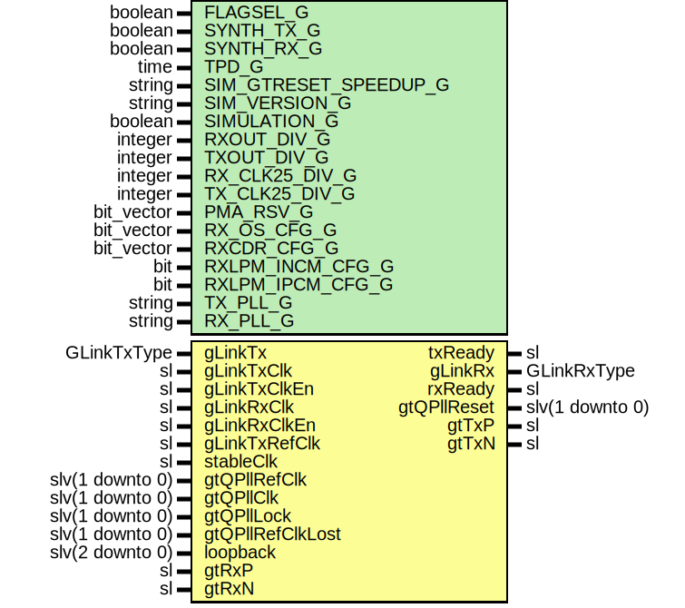

# Entity: GLinkGtp7FixedLat

- **File**: GLinkGtp7FixedLat.vhd
## Diagram

## Description

-----------------------------------------------------------------------------
 Company    : SLAC National Accelerator Laboratory
-----------------------------------------------------------------------------
 Description: G-Link wrapper for GTP7 transceiver
-----------------------------------------------------------------------------
 This file is part of 'SLAC Firmware Standard Library'.
 It is subject to the license terms in the LICENSE.txt file found in the
 top-level directory of this distribution and at:
    https://confluence.slac.stanford.edu/display/ppareg/LICENSE.html.
 No part of 'SLAC Firmware Standard Library', including this file,
 may be copied, modified, propagated, or distributed except according to
 the terms contained in the LICENSE.txt file.
-----------------------------------------------------------------------------
## Generics

| Generic name          | Type       | Value                    | Description            |
| --------------------- | ---------- | ------------------------ | ---------------------- |
| FLAGSEL_G             | boolean    | false                    | GLink Settings         |
| SYNTH_TX_G            | boolean    | true                     |                        |
| SYNTH_RX_G            | boolean    | true                     |                        |
| TPD_G                 | time       | 1 ns                     | Simulation Generics    |
| SIM_GTRESET_SPEEDUP_G | string     | "FALSE"                  |                        |
| SIM_VERSION_G         | string     | "4.0"                    |                        |
| SIMULATION_G          | boolean    | false                    |                        |
| RXOUT_DIV_G           | integer    | 2                        | MGT Settings           |
| TXOUT_DIV_G           | integer    | 2                        |                        |
| RX_CLK25_DIV_G        | integer    | 5                        |  Set by wizard         |
| TX_CLK25_DIV_G        | integer    | 5                        |  Set by wizard         |
| PMA_RSV_G             | bit_vector | x"00000333"              |  Set by wizard         |
| RX_OS_CFG_G           | bit_vector | "0001111110000"          |  Set by wizard         |
| RXCDR_CFG_G           | bit_vector | x"0000107FE206001041010" |  Set by wizard         |
| RXLPM_INCM_CFG_G      | bit        | '1'                      |  Set by wizard         |
| RXLPM_IPCM_CFG_G      | bit        | '0'                      |  Set by wizard         |
| TX_PLL_G              | string     | "PLL0"                   | Configure PLL sources  |
| RX_PLL_G              | string     | "PLL1"                   |                        |
## Ports

| Port name        | Direction | Type            | Description                             |
| ---------------- | --------- | --------------- | --------------------------------------- |
| gLinkTx          | in        | GLinkTxType     | G-Link TX Interface (gLinkTxClk Domain) |
| txReady          | out       | sl              |                                         |
| gLinkTxClk       | in        | sl              |                                         |
| gLinkTxClkEn     | in        | sl              |                                         |
| gLinkRx          | out       | GLinkRxType     | G-Link TX Interface (gLinkClk Domain)   |
| rxReady          | out       | sl              |                                         |
| gLinkRxClk       | in        | sl              |                                         |
| gLinkRxClkEn     | in        | sl              |                                         |
| gLinkTxRefClk    | in        | sl              |  G-Link TX clock reference              |
| stableClk        | in        | sl              |                                         |
| gtQPllRefClk     | in        | slv(1 downto 0) |                                         |
| gtQPllClk        | in        | slv(1 downto 0) |                                         |
| gtQPllLock       | in        | slv(1 downto 0) |                                         |
| gtQPllRefClkLost | in        | slv(1 downto 0) |                                         |
| gtQPllReset      | out       | slv(1 downto 0) |                                         |
| loopback         | in        | slv(2 downto 0) | MGT loopback control                    |
| gtTxP            | out       | sl              | MGT Serial IO                           |
| gtTxN            | out       | sl              |                                         |
| gtRxP            | in        | sl              |                                         |
| gtRxN            | in        | sl              |                                         |
## Signals

| Name                    | Type             | Description |
| ----------------------- | ---------------- | ----------- |
| txFifoValid             | sl               |             |
| 
      rxFifoValid      | sl               |             |
| 
      rxRecClk         | sl               |             |
| 
      rxClk            | sl               |             |
| 
      rxRst            | sl               |             |
| 
      txClk            | sl               |             |
| 
      gtTxRstDone      | sl               |             |
| 
      gtRxRstDone      | sl               |             |
| 
      gtTxRst          | sl               |             |
| 
      gtRxRst          | sl               |             |
| 
      dataValid        | sl               |             |
| txFifoDout              | slv(19 downto 0) |             |
| 
      gtTxData         | slv(19 downto 0) |             |
| 
      gtRxData         | slv(19 downto 0) |             |
| 
      gtTxDataReversed | slv(19 downto 0) |             |
| 
      gtRxDataReversed | slv(19 downto 0) |             |
| rxFifoDout              | slv(23 downto 0) |             |
| gLinkTxSync             | GLinkTxType      |             |
| gLinkRxSync             | GLinkRxType      |             |
## Constants

| Name                  | Type             | Value                                                             | Description |
| --------------------- | ---------------- | ----------------------------------------------------------------- | ----------- |
| FIXED_ALIGN_COMMA_0_C | slv(19 downto 0) |  bitReverse((GLINK_VALID_IDLE_WORDS_C(0) & GLINK_CONTROL_WORD_C)) |  FF0        |
| FIXED_ALIGN_COMMA_1_C | slv(19 downto 0) |  bitReverse((GLINK_VALID_IDLE_WORDS_C(1) & GLINK_CONTROL_WORD_C)) |  FF1A       |
| FIXED_ALIGN_COMMA_2_C | slv(19 downto 0) |  bitReverse((GLINK_VALID_IDLE_WORDS_C(2) & GLINK_CONTROL_WORD_C)) |  FF1B       |
## Instantiations

- Gtp7Core_Inst: surf.Gtp7Core
**Description**
 GTP 7 Core in Fixed Latency mode

