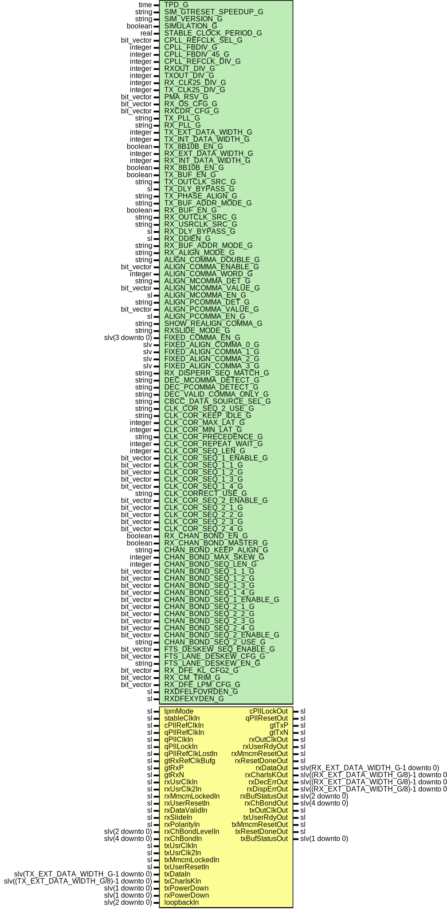

# Entity: GLinkGtx7Core

- **File**: GLinkGtx7Core.vhd
## Diagram

## Description

-----------------------------------------------------------------------------
 Company    : SLAC National Accelerator Laboratory
-----------------------------------------------------------------------------
 Description: G-Link wrapper for GTX7 primitive
-----------------------------------------------------------------------------
 This file is part of 'SLAC Firmware Standard Library'.
 It is subject to the license terms in the LICENSE.txt file found in the
 top-level directory of this distribution and at:
    https://confluence.slac.stanford.edu/display/ppareg/LICENSE.html.
 No part of 'SLAC Firmware Standard Library', including this file,
 may be copied, modified, propagated, or distributed except according to
 the terms contained in the LICENSE.txt file.
-----------------------------------------------------------------------------
## Generics

| Generic name             | Type            | Value                  | Description                                                       |
| ------------------------ | --------------- | ---------------------- | ----------------------------------------------------------------- |
| TPD_G                    | time            | 1 ns                   |                                                                   |
| SIM_GTRESET_SPEEDUP_G    | string          | "FALSE"                | Sim Generics --                                                   |
| SIM_VERSION_G            | string          | "4.0"                  |                                                                   |
| SIMULATION_G             | boolean         | false                  |                                                                   |
| STABLE_CLOCK_PERIOD_G    | real            | 4.0E-9                 | units of seconds                                                  |
| CPLL_REFCLK_SEL_G        | bit_vector      | "001"                  | CPLL Settings --                                                  |
| CPLL_FBDIV_G             | integer         | 4                      |                                                                   |
| CPLL_FBDIV_45_G          | integer         | 5                      |                                                                   |
| CPLL_REFCLK_DIV_G        | integer         | 1                      |                                                                   |
| RXOUT_DIV_G              | integer         | 2                      |                                                                   |
| TXOUT_DIV_G              | integer         | 2                      |                                                                   |
| RX_CLK25_DIV_G           | integer         | 5                      |  Set by wizard                                                    |
| TX_CLK25_DIV_G           | integer         | 5                      |  Set by wizard                                                    |
| PMA_RSV_G                | bit_vector      | X"00018480"            |  Use X"00018480" when RXPLL=CPLL                                  |
| RX_OS_CFG_G              | bit_vector      | "0000010000000"        |  Set by wizard                                                    |
| RXCDR_CFG_G              | bit_vector      | x"03000023ff40200020"  |  Set by wizard                                                    |
| TX_PLL_G                 | string          | "CPLL"                 | Configure PLL sources                                             |
| RX_PLL_G                 | string          | "CPLL"                 |                                                                   |
| TX_EXT_DATA_WIDTH_G      | integer         | 16                     | Configure Data widths                                             |
| TX_INT_DATA_WIDTH_G      | integer         | 20                     |                                                                   |
| TX_8B10B_EN_G            | boolean         | true                   |                                                                   |
| RX_EXT_DATA_WIDTH_G      | integer         | 16                     |                                                                   |
| RX_INT_DATA_WIDTH_G      | integer         | 20                     |                                                                   |
| RX_8B10B_EN_G            | boolean         | true                   |                                                                   |
| TX_BUF_EN_G              | boolean         | true                   | Configure Buffer usage                                            |
| TX_OUTCLK_SRC_G          | string          | "PLLREFCLK"            |  or "OUTCLKPMA" when bypassing buffer                             |
| TX_DLY_BYPASS_G          | sl              | '1'                    |  1 for bypass, 0 for delay                                        |
| TX_PHASE_ALIGN_G         | string          | "AUTO"                 |  Or "MANUAL" or "NONE"                                            |
| TX_BUF_ADDR_MODE_G       | string          | "FAST"                 |  Or "FULL"                                                        |
| RX_BUF_EN_G              | boolean         | true                   |                                                                   |
| RX_OUTCLK_SRC_G          | string          | "PLLREFCLK"            |  or "OUTCLKPMA" when bypassing buffer                             |
| RX_USRCLK_SRC_G          | string          | "RXOUTCLK"             |  or "TXOUTCLK"                                                    |
| RX_DLY_BYPASS_G          | sl              | '1'                    |  1 for bypass, 0 for delay                                        |
| RX_DDIEN_G               | sl              | '0'                    |  Supposed to be '1' when bypassing rx buffer                      |
| RX_BUF_ADDR_MODE_G       | string          | "FAST"                 |                                                                   |
| RX_ALIGN_MODE_G          | string          | "GT"                   |  Or "FIXED_LAT" or "NONE"                                         |
| ALIGN_COMMA_DOUBLE_G     | string          | "FALSE"                |                                                                   |
| ALIGN_COMMA_ENABLE_G     | bit_vector      | "1111111111"           |                                                                   |
| ALIGN_COMMA_WORD_G       | integer         | 2                      |                                                                   |
| ALIGN_MCOMMA_DET_G       | string          | "FALSE"                |                                                                   |
| ALIGN_MCOMMA_VALUE_G     | bit_vector      | "1010000011"           |                                                                   |
| ALIGN_MCOMMA_EN_G        | sl              | '0'                    |                                                                   |
| ALIGN_PCOMMA_DET_G       | string          | "FALSE"                |                                                                   |
| ALIGN_PCOMMA_VALUE_G     | bit_vector      | "0101111100"           |                                                                   |
| ALIGN_PCOMMA_EN_G        | sl              | '0'                    |                                                                   |
| SHOW_REALIGN_COMMA_G     | string          | "FALSE"                |                                                                   |
| RXSLIDE_MODE_G           | string          | "PCS"                  |  Set to PMA for fixed latency operation                           |
| FIXED_COMMA_EN_G         | slv(3 downto 0) | "0011"                 | Fixed Latency comma alignment (If RX_ALIGN_MODE_G = "FIXED_LAT")  |
| FIXED_ALIGN_COMMA_0_G    | slv             | "----------0101111100" |                                                                   |
| FIXED_ALIGN_COMMA_1_G    | slv             | "----------1010000011" |                                                                   |
| FIXED_ALIGN_COMMA_2_G    | slv             | "XXXXXXXXXXXXXXXXXXXX" |                                                                   |
| FIXED_ALIGN_COMMA_3_G    | slv             | "XXXXXXXXXXXXXXXXXXXX" |                                                                   |
| RX_DISPERR_SEQ_MATCH_G   | string          | "TRUE"                 | Configure RX 8B10B decoding (If RX_8B10B_EN_G = true)             |
| DEC_MCOMMA_DETECT_G      | string          | "TRUE"                 |                                                                   |
| DEC_PCOMMA_DETECT_G      | string          | "TRUE"                 |                                                                   |
| DEC_VALID_COMMA_ONLY_G   | string          | "FALSE"                |                                                                   |
| CBCC_DATA_SOURCE_SEL_G   | string          | "DECODED"              | Configure Clock Correction                                        |
| CLK_COR_SEQ_2_USE_G      | string          | "FALSE"                |                                                                   |
| CLK_COR_KEEP_IDLE_G      | string          | "FALSE"                |                                                                   |
| CLK_COR_MAX_LAT_G        | integer         | 9                      |                                                                   |
| CLK_COR_MIN_LAT_G        | integer         | 7                      |                                                                   |
| CLK_COR_PRECEDENCE_G     | string          | "TRUE"                 |                                                                   |
| CLK_COR_REPEAT_WAIT_G    | integer         | 0                      |                                                                   |
| CLK_COR_SEQ_LEN_G        | integer         | 1                      |                                                                   |
| CLK_COR_SEQ_1_ENABLE_G   | bit_vector      | "1111"                 |                                                                   |
| CLK_COR_SEQ_1_1_G        | bit_vector      | "0100000000"           |  UG476 pg 249                                                     |
| CLK_COR_SEQ_1_2_G        | bit_vector      | "0000000000"           |                                                                   |
| CLK_COR_SEQ_1_3_G        | bit_vector      | "0000000000"           |                                                                   |
| CLK_COR_SEQ_1_4_G        | bit_vector      | "0000000000"           |                                                                   |
| CLK_CORRECT_USE_G        | string          | "FALSE"                |                                                                   |
| CLK_COR_SEQ_2_ENABLE_G   | bit_vector      | "0000"                 |                                                                   |
| CLK_COR_SEQ_2_1_G        | bit_vector      | "0100000000"           |  UG476 pg 249                                                     |
| CLK_COR_SEQ_2_2_G        | bit_vector      | "0000000000"           |                                                                   |
| CLK_COR_SEQ_2_3_G        | bit_vector      | "0000000000"           |                                                                   |
| CLK_COR_SEQ_2_4_G        | bit_vector      | "0000000000"           |                                                                   |
| RX_CHAN_BOND_EN_G        | boolean         | false                  | Configure Channel Bonding                                         |
| RX_CHAN_BOND_MASTER_G    | boolean         | false                  | True: Master, False: Slave                                        |
| CHAN_BOND_KEEP_ALIGN_G   | string          | "FALSE"                |                                                                   |
| CHAN_BOND_MAX_SKEW_G     | integer         | 1                      |                                                                   |
| CHAN_BOND_SEQ_LEN_G      | integer         | 1                      |                                                                   |
| CHAN_BOND_SEQ_1_1_G      | bit_vector      | "0000000000"           |                                                                   |
| CHAN_BOND_SEQ_1_2_G      | bit_vector      | "0000000000"           |                                                                   |
| CHAN_BOND_SEQ_1_3_G      | bit_vector      | "0000000000"           |                                                                   |
| CHAN_BOND_SEQ_1_4_G      | bit_vector      | "0000000000"           |                                                                   |
| CHAN_BOND_SEQ_1_ENABLE_G | bit_vector      | "1111"                 |                                                                   |
| CHAN_BOND_SEQ_2_1_G      | bit_vector      | "0000000000"           |                                                                   |
| CHAN_BOND_SEQ_2_2_G      | bit_vector      | "0000000000"           |                                                                   |
| CHAN_BOND_SEQ_2_3_G      | bit_vector      | "0000000000"           |                                                                   |
| CHAN_BOND_SEQ_2_4_G      | bit_vector      | "0000000000"           |                                                                   |
| CHAN_BOND_SEQ_2_ENABLE_G | bit_vector      | "0000"                 |                                                                   |
| CHAN_BOND_SEQ_2_USE_G    | string          | "FALSE"                |                                                                   |
| FTS_DESKEW_SEQ_ENABLE_G  | bit_vector      | "1111"                 |                                                                   |
| FTS_LANE_DESKEW_CFG_G    | bit_vector      | "1111"                 |                                                                   |
| FTS_LANE_DESKEW_EN_G     | string          | "FALSE"                |                                                                   |
| RX_DFE_KL_CFG2_G         | bit_vector      | x"3008E56A"            |  Set by wizard                                                    |
| RX_CM_TRIM_G             | bit_vector      | "010"                  |                                                                   |
| RX_DFE_LPM_CFG_G         | bit_vector      | x"0954"                |                                                                   |
| RXDFELFOVRDEN_G          | sl              | '1'                    |                                                                   |
| RXDFEXYDEN_G             | sl              | '1'                    |  This should always be 1                                          |
## Ports

| Port name        | Direction | Type                                    | Description                                                     |
| ---------------- | --------- | --------------------------------------- | --------------------------------------------------------------- |
| lpmMode          | in        | sl                                      |                                                                 |
| stableClkIn      | in        | sl                                      |  Freerunning clock needed to drive reset logic                  |
| cPllRefClkIn     | in        | sl                                      |  Drives CPLL if used                                            |
| cPllLockOut      | out       | sl                                      |                                                                 |
| qPllRefClkIn     | in        | sl                                      |  Signals from QPLL if used                                      |
| qPllClkIn        | in        | sl                                      |                                                                 |
| qPllLockIn       | in        | sl                                      |                                                                 |
| qPllRefClkLostIn | in        | sl                                      |                                                                 |
| qPllResetOut     | out       | sl                                      |                                                                 |
| gtRxRefClkBufg   | in        | sl                                      |  In fixed latency mode, need BUF'd version of gt rx             |
| gtTxP            | out       | sl                                      | reference clock to check if recovered clock is stableSerial IO  |
| gtTxN            | out       | sl                                      |                                                                 |
| gtRxP            | in        | sl                                      |                                                                 |
| gtRxN            | in        | sl                                      |                                                                 |
| rxOutClkOut      | out       | sl                                      | Rx Clock related signals                                        |
| rxUsrClkIn       | in        | sl                                      |                                                                 |
| rxUsrClk2In      | in        | sl                                      |                                                                 |
| rxUserRdyOut     | out       | sl                                      |                                                                 |
| rxMmcmResetOut   | out       | sl                                      |                                                                 |
| rxMmcmLockedIn   | in        | sl                                      |                                                                 |
| rxUserResetIn    | in        | sl                                      | Rx User Reset Signals                                           |
| rxResetDoneOut   | out       | sl                                      |                                                                 |
| rxDataValidIn    | in        | sl                                      | Manual Comma Align signals                                      |
| rxSlideIn        | in        | sl                                      |                                                                 |
| rxDataOut        | out       | slv(RX_EXT_DATA_WIDTH_G-1 downto 0)     | Rx Data and decode signals                                      |
| rxCharIsKOut     | out       | slv((RX_EXT_DATA_WIDTH_G/8)-1 downto 0) |  If WIDTH not mult of 8 then                                    |
| rxDecErrOut      | out       | slv((RX_EXT_DATA_WIDTH_G/8)-1 downto 0) |  not using 8b10b and these dont matter                          |
| rxDispErrOut     | out       | slv((RX_EXT_DATA_WIDTH_G/8)-1 downto 0) |                                                                 |
| rxPolarityIn     | in        | sl                                      |                                                                 |
| rxBufStatusOut   | out       | slv(2 downto 0)                         |                                                                 |
| rxChBondLevelIn  | in        | slv(2 downto 0)                         | Rx Channel Bonding                                              |
| rxChBondIn       | in        | slv(4 downto 0)                         |                                                                 |
| rxChBondOut      | out       | slv(4 downto 0)                         |                                                                 |
| txOutClkOut      | out       | sl                                      | Tx Clock Related Signals                                        |
| txUsrClkIn       | in        | sl                                      |                                                                 |
| txUsrClk2In      | in        | sl                                      |                                                                 |
| txUserRdyOut     | out       | sl                                      |  txOutClk is valid                                              |
| txMmcmResetOut   | out       | sl                                      |                                                                 |
| txMmcmLockedIn   | in        | sl                                      |                                                                 |
| txUserResetIn    | in        | sl                                      | Tx User Reset signals                                           |
| txResetDoneOut   | out       | sl                                      |                                                                 |
| txDataIn         | in        | slv(TX_EXT_DATA_WIDTH_G-1 downto 0)     | Tx Data                                                         |
| txCharIsKIn      | in        | slv((TX_EXT_DATA_WIDTH_G/8)-1 downto 0) |                                                                 |
| txBufStatusOut   | out       | slv(1 downto 0)                         |                                                                 |
| txPowerDown      | in        | slv(1 downto 0)                         |                                                                 |
| rxPowerDown      | in        | slv(1 downto 0)                         |                                                                 |
| loopbackIn       | in        | slv(2 downto 0)                         |                                                                 |
## Signals

| Name                   | Type                                   | Description                                                                                                                                                                                                             |
| ---------------------- | -------------------------------------- | ----------------------------------------------------------------------------------------------------------------------------------------------------------------------------------------------------------------------- |
| cPllLock               | sl                                     | ------------------------------------------------------------------------------------------------  Signals ------------------------------------------------------------------------------------------------  CPll Reset  |
| cPllReset              | sl                                     |                                                                                                                                                                                                                         |
| cPllRefClkLost         | sl                                     |                                                                                                                                                                                                                         |
| gtGRefClk              | sl                                     |  Gtx CPLL Input Clocks                                                                                                                                                                                                  |
| gtNorthRefClk0         | sl                                     |                                                                                                                                                                                                                         |
| gtNorthRefClk1         | sl                                     |                                                                                                                                                                                                                         |
| gtRefClk0              | sl                                     |                                                                                                                                                                                                                         |
| gtRefClk1              | sl                                     |                                                                                                                                                                                                                         |
| gtSouthRefClk0         | sl                                     |                                                                                                                                                                                                                         |
| gtSouthRefClk1         | sl                                     |                                                                                                                                                                                                                         |
| rxOutClk               | sl                                     | --------------------------  Rx Signals                                                                                                                                                                                  |
| rxOutClkBufg           | sl                                     |                                                                                                                                                                                                                         |
| rxPllLock              | sl                                     |                                                                                                                                                                                                                         |
| rxPllReset             | sl                                     |                                                                                                                                                                                                                         |
| rxPllRefClkLost        | sl                                     |                                                                                                                                                                                                                         |
| gtRxReset              | sl                                     |  GT GTRXRESET                                                                                                                                                                                                           |
| rxResetDone            | sl                                     |  GT RXRESETDONE                                                                                                                                                                                                         |
| rxUserRdyInt           | sl                                     |  GT RXUSERRDY                                                                                                                                                                                                           |
| rxUserResetInt         | sl                                     |                                                                                                                                                                                                                         |
| rxFsmResetDone         | sl                                     |                                                                                                                                                                                                                         |
| rxRstTxUserRdy         | sl                                     |                                                                                                                                                                                                                         |
| rxRecClkStable         | sl                                     |                                                                                                                                                                                                                         |
| rxRecClkMonitorRestart | sl                                     |                                                                                                                                                                                                                         |
| rxCdrLockCnt           | integer range 0 to WAIT_TIME_CDRLOCK_C |                                                                                                                                                                                                                         |
| rxRunPhAlignment       | sl                                     |                                                                                                                                                                                                                         |
| rxPhaseAlignmentDone   | sl                                     |                                                                                                                                                                                                                         |
| rxAlignReset           | sl                                     |                                                                                                                                                                                                                         |
| rxDlySReset            | sl                                     |  GT RXDLYSRESET                                                                                                                                                                                                         |
| rxDlySResetDone        | sl                                     |  GT RXDLYSRESETDONE                                                                                                                                                                                                     |
| rxPhAlignDone          | sl                                     |  GT RXPHALIGNDONE                                                                                                                                                                                                       |
| rxSlide                | sl                                     |  GT RXSLIDE                                                                                                                                                                                                             |
| rxCdrLock              | sl                                     |  GT RXCDRLOCK                                                                                                                                                                                                           |
| rxDfeAgcHold           | sl                                     |                                                                                                                                                                                                                         |
| rxDfeLfHold            | sl                                     |                                                                                                                                                                                                                         |
| rxLpmLfHold            | sl                                     |                                                                                                                                                                                                                         |
| rxLpmHfHold            | sl                                     |                                                                                                                                                                                                                         |
| rxDataInt              | slv(RX_EXT_DATA_WIDTH_G-1 downto 0)    |  Rx Data                                                                                                                                                                                                                |
| rxDataFull             | slv(63 downto 0)                       |  GT RXDATA                                                                                                                                                                                                              |
| rxCharIsKFull          | slv(7 downto 0)                        |  GT RXCHARISK                                                                                                                                                                                                           |
| rxDispErrFull          | slv(7 downto 0)                        |  GT RXDISPERR                                                                                                                                                                                                           |
| rxDecErrFull           | slv(7 downto 0)                        |                                                                                                                                                                                                                         |
| txPllLock              | sl                                     | --------------------------  Tx Signals                                                                                                                                                                                  |
| txPllReset             | sl                                     |                                                                                                                                                                                                                         |
| txPllRefClkLost        | sl                                     |                                                                                                                                                                                                                         |
| gtTxReset              | sl                                     |  GT GTTXRESET                                                                                                                                                                                                           |
| txResetDone            | sl                                     |  GT TXRESETDONE                                                                                                                                                                                                         |
| txUserRdyInt           | sl                                     |  GT TXUSERRDY                                                                                                                                                                                                           |
| txFsmResetDone         | sl                                     |                                                                                                                                                                                                                         |
| txResetPhAlignment     | sl                                     |                                                                                                                                                                                                                         |
| txRunPhAlignment       | sl                                     |                                                                                                                                                                                                                         |
| txPhaseAlignmentDone   | sl                                     |                                                                                                                                                                                                                         |
| txPhAlignEn            | sl                                     |  GT TXPHALIGNEN                                                                                                                                                                                                         |
| txDlySReset            | sl                                     |  GT TXDLYSRESET                                                                                                                                                                                                         |
| txDlySResetDone        | sl                                     |  GT TXDLYSRESETDONE                                                                                                                                                                                                     |
| txPhInit               | sl                                     |  GT TXPHINIT                                                                                                                                                                                                            |
| txPhInitDone           | sl                                     |  GT TXPHINITDONE                                                                                                                                                                                                        |
| txPhAlign              | sl                                     |  GT TXPHALIGN                                                                                                                                                                                                           |
| txPhAlignDone          | sl                                     |  GT TXPHALIGNDONE                                                                                                                                                                                                       |
| txDlyEn                | sl                                     |  GT TXDLYEN                                                                                                                                                                                                             |
| txDataFull             | slv(63 downto 0)                       |  Tx Data Signals                                                                                                                                                                                                        |
| txCharIsKFull          | slv(7 downto 0)                        |                                                                                                                                                                                                                         |
| 
      txCharDispMode  | slv(7 downto 0)                        |                                                                                                                                                                                                                         |
| 
      txCharDispVal   | slv(7 downto 0)                        |                                                                                                                                                                                                                         |
## Constants

| Name                | Type       | Value                                                                                                                   | Description                                                                                                                                                                                                   |
| ------------------- | ---------- | ----------------------------------------------------------------------------------------------------------------------- | ------------------------------------------------------------------------------------------------------------------------------------------------------------------------------------------------------------- |
| RX_SYSCLK_SEL_C     | slv        |  ite(RX_PLL_G = "CPLL",  "00",  "11")             | ------------------------------------------------------------------------------------------------  Constants ------------------------------------------------------------------------------------------------  |
| TX_SYSCLK_SEL_C     | slv        |  ite(TX_PLL_G = "CPLL",  "00",  "11")             |                                                                                                                                                                                                               |
| RX_XCLK_SEL_C       | string     |  ite(RX_BUF_EN_G,  "RXREC",  "RXUSR")             |                                                                                                                                                                                                               |
| TX_XCLK_SEL_C       | string     |  ite(TX_BUF_EN_G,  "TXOUT",  "TXUSR")             |                                                                                                                                                                                                               |
| RX_OUTCLK_SEL_C     | bit_vector |  getOutClkSelVal(RX_OUTCLK_SRC_G)                                                                                       |                                                                                                                                                                                                               |
| TX_OUTCLK_SEL_C     | bit_vector |  getOutClkSelVal(TX_OUTCLK_SRC_G)                                                                                       |                                                                                                                                                                                                               |
| RX_DATA_WIDTH_C     | integer    |  getDataWidth(RX_8B10B_EN_G,  RX_EXT_DATA_WIDTH_G)                                   |                                                                                                                                                                                                               |
| TX_DATA_WIDTH_C     | integer    |  getDataWidth(TX_8B10B_EN_G,  TX_EXT_DATA_WIDTH_G)                                   |                                                                                                                                                                                                               |
| WAIT_TIME_CDRLOCK_C | integer    |  ite(SIM_GTRESET_SPEEDUP_G = "TRUE",  16,  65520) |                                                                                                                                                                                                               |
| RX_INT_DATAWIDTH_C  | integer    |  (RX_INT_DATA_WIDTH_G/32)                                                                                               |                                                                                                                                                                                                               |
| TX_INT_DATAWIDTH_C  | integer    |  (TX_INT_DATA_WIDTH_G/32)                                                                                               |                                                                                                                                                                                                               |
## Functions
- getOutClkSelVal (OUT_CLK_SRC : string)  return bit_vector 
- getDataWidth (USE_8B10B : boolean;  EXT_DATA_WIDTH : integer)  return integer 
## Processes
- RX_DATA_8B10B_GLUE: ( rxCharIsKFull, rxDataFull, rxDecErrFull,
                                 rxDispErrFull )
- TX_DATA_8B10B_GLUE: ( txCharIsKIn, txDataIn )
 **Description**
------------------------------------------------------------------------------------------------  Tx Logic ------------------------------------------------------------------------------------------------ 
## Instantiations

- Gtx7RxRst_Inst: surf.GLinkGtx7RxRst
 **Description**
------------------------------------------------------------------------------------------------
 Rx Reset Module
 1. Reset RX PLL,
 2. Wait PLL Lock
 3. Wait recclk_stable
 4. Reset MMCM
 5. Wait MMCM Lock
 6. Assert gtRxUserRdy (gtRxUsrClk now usable)
 7. Wait gtRxResetDone
 8. Do phase alignment if necessary
 9. Wait DATA_VALID (aligned) - 100 us
10. Wait 1 us, Set rxFsmResetDone.
------------------------------------------------------------------------------------------------

- RstSync_RxResetDone: surf.RstSync
 **Description**
------------------------------------------------------------------------------------------------
 Synchronize rxFsmResetDone to rxUsrClk to use as reset for external logic.
------------------------------------------------------------------------------------------------

- BUFG_RX_OUT_CLK: BUFG
 **Description**
 Output
-----------------------------------------------------------------------------------------------
 Recovered clock monitor
-----------------------------------------------------------------------------------------------

- Gtx7TxRst_Inst: surf.Gtx7TxRst
 **Description**
------------------------------------------------------------------------------------------------
 Tx Reset Module
------------------------------------------------------------------------------------------------

- RstSync_Tx: surf.RstSync
 **Description**
 Might be interesting to look at
------------------------------------------------------------------------------------------------
 Synchronize rxFsmResetDone to rxUsrClk to use as reset for external logic.
------------------------------------------------------------------------------------------------

- gtxe2_i: GTXE2_CHANNEL
 **Description**
------------------------------------------------------------------------------------------------
 GTX Instantiation
------------------------------------------------------------------------------------------------

