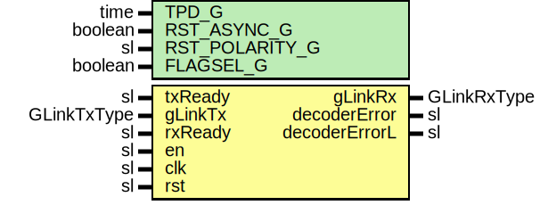

# Entity: GLinkTxToRx

- **File**: GLinkTxToRx.vhd
## Diagram

## Description

Company    : SLAC National Accelerator Laboratory
Description: Wrapper for GLinkEncoder/GLinkDecoder loopback testing
This file is part of 'SLAC Firmware Standard Library'.
It is subject to the license terms in the LICENSE.txt file found in the
top-level directory of this distribution and at:
   https://confluence.slac.stanford.edu/display/ppareg/LICENSE.html.
No part of 'SLAC Firmware Standard Library', including this file,
may be copied, modified, propagated, or distributed except according to
the terms contained in the LICENSE.txt file.
## Generics

| Generic name   | Type    | Value | Description                                         |
| -------------- | ------- | ----- | --------------------------------------------------- |
| TPD_G          | time    | 1 ns  |                                                     |
| RST_ASYNC_G    | boolean | false |                                                     |
| RST_POLARITY_G | sl      | '1'   | '1' for active HIGH reset, '0' for active LOW reset |
| FLAGSEL_G      | boolean | false |                                                     |
## Ports

| Port name     | Direction | Type        | Description    |
| ------------- | --------- | ----------- | -------------- |
| txReady       | in        | sl          | TX Signals     |
| gLinkTx       | in        | GLinkTxType |                |
| rxReady       | in        | sl          | RX Signals     |
| gLinkRx       | out       | GLinkRxType |                |
| decoderError  | out       | sl          |                |
| decoderErrorL | out       | sl          |                |
| en            | in        | sl          | Global Signals |
| clk           | in        | sl          |                |
| rst           | in        | sl          |                |
## Signals

| Name        | Type             | Description |
| ----------- | ---------------- | ----------- |
| encodedData | slv(19 downto 0) |             |
## Instantiations

- GLinkEncoder_Inst: surf.GLinkEncoder
- GLinkDecoder_Inst: surf.GLinkDecoder
