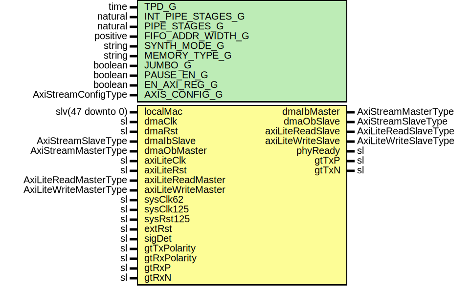

# Entity: GigEthGthUltraScale

- **File**: GigEthGthUltraScale.vhd
## Diagram

## Description

Company    : SLAC National Accelerator Laboratory
Description: 1000BASE-X Ethernet for Gth7
This file is part of 'SLAC Firmware Standard Library'.
It is subject to the license terms in the LICENSE.txt file found in the
top-level directory of this distribution and at:
   https://confluence.slac.stanford.edu/display/ppareg/LICENSE.html.
No part of 'SLAC Firmware Standard Library', including this file,
may be copied, modified, propagated, or distributed except according to
the terms contained in the LICENSE.txt file.
## Generics

| Generic name      | Type                | Value              | Description                   |
| ----------------- | ------------------- | ------------------ | ----------------------------- |
| TPD_G             | time                | 1 ns               |                               |
| INT_PIPE_STAGES_G | natural             | 1                  | MAC Configurations            |
| PIPE_STAGES_G     | natural             | 1                  |                               |
| FIFO_ADDR_WIDTH_G | positive            | 12                 | single 4K UltraRAM            |
| SYNTH_MODE_G      | string              | "xpm"              |                               |
| MEMORY_TYPE_G     | string              | "ultra"            |                               |
| JUMBO_G           | boolean             | true               |                               |
| PAUSE_EN_G        | boolean             | true               |                               |
| EN_AXI_REG_G      | boolean             | false              | AXI-Lite Configurations       |
| AXIS_CONFIG_G     | AxiStreamConfigType | EMAC_AXIS_CONFIG_C | AXI Streaming Configurations  |
## Ports

| Port name          | Direction | Type                   | Description                         |
| ------------------ | --------- | ---------------------- | ----------------------------------- |
| localMac           | in        | slv(47 downto 0)       | Local Configurations                |
| dmaClk             | in        | sl                     | Streaming DMA Interface             |
| dmaRst             | in        | sl                     |                                     |
| dmaIbMaster        | out       | AxiStreamMasterType    |                                     |
| dmaIbSlave         | in        | AxiStreamSlaveType     |                                     |
| dmaObMaster        | in        | AxiStreamMasterType    |                                     |
| dmaObSlave         | out       | AxiStreamSlaveType     |                                     |
| axiLiteClk         | in        | sl                     | Slave AXI-Lite Interface            |
| axiLiteRst         | in        | sl                     |                                     |
| axiLiteReadMaster  | in        | AxiLiteReadMasterType  |                                     |
| axiLiteReadSlave   | out       | AxiLiteReadSlaveType   |                                     |
| axiLiteWriteMaster | in        | AxiLiteWriteMasterType |                                     |
| axiLiteWriteSlave  | out       | AxiLiteWriteSlaveType  |                                     |
| sysClk62           | in        | sl                     | PHY + MAC signals                   |
| sysClk125          | in        | sl                     |                                     |
| sysRst125          | in        | sl                     |                                     |
| extRst             | in        | sl                     |                                     |
| phyReady           | out       | sl                     |                                     |
| sigDet             | in        | sl                     |                                     |
| gtTxPolarity       | in        | sl                     | Switch Polarity of TxN/TxP, RxN/RxP |
| gtRxPolarity       | in        | sl                     |                                     |
| gtTxP              | out       | sl                     | MGT Ports                           |
| gtTxN              | out       | sl                     |                                     |
| gtRxP              | in        | sl                     |                                     |
| gtRxN              | in        | sl                     |                                     |
## Signals

| Name            | Type                   | Description |
| --------------- | ---------------------- | ----------- |
| config          | GigEthConfigType       |             |
| status          | GigEthStatusType       |             |
| mAxiReadMaster  | AxiLiteReadMasterType  |             |
| mAxiReadSlave   | AxiLiteReadSlaveType   |             |
| mAxiWriteMaster | AxiLiteWriteMasterType |             |
| mAxiWriteSlave  | AxiLiteWriteSlaveType  |             |
| gmiiTxClk       | sl                     |             |
| gmiiTxd         | slv(7 downto 0)        |             |
| gmiiTxEn        | sl                     |             |
| gmiiTxEr        | sl                     |             |
| gmiiRxClk       | sl                     |             |
| gmiiRxd         | slv(7 downto 0)        |             |
| gmiiRxDv        | sl                     |             |
| gmiiRxEr        | sl                     |             |
| areset          | sl                     |             |
| coreRst         | sl                     |             |
## Instantiations

- U_PwrUpRst: surf.PwrUpRst
- U_MAC: surf.EthMacTop
**Description**
Ethernet MAC core

- U_GigEthGthUltraScaleCore: GigEthGthUltraScaleCore
**Description**
1000BASE-X core

- U_GigEthReg: surf.GigEthReg
**Description**
Configuration/Status Register

