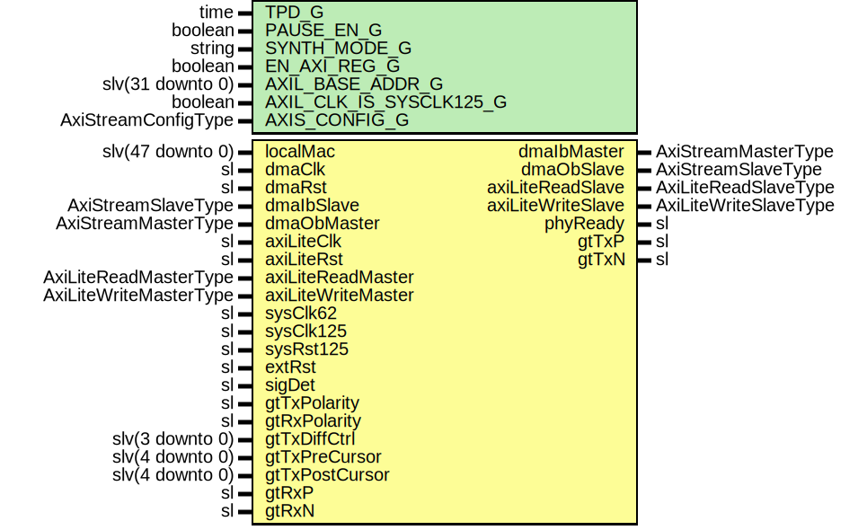

# Entity: GigEthGtx7

- **File**: GigEthGtx7.vhd
## Diagram

## Description

-----------------------------------------------------------------------------
 Company    : SLAC National Accelerator Laboratory
-----------------------------------------------------------------------------
 Description: 1000BASE-X Ethernet for Gtx7
-----------------------------------------------------------------------------
 This file is part of 'SLAC Firmware Standard Library'.
 It is subject to the license terms in the LICENSE.txt file found in the
 top-level directory of this distribution and at:
    https://confluence.slac.stanford.edu/display/ppareg/LICENSE.html.
 No part of 'SLAC Firmware Standard Library', including this file,
 may be copied, modified, propagated, or distributed except according to
 the terms contained in the LICENSE.txt file.
-----------------------------------------------------------------------------
## Generics

| Generic name            | Type                | Value              | Description                   |
| ----------------------- | ------------------- | ------------------ | ----------------------------- |
| TPD_G                   | time                | 1 ns               |                               |
| PAUSE_EN_G              | boolean             | true               |                               |
| SYNTH_MODE_G            | string              | "inferred"         |                               |
| EN_AXI_REG_G            | boolean             | false              | AXI-Lite Configurations       |
| AXIL_BASE_ADDR_G        | slv(31 downto 0)    | X"00000000"        |                               |
| AXIL_CLK_IS_SYSCLK125_G | boolean             | false              |                               |
| AXIS_CONFIG_G           | AxiStreamConfigType | EMAC_AXIS_CONFIG_C | AXI Streaming Configurations  |
## Ports

| Port name          | Direction | Type                   | Description                         |
| ------------------ | --------- | ---------------------- | ----------------------------------- |
| localMac           | in        | slv(47 downto 0)       | Local Configurations                |
| dmaClk             | in        | sl                     | Streaming DMA Interface             |
| dmaRst             | in        | sl                     |                                     |
| dmaIbMaster        | out       | AxiStreamMasterType    |                                     |
| dmaIbSlave         | in        | AxiStreamSlaveType     |                                     |
| dmaObMaster        | in        | AxiStreamMasterType    |                                     |
| dmaObSlave         | out       | AxiStreamSlaveType     |                                     |
| axiLiteClk         | in        | sl                     | Slave AXI-Lite Interface            |
| axiLiteRst         | in        | sl                     |                                     |
| axiLiteReadMaster  | in        | AxiLiteReadMasterType  |                                     |
| axiLiteReadSlave   | out       | AxiLiteReadSlaveType   |                                     |
| axiLiteWriteMaster | in        | AxiLiteWriteMasterType |                                     |
| axiLiteWriteSlave  | out       | AxiLiteWriteSlaveType  |                                     |
| sysClk62           | in        | sl                     | PHY + MAC signals                   |
| sysClk125          | in        | sl                     |                                     |
| sysRst125          | in        | sl                     |                                     |
| extRst             | in        | sl                     |                                     |
| phyReady           | out       | sl                     |                                     |
| sigDet             | in        | sl                     |                                     |
| gtTxPolarity       | in        | sl                     | Switch Polarity of TxN/TxP, RxN/RxP |
| gtRxPolarity       | in        | sl                     |                                     |
| gtTxDiffCtrl       | in        | slv(3 downto 0)        | GT Drive strength                   |
| gtTxPreCursor      | in        | slv(4 downto 0)        |                                     |
| gtTxPostCursor     | in        | slv(4 downto 0)        |                                     |
| gtTxP              | out       | sl                     | MGT Ports                           |
| gtTxN              | out       | sl                     |                                     |
| gtRxP              | in        | sl                     |                                     |
| gtRxN              | in        | sl                     |                                     |
## Signals

| Name                | Type                                           | Description |
| ------------------- | ---------------------------------------------- | ----------- |
| config              | GigEthConfigType                               |             |
| status              | GigEthStatusType                               |             |
| syncAxilReadMaster  | AxiLiteReadMasterType                          |             |
| syncAxilReadSlave   | AxiLiteReadSlaveType                           |             |
| syncAxilWriteMaster | AxiLiteWriteMasterType                         |             |
| syncAxilWriteSlave  | AxiLiteWriteSlaveType                          |             |
| locAxilReadMasters  | AxiLiteReadMasterArray(AXIL_NUM_C-1 downto 0)  |             |
| locAxilReadSlaves   | AxiLiteReadSlaveArray(AXIL_NUM_C-1 downto 0)   |             |
| locAxilWriteMasters | AxiLiteWriteMasterArray(AXIL_NUM_C-1 downto 0) |             |
| locAxilWriteSlaves  | AxiLiteWriteSlaveArray(AXIL_NUM_C-1 downto 0)  |             |
| gmiiTxClk           | sl                                             |             |
| gmiiTxd             | slv(7 downto 0)                                |             |
| gmiiTxEn            | sl                                             |             |
| gmiiTxEr            | sl                                             |             |
| gmiiRxClk           | sl                                             |             |
| gmiiRxd             | slv(7 downto 0)                                |             |
| gmiiRxDv            | sl                                             |             |
| gmiiRxEr            | sl                                             |             |
| areset              | sl                                             |             |
| coreRst             | sl                                             |             |
| drpaddr             | slv (8 downto 0)                               |             |
| drpclk              | sl                                             |             |
| drpdi               | slv (15 downto 0)                              |             |
| drpdo               | slv (15 downto 0)                              |             |
| drpen               | sl                                             |             |
| drprdy              | sl                                             |             |
| drpwe               | sl                                             |             |
## Constants

| Name               | Type                                                    | Value                                                                                                                                                                                                                                                                                                                                                                                                                                                                                  | Description |
| ------------------ | ------------------------------------------------------- | -------------------------------------------------------------------------------------------------------------------------------------------------------------------------------------------------------------------------------------------------------------------------------------------------------------------------------------------------------------------------------------------------------------------------------------------------------------------------------------- | ----------- |
| AXIL_NUM_C         | integer                                                 |  2                                                                                                                                                                                                                                                                                                                                                                                                                                                                                     |             |
| ETH_AXIL_C         | integer                                                 |  0                                                                                                                                                                                                                                                                                                                                                                                                                                                                                     |             |
| DRP_AXIL_C         | integer                                                 |  1                                                                                                                                                                                                                                                                                                                                                                                                                                                                                     |             |
| AXIL_XBAR_CONFIG_C | AxiLiteCrossbarMasterConfigArray(AXIL_NUM_C-1 downto 0) |  (       ETH_AXIL_C      => (          baseAddr     => AXIL_BASE_ADDR_G + X"0000",           addrBits     => 12,           connectivity => X"FFFF"),        DRP_AXIL_C      => (          baseAddr     => AXIL_BASE_ADDR_G + X"1000",           addrBits     => 12,           connectivity => X"FFFF")) |             |
## Instantiations

- U_AxiLiteAsync: surf.AxiLiteAsync
- U_XBAR: surf.AxiLiteCrossbar
- U_PwrUpRst: surf.PwrUpRst
- U_MAC: surf.EthMacTop
 **Description**
------------------
 Ethernet MAC core
------------------

- U_GigEthGtx7Core: GigEthGtx7Core
 **Description**
----------------
 1000BASE-X core
----------------

- U_AxiLiteToDrp_1: surf.AxiLiteToDrp
- U_GigEthReg: surf.GigEthReg
 **Description**
 [in]
------------------------------
 Configuration/Status Register
------------------------------

