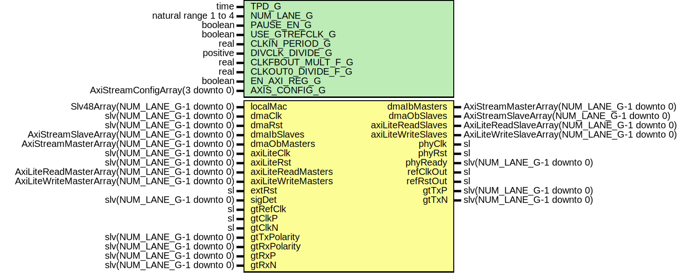

# Entity: GigEthGtx7Wrapper

- **File**: GigEthGtx7Wrapper.vhd
## Diagram

## Description

-----------------------------------------------------------------------------
 Company    : SLAC National Accelerator Laboratory
-----------------------------------------------------------------------------
 Description: Gtx7 Wrapper for 1000BASE-X Ethernet
 Note: This module supports up to a MGT QUAD of 1GigE interfaces
-----------------------------------------------------------------------------
 This file is part of 'SLAC Firmware Standard Library'.
 It is subject to the license terms in the LICENSE.txt file found in the
 top-level directory of this distribution and at:
    https://confluence.slac.stanford.edu/display/ppareg/LICENSE.html.
 No part of 'SLAC Firmware Standard Library', including this file,
 may be copied, modified, propagated, or distributed except according to
 the terms contained in the LICENSE.txt file.
-----------------------------------------------------------------------------
## Generics

| Generic name       | Type                             | Value                          | Description                        |
| ------------------ | -------------------------------- | ------------------------------ | ---------------------------------- |
| TPD_G              | time                             | 1 ns                           |                                    |
| NUM_LANE_G         | natural range 1 to 4             | 1                              |                                    |
| PAUSE_EN_G         | boolean                          | true                           |                                    |
| USE_GTREFCLK_G     | boolean                          | false                          |   FALSE: gtClkP/N,  TRUE: gtRefClk |
| CLKIN_PERIOD_G     | real                             | 8.0                            |                                    |
| DIVCLK_DIVIDE_G    | positive                         | 1                              |                                    |
| CLKFBOUT_MULT_F_G  | real                             | 8.0                            |                                    |
| CLKOUT0_DIVIDE_F_G | real                             | 8.0                            |                                    |
| EN_AXI_REG_G       | boolean                          | false                          | AXI-Lite Configurations            |
| AXIS_CONFIG_G      | AxiStreamConfigArray(3 downto 0) | (others => EMAC_AXIS_CONFIG_C) | AXI Streaming Configurations       |
## Ports

| Port name           | Direction | Type                                           | Description                                     |
| ------------------- | --------- | ---------------------------------------------- | ----------------------------------------------- |
| localMac            | in        | Slv48Array(NUM_LANE_G-1 downto 0)              | Local Configurations                            |
| dmaClk              | in        | slv(NUM_LANE_G-1 downto 0)                     | Streaming DMA Interface                         |
| dmaRst              | in        | slv(NUM_LANE_G-1 downto 0)                     |                                                 |
| dmaIbMasters        | out       | AxiStreamMasterArray(NUM_LANE_G-1 downto 0)    |                                                 |
| dmaIbSlaves         | in        | AxiStreamSlaveArray(NUM_LANE_G-1 downto 0)     |                                                 |
| dmaObMasters        | in        | AxiStreamMasterArray(NUM_LANE_G-1 downto 0)    |                                                 |
| dmaObSlaves         | out       | AxiStreamSlaveArray(NUM_LANE_G-1 downto 0)     |                                                 |
| axiLiteClk          | in        | slv(NUM_LANE_G-1 downto 0)                     | Slave AXI-Lite Interface                        |
| axiLiteRst          | in        | slv(NUM_LANE_G-1 downto 0)                     |                                                 |
| axiLiteReadMasters  | in        | AxiLiteReadMasterArray(NUM_LANE_G-1 downto 0)  |                                                 |
| axiLiteReadSlaves   | out       | AxiLiteReadSlaveArray(NUM_LANE_G-1 downto 0)   |                                                 |
| axiLiteWriteMasters | in        | AxiLiteWriteMasterArray(NUM_LANE_G-1 downto 0) |                                                 |
| axiLiteWriteSlaves  | out       | AxiLiteWriteSlaveArray(NUM_LANE_G-1 downto 0)  |                                                 |
| extRst              | in        | sl                                             | Misc. Signals                                   |
| phyClk              | out       | sl                                             |                                                 |
| phyRst              | out       | sl                                             |                                                 |
| phyReady            | out       | slv(NUM_LANE_G-1 downto 0)                     |                                                 |
| sigDet              | in        | slv(NUM_LANE_G-1 downto 0)                     |                                                 |
| gtRefClk            | in        | sl                                             | MGT Clock Port (156.25 MHz or 312.5 MHz)        |
| gtClkP              | in        | sl                                             |                                                 |
| gtClkN              | in        | sl                                             |                                                 |
| refClkOut           | out       | sl                                             | Copy of internal MMCM reference clock and Reset |
| refRstOut           | out       | sl                                             |                                                 |
| gtTxPolarity        | in        | slv(NUM_LANE_G-1 downto 0)                     | Switch Polarity of TxN/TxP, RxN/RxP             |
| gtRxPolarity        | in        | slv(NUM_LANE_G-1 downto 0)                     |                                                 |
| gtTxP               | out       | slv(NUM_LANE_G-1 downto 0)                     | MGT Ports                                       |
| gtTxN               | out       | slv(NUM_LANE_G-1 downto 0)                     |                                                 |
| gtRxP               | in        | slv(NUM_LANE_G-1 downto 0)                     |                                                 |
| gtRxN               | in        | slv(NUM_LANE_G-1 downto 0)                     |                                                 |
## Signals

| Name      | Type | Description |
| --------- | ---- | ----------- |
| gtClk     | sl   |             |
| gtClkBufg | sl   |             |
| refClk    | sl   |             |
| refRst    | sl   |             |
| sysClk125 | sl   |             |
| sysRst125 | sl   |             |
| sysClk62  | sl   |             |
| sysRst62  | sl   |             |
## Instantiations

- IBUFDS_GTE2_Inst: IBUFDS_GTE2
**Description**
---------------------------
 Select the Reference Clock
---------------------------

- BUFG_Inst: BUFG
- PwrUpRst_Inst: surf.PwrUpRst
**Description**
---------------
 Power Up Reset
---------------

- U_MMCM: surf.ClockManager7
**Description**
--------------
 Clock Manager
--------------

