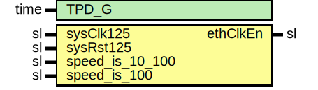

# Entity: GigEthLvdsClockEnable

- **File**: GigEthLvdsClockEnable.vhd
## Diagram

## Description

-----------------------------------------------------------------------------
 Company    : SLAC National Accelerator Laboratory
-----------------------------------------------------------------------------
 Description: SGMII/LVDS Ethernet's clock enabling for 10/100 speeds
-----------------------------------------------------------------------------
 This file is part of 'SLAC Firmware Standard Library'.
 It is subject to the license terms in the LICENSE.txt file found in the
 top-level directory of this distribution and at:
    https://confluence.slac.stanford.edu/display/ppareg/LICENSE.html.
 No part of 'SLAC Firmware Standard Library', including this file,
 may be copied, modified, propagated, or distributed except according to
 the terms contained in the LICENSE.txt file.
-----------------------------------------------------------------------------
## Generics

| Generic name | Type | Value | Description |
| ------------ | ---- | ----- | ----------- |
| TPD_G        | time | 1 ns  |             |
## Ports

| Port name       | Direction | Type | Description |
| --------------- | --------- | ---- | ----------- |
| sysClk125       | in        | sl   |             |
| sysRst125       | in        | sl   |             |
| speed_is_10_100 | in        | sl   |             |
| speed_is_100    | in        | sl   |             |
| ethClkEn        | out       | sl   |             |
## Signals

| Name | Type    | Description |
| ---- | ------- | ----------- |
| r    | RegType |             |
| rin  | RegType |             |
## Constants

| Name       | Type    | Value                                                                                                                                                                                                                                                             | Description |
| ---------- | ------- | ----------------------------------------------------------------------------------------------------------------------------------------------------------------------------------------------------------------------------------------------------------------- | ----------- |
| REG_INIT_C | RegType |  (       ethClkEn => '1',        en100    => '0',        cnt100   => 0,        en10     => '0',        cnt10    => 0) |             |
## Types

| Name    | Type | Description |
| ------- | ---- | ----------- |
| RegType |      |             |
## Processes
- comb: ( r, speed_is_100, speed_is_10_100, sysRst125 )
- seq: ( sysClk125 )
