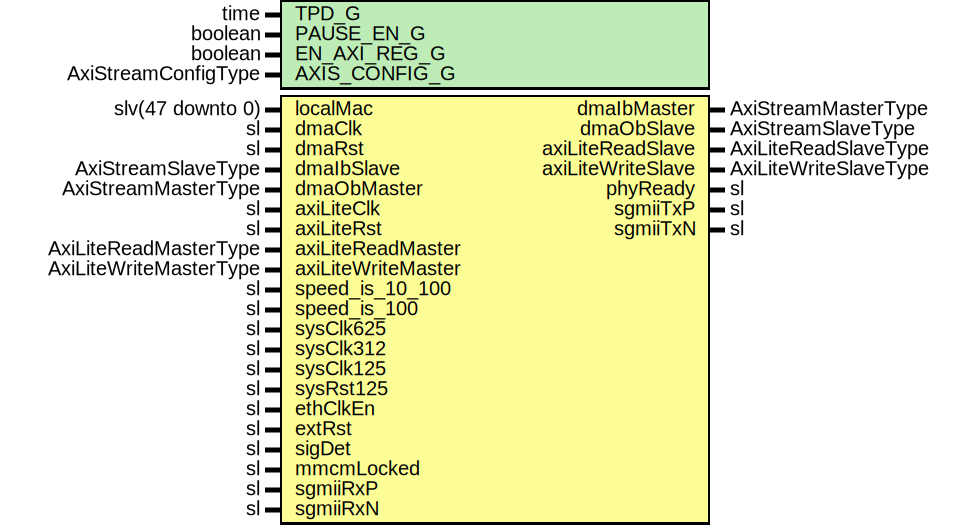

# Entity: GigEthLvdsUltraScale

- **File**: GigEthLvdsUltraScale.vhd
## Diagram

## Description

-----------------------------------------------------------------------------
 Company    : SLAC National Accelerator Laboratory
-----------------------------------------------------------------------------
 Description: SGMII Ethernet over LVDS
-----------------------------------------------------------------------------
 This file is part of 'SLAC Firmware Standard Library'.
 It is subject to the license terms in the LICENSE.txt file found in the
 top-level directory of this distribution and at:
    https://confluence.slac.stanford.edu/display/ppareg/LICENSE.html.
 No part of 'SLAC Firmware Standard Library', including this file,
 may be copied, modified, propagated, or distributed except according to
 the terms contained in the LICENSE.txt file.
-----------------------------------------------------------------------------
## Generics

| Generic name  | Type                | Value              | Description                   |
| ------------- | ------------------- | ------------------ | ----------------------------- |
| TPD_G         | time                | 1 ns               |                               |
| PAUSE_EN_G    | boolean             | true               |                               |
| EN_AXI_REG_G  | boolean             | false              | AXI-Lite Configurations       |
| AXIS_CONFIG_G | AxiStreamConfigType | EMAC_AXIS_CONFIG_C | AXI Streaming Configurations  |
## Ports

| Port name          | Direction | Type                   | Description              |
| ------------------ | --------- | ---------------------- | ------------------------ |
| localMac           | in        | slv(47 downto 0)       | Local Configurations     |
| dmaClk             | in        | sl                     | Streaming DMA Interface  |
| dmaRst             | in        | sl                     |                          |
| dmaIbMaster        | out       | AxiStreamMasterType    |                          |
| dmaIbSlave         | in        | AxiStreamSlaveType     |                          |
| dmaObMaster        | in        | AxiStreamMasterType    |                          |
| dmaObSlave         | out       | AxiStreamSlaveType     |                          |
| axiLiteClk         | in        | sl                     | Slave AXI-Lite Interface |
| axiLiteRst         | in        | sl                     |                          |
| axiLiteReadMaster  | in        | AxiLiteReadMasterType  |                          |
| axiLiteReadSlave   | out       | AxiLiteReadSlaveType   |                          |
| axiLiteWriteMaster | in        | AxiLiteWriteMasterType |                          |
| axiLiteWriteSlave  | out       | AxiLiteWriteSlaveType  |                          |
| speed_is_10_100    | in        | sl                     | Speed selection          |
| speed_is_100       | in        | sl                     |                          |
| sysClk625          | in        | sl                     | PHY + MAC signals        |
| sysClk312          | in        | sl                     |                          |
| sysClk125          | in        | sl                     |                          |
| sysRst125          | in        | sl                     |                          |
| ethClkEn           | in        | sl                     |                          |
| extRst             | in        | sl                     |                          |
| phyReady           | out       | sl                     |                          |
| sigDet             | in        | sl                     |                          |
| mmcmLocked         | in        | sl                     |                          |
| sgmiiTxP           | out       | sl                     | SGMII / LVDS Ports       |
| sgmiiTxN           | out       | sl                     |                          |
| sgmiiRxP           | in        | sl                     |                          |
| sgmiiRxN           | in        | sl                     |                          |
## Signals

| Name            | Type                   | Description |
| --------------- | ---------------------- | ----------- |
| config          | GigEthConfigType       |             |
| status          | GigEthStatusType       |             |
| mAxiReadMaster  | AxiLiteReadMasterType  |             |
| mAxiReadSlave   | AxiLiteReadSlaveType   |             |
| mAxiWriteMaster | AxiLiteWriteMasterType |             |
| mAxiWriteSlave  | AxiLiteWriteSlaveType  |             |
| gmiiTxClk       | sl                     |             |
| gmiiTxd         | slv(7 downto 0)        |             |
| gmiiTxEn        | sl                     |             |
| gmiiTxEr        | sl                     |             |
| gmiiRxClk       | sl                     |             |
| gmiiRxd         | slv(7 downto 0)        |             |
| gmiiRxDv        | sl                     |             |
| gmiiRxEr        | sl                     |             |
| areset          | sl                     |             |
| coreRst         | sl                     |             |
| delayCtrlRdy    | sl                     |             |
## Instantiations

- U_AxiLiteAsync: surf.AxiLiteAsync
- U_PwrUpRst: surf.PwrUpRst
- U_MAC: surf.EthMacTop
**Description**
------------------
 Ethernet MAC core
------------------

- U_GigEthLvdsUltraScaleCore: SaltUltraScaleCore
**Description**
----------------
 gmii - sgmii
----------------

- U_GigEthReg: surf.GigEthReg
**Description**
------------------------------
 Configuration/Status Register
------------------------------

