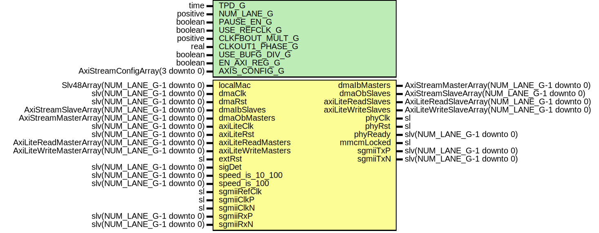

# Entity: GigEthLvdsUltraScaleWrapper

- **File**: GigEthLvdsUltraScaleWrapper.vhd
## Diagram

## Description

Company    : SLAC National Accelerator Laboratory
Description: Wrapper for SGMII/LVDS Ethernet
This file is part of 'SLAC Firmware Standard Library'.
It is subject to the license terms in the LICENSE.txt file found in the
top-level directory of this distribution and at:
   https://confluence.slac.stanford.edu/display/ppareg/LICENSE.html.
No part of 'SLAC Firmware Standard Library', including this file,
may be copied, modified, propagated, or distributed except according to
the terms contained in the LICENSE.txt file.
## Generics

| Generic name    | Type                             | Value                          | Description                             |
| --------------- | -------------------------------- | ------------------------------ | --------------------------------------- |
| TPD_G           | time                             | 1 ns                           |                                         |
| NUM_LANE_G      | positive                         | 1                              |                                         |
| PAUSE_EN_G      | boolean                          | true                           |                                         |
| USE_REFCLK_G    | boolean                          | false                          |  FALSE: sgmiiClkP/N,  TRUE: sgmiiRefClk |
| CLKFBOUT_MULT_G | positive                         | 10                             |                                         |
| CLKOUT1_PHASE_G | real                             | 90.0                           |                                         |
| USE_BUFG_DIV_G  | boolean                          | false                          |                                         |
| EN_AXI_REG_G    | boolean                          | false                          | AXI-Lite Configurations                 |
| AXIS_CONFIG_G   | AxiStreamConfigArray(3 downto 0) | (others => EMAC_AXIS_CONFIG_C) | AXI Streaming Configurations            |
## Ports

| Port name           | Direction | Type                                           | Description              |
| ------------------- | --------- | ---------------------------------------------- | ------------------------ |
| localMac            | in        | Slv48Array(NUM_LANE_G-1 downto 0)              | Local Configurations     |
| dmaClk              | in        | slv(NUM_LANE_G-1 downto 0)                     | Streaming DMA Interface  |
| dmaRst              | in        | slv(NUM_LANE_G-1 downto 0)                     |                          |
| dmaIbMasters        | out       | AxiStreamMasterArray(NUM_LANE_G-1 downto 0)    |                          |
| dmaIbSlaves         | in        | AxiStreamSlaveArray(NUM_LANE_G-1 downto 0)     |                          |
| dmaObMasters        | in        | AxiStreamMasterArray(NUM_LANE_G-1 downto 0)    |                          |
| dmaObSlaves         | out       | AxiStreamSlaveArray(NUM_LANE_G-1 downto 0)     |                          |
| axiLiteClk          | in        | slv(NUM_LANE_G-1 downto 0)                     | Slave AXI-Lite Interface |
| axiLiteRst          | in        | slv(NUM_LANE_G-1 downto 0)                     |                          |
| axiLiteReadMasters  | in        | AxiLiteReadMasterArray(NUM_LANE_G-1 downto 0)  |                          |
| axiLiteReadSlaves   | out       | AxiLiteReadSlaveArray(NUM_LANE_G-1 downto 0)   |                          |
| axiLiteWriteMasters | in        | AxiLiteWriteMasterArray(NUM_LANE_G-1 downto 0) |                          |
| axiLiteWriteSlaves  | out       | AxiLiteWriteSlaveArray(NUM_LANE_G-1 downto 0)  |                          |
| extRst              | in        | sl                                             | Misc. Signals            |
| phyClk              | out       | sl                                             |                          |
| phyRst              | out       | sl                                             |                          |
| phyReady            | out       | slv(NUM_LANE_G-1 downto 0)                     |                          |
| sigDet              | in        | slv(NUM_LANE_G-1 downto 0)                     |                          |
| mmcmLocked          | out       | sl                                             |                          |
| speed_is_10_100     | in        | slv(NUM_LANE_G-1 downto 0)                     |                          |
| speed_is_100        | in        | slv(NUM_LANE_G-1 downto 0)                     |                          |
| sgmiiRefClk         | in        | sl                                             | 125 MHz                  |
| sgmiiClkP           | in        | sl                                             | 625 MHz                  |
| sgmiiClkN           | in        | sl                                             | 625 MHz                  |
| sgmiiTxP            | out       | slv(NUM_LANE_G-1 downto 0)                     | MGT Ports                |
| sgmiiTxN            | out       | slv(NUM_LANE_G-1 downto 0)                     |                          |
| sgmiiRxP            | in        | slv(NUM_LANE_G-1 downto 0)                     |                          |
| sgmiiRxN            | in        | slv(NUM_LANE_G-1 downto 0)                     |                          |
## Signals

| Name         | Type | Description |
| ------------ | ---- | ----------- |
| sgmiiClk     | sl   |             |
| sgmiiClkBufg | sl   |             |
| refClk       | sl   |             |
| refRst       | sl   |             |
| locked       | sl   |             |
| clkFbIn      | sl   |             |
| clkFbOut     | sl   |             |
| CLKOUT0      | sl   |             |
| CLKOUT1      | sl   |             |
| sysClk625    | sl   |             |
| sysClk312    | sl   |             |
| sysClk125    | sl   |             |
| sysRst125    | sl   |             |
## Instantiations

- IBUFGDS_SGMII: IBUFGDS
**Description**
Select the Reference Clock

- U_Bufg_sgmiiClk: BUFGCE_DIV
- U_PwrUpRst: surf.PwrUpRst
**Description**
125 MHz

- U_PLL: PLLE3_ADV
**Description**
Clock Manager

- U_Bufg: BUFG
- U_sysClk625: BUFG
- U_sysRst125: surf.RstSync
