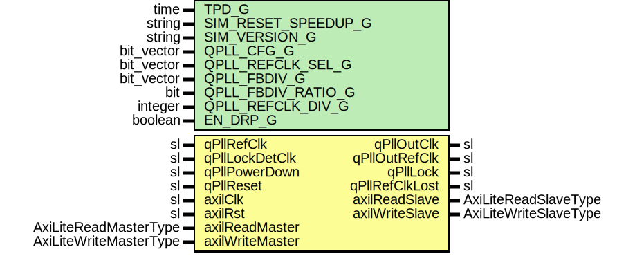

# Entity: Gth7QuadPll

## Diagram

## Description

Company    : SLAC National Accelerator Laboratory
Description: Wrapper for Xilinx 7-series GTH's QPLL
This file is part of 'SLAC Firmware Standard Library'.
It is subject to the license terms in the LICENSE.txt file found in the
top-level directory of this distribution and at:
   https://confluence.slac.stanford.edu/display/ppareg/LICENSE.html.
No part of 'SLAC Firmware Standard Library', including this file,
may be copied, modified, propagated, or distributed except according to
the terms contained in the LICENSE.txt file.
## Generics

| Generic name        | Type       | Value        | Description                                                                   |
| ------------------- | ---------- | ------------ | ----------------------------------------------------------------------------- |
| TPD_G               | time       | 1 ns         |                                                                               |
| SIM_RESET_SPEEDUP_G | string     | "TRUE"       |                                                                               |
| SIM_VERSION_G       | string     | "2.0"        |                                                                               |
| QPLL_CFG_G          | bit_vector | x"04801C7"   | QPLL_CFG_G[6] selects the QPLL frequency band: 0 = upper band, 1 = lower band |
| QPLL_REFCLK_SEL_G   | bit_vector | "001"        |                                                                               |
| QPLL_FBDIV_G        | bit_vector | "0100100000" |                                                                               |
| QPLL_FBDIV_RATIO_G  | bit        | '1'          |                                                                               |
| QPLL_REFCLK_DIV_G   | integer    | 1            |                                                                               |
| EN_DRP_G            | boolean    | true         |                                                                               |
## Ports

| Port name       | Direction | Type                   | Description        |
| --------------- | --------- | ---------------------- | ------------------ |
| qPllRefClk      | in        | sl                     |                    |
| qPllOutClk      | out       | sl                     |                    |
| qPllOutRefClk   | out       | sl                     |                    |
| qPllLock        | out       | sl                     |                    |
| qPllLockDetClk  | in        | sl                     | Lock detect clock  |
| qPllRefClkLost  | out       | sl                     |                    |
| qPllPowerDown   | in        | sl                     |                    |
| qPllReset       | in        | sl                     |                    |
| axilClk         | in        | sl                     | AXI-Lite Interface |
| axilRst         | in        | sl                     |                    |
| axilReadMaster  | in        | AxiLiteReadMasterType  |                    |
| axilReadSlave   | out       | AxiLiteReadSlaveType   |                    |
| axilWriteMaster | in        | AxiLiteWriteMasterType |                    |
| axilWriteSlave  | out       | AxiLiteWriteSlaveType  |                    |
## Signals

| Name           | Type             | Description |
| -------------- | ---------------- | ----------- |
| gtRefClk0      | sl               |             |
| gtRefClk1      | sl               |             |
| gtNorthRefClk0 | sl               |             |
| gtNorthRefClk1 | sl               |             |
| gtSouthRefClk0 | sl               |             |
| gtSouthRefClk1 | sl               |             |
| gtGRefClk      | sl               |             |
| drpEn          | sl               |             |
| drpWe          | sl               |             |
| drpRdy         | sl               |             |
| drpAddr        | slv(7 downto 0)  |             |
| drpDi          | slv(15 downto 0) |             |
| drpDo          | slv(15 downto 0) |             |
## Instantiations

- gthe2_common_0_i: GTHE2_COMMON
