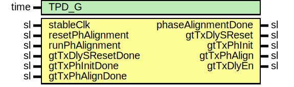

# Entity: Gth7TxManualPhaseAligner

- **File**: Gth7TxManualPhaseAligner.vhd
## Diagram

## Description

Company    : SLAC National Accelerator Laboratory
Description: GTH7 TX manual phase aligner
This file is part of 'SLAC Firmware Standard Library'.
It is subject to the license terms in the LICENSE.txt file found in the
top-level directory of this distribution and at:
   https://confluence.slac.stanford.edu/display/ppareg/LICENSE.html.
No part of 'SLAC Firmware Standard Library', including this file,
may be copied, modified, propagated, or distributed except according to
the terms contained in the LICENSE.txt file.
## Generics

| Generic name | Type | Value | Description |
| ------------ | ---- | ----- | ----------- |
| TPD_G        | time | 1 ns  |             |
## Ports

| Port name          | Direction | Type | Description                     |
| ------------------ | --------- | ---- | ------------------------------- |
| stableClk          | in        | sl   |                                 |
| resetPhAlignment   | in        | sl   | TX RST IO                       |
| runPhAlignment     | in        | sl   |                                 |
| phaseAlignmentDone | out       | sl   |                                 |
| gtTxDlySReset      | out       | sl   | GT IO - Inputs are asynchronous |
| gtTxDlySResetDone  | in        | sl   |                                 |
| gtTxPhInit         | out       | sl   |                                 |
| gtTxPhInitDone     | in        | sl   |                                 |
| gtTxPhAlign        | out       | sl   |                                 |
| gtTxPhAlignDone    | in        | sl   |                                 |
| gtTxDlyEn          | out       | sl   |                                 |
## Signals

| Name                  | Type    | Description |
| --------------------- | ------- | ----------- |
| r                     | RegType |             |
|  rin                  | RegType |             |
| gtTxDlySResetDoneSync | sl      |             |
| gtTxPhInitDoneSync    | sl      |             |
| gtTxPhAlignDoneSync   | sl      |             |
| gtTxPhAlignDoneEdge   | sl      |             |
## Constants

| Name        | Type    | Value                                                                                                                                                                                                                                                                                                                                                                                           | Description |
| ----------- | ------- | ----------------------------------------------------------------------------------------------------------------------------------------------------------------------------------------------------------------------------------------------------------------------------------------------------------------------------------------------------------------------------------------------- | ----------- |
| REG_RESET_C | RegType |  (       state              => INIT_S,        phaseAlignmentDone => '0',        gtTxDlySReset      => '0',        gtTxPhInit         => '0',        gtTxPhAlign        => '0',        gtTxDlyEn          => '0') |             |
## Types

| Name      | Type                                                                                                                                                                                                                                                                                              | Description |
| --------- | ------------------------------------------------------------------------------------------------------------------------------------------------------------------------------------------------------------------------------------------------------------------------------------------------- | ----------- |
| StateType | ( INIT_S,  WAIT_DLY_SRESET_DONE_S,  WAIT_PH_INIT_DONE_S,  WAIT_PH_ALIGN_DONE_S,  WAIT_PH_ALIGN_DONE_2_S,  DONE_S)  |             |
| RegType   |                                                                                                                                                                                                                                                                                                   |             |
## Processes
- comb: ( r, gtTxDlySResetDoneSync, gtTxPhInitDoneSync, gtTxPhAlignDoneSync, gtTxPhAlignDoneEdge,
                   resetPhAlignment, runPhAlignment )
- seq: ( stableClk )
## Instantiations

- TX_DLY_S_RESET_DONE_SYNC: surf.Synchronizer
- TX_PH_INIT_DONE_SYNC: surf.Synchronizer
- TX_PH_ALIGN_DONE_SYNC: surf.SynchronizerEdge
