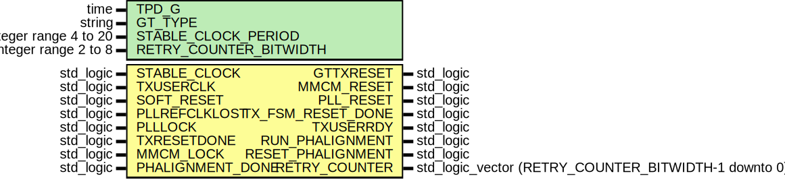
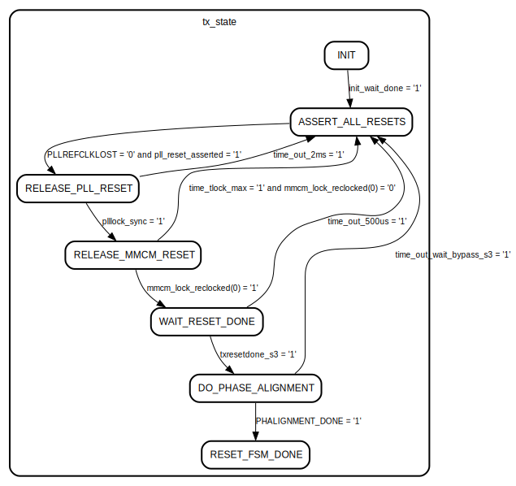

# Entity: Gth7TxRst

- **File**: Gth7TxRst.vhd
## Diagram

## Description

 Description :     This module performs TX reset and initialization.
Module Gth7TxRst
Generated by Xilinx 7 Series FPGAs Transceivers Wizard
(c) Copyright 2010-2012 Xilinx, Inc. All rights reserved.
This file contains confidential and proprietary information
of Xilinx, Inc. and is protected under U.S. and
international copyright and other intellectual property
laws.
DISCLAIMER
This disclaimer is not a license and does not grant any
rights to the materials distributed herewith. Except as
otherwise provided in a valid license issued to you by
Xilinx, and to the maximum extent permitted by applicable
law: (1) THESE MATERIALS ARE MADE AVAILABLE "AS IS" AND
WITH ALL FAULTS, AND XILINX HEREBY DISCLAIMS ALL WARRANTIES
AND CONDITIONS, EXPRESS, IMPLIED, OR STATUTORY, INCLUDING
BUT NOT LIMITED TO WARRANTIES OF MERCHANTABILITY, NON-
INFRINGEMENT, OR FITNESS FOR ANY PARTICULAR PURPOSE; and
(2) Xilinx shall not be liable (whether in contract or tort,
including negligence, or under any other theory of
liability) for any loss or damage of any kind or nature
related to, arising under or in connection with these
materials, including for any direct, or any indirect,
special, incidental, or consequential loss or damage
(including loss of data, profits, goodwill, or any type of
loss or damage suffered as a result of any action brought
by a third party) even if such damage or loss was
reasonably foreseeable or Xilinx had been advised of the
possibility of the same.
CRITICAL APPLICATIONS
Xilinx products are not designed or intended to be fail-
safe, or for use in any application requiring fail-safe
performance, such as life-support or safety devices or
systems, Class III medical devices, nuclear facilities,
applications related to the deployment of airbags, or any
other applications that could lead to death, personal
injury, or severe property or environmental damage
(individually and collectively, "Critical
Applications"). Customer assumes the sole risk and
liability of any use of Xilinx products in Critical
Applications, subject only to applicable laws and
regulations governing limitations on product liability.
THIS COPYRIGHT NOTICE AND DISCLAIMER MUST BE RETAINED AS
PART OF THIS FILE AT ALL TIMES.
## Generics

| Generic name           | Type                  | Value | Description |
| ---------------------- | --------------------- | ----- | ----------- |
| TPD_G                  | time                  | 1 ns  |             |
| GT_TYPE                | string                | "GTX" |             |
| STABLE_CLOCK_PERIOD    | integer range 4 to 20 | 8     |             |
| RETRY_COUNTER_BITWIDTH | integer range 2 to 8  | 8     |             |
## Ports

| Port name         | Direction | Type                                                 | Description |
| ----------------- | --------- | ---------------------------------------------------- | ----------- |
| STABLE_CLOCK      | in        | std_logic                                            |             |
| TXUSERCLK         | in        | std_logic                                            |             |
| SOFT_RESET        | in        | std_logic                                            |             |
| PLLREFCLKLOST     | in        | std_logic                                            |             |
| PLLLOCK           | in        | std_logic                                            |             |
| TXRESETDONE       | in        | std_logic                                            |             |
| MMCM_LOCK         | in        | std_logic                                            |             |
| GTTXRESET         | out       | std_logic                                            |             |
| MMCM_RESET        | out       | std_logic                                            |             |
| PLL_RESET         | out       | std_logic                                            |             |
| TX_FSM_RESET_DONE | out       | std_logic                                            |             |
| TXUSERRDY         | out       | std_logic                                            |             |
| RUN_PHALIGNMENT   | out       | std_logic                                            |             |
| RESET_PHALIGNMENT | out       | std_logic                                            |             |
| PHALIGNMENT_DONE  | in        | std_logic                                            |             |
| RETRY_COUNTER     | out       | std_logic_vector (RETRY_COUNTER_BITWIDTH-1 downto 0) | Number of   |
## Signals

| Name                       | Type                                   | Description |
| -------------------------- | -------------------------------------- | ----------- |
| tx_state                   | tx_rst_fsm_type                        |             |
| soft_reset_sync            | std_logic                              |             |
| soft_reset_rise            | std_logic                              |             |
| soft_reset_fall            | std_logic                              |             |
| init_wait_count            | integer range 0 to WAIT_MAX            |             |
| init_wait_done             | std_logic                              |             |
| pll_reset_asserted         | std_logic                              |             |
| tx_fsm_reset_done_int      | std_logic                              |             |
| tx_fsm_reset_done_int_s3   | std_logic                              |             |
| txresetdone_s3             | std_logic                              |             |
| retry_counter_int          | integer range 0 to MAX_RETRIES         |             |
| time_out_counter           | integer range 0 to WAIT_TIMEOUT_2ms    |             |
| reset_time_out             | std_logic                              |             |
| time_out_2ms               | std_logic                              |             |
| time_tlock_max             | std_logic                              |             |
| time_out_500us             | std_logic                              |             |
| mmcm_lock_count            | integer range 0 to MMCM_LOCK_CNT_MAX-1 |             |
| mmcm_lock_int              | std_logic                              |             |
| mmcm_lock_reclocked        | std_logic_vector(3 downto 0)           |             |
| run_phase_alignment_int    | std_logic                              |             |
| run_phase_alignment_int_s3 | std_logic                              |             |
| wait_bypass_count          | integer range 0 to MAX_WAIT_BYPASS-1   |             |
| time_out_wait_bypass       | std_logic                              |             |
| time_out_wait_bypass_s3    | std_logic                              |             |
| refclk_lost                | std_logic                              |             |
| plllock_sync               | std_logic                              |             |
## Constants

| Name               | Type    | Value                                | Description                                        |
| ------------------ | ------- | ------------------------------------ | -------------------------------------------------- |
| MMCM_LOCK_CNT_MAX  | integer |  1024                                |                                                    |
| STARTUP_DELAY      | integer |  500                                 |                                                    |
| WAIT_CYCLES        | integer |  STARTUP_DELAY / STABLE_CLOCK_PERIOD | Number of Clock-Cycles to wait after configuration |
| WAIT_MAX           | integer |  WAIT_CYCLES + 10                    | 500 ns plus some additional margin                 |
| WAIT_TIMEOUT_2ms   | integer |  2000000 / STABLE_CLOCK_PERIOD       |  2 ms time-out                                     |
| WAIT_TLOCK_MAX     | integer |  100000 / STABLE_CLOCK_PERIOD        |                                                    |
| WAIT_TIMEOUT_500us | integer |  500000 / STABLE_CLOCK_PERIOD        |                                                    |
| MAX_RETRIES        | integer |  2**RETRY_COUNTER_BITWIDTH-1         |                                                    |
| MAX_WAIT_BYPASS    | integer |  110000                              |                                                    |
## Types

| Name            | Type                                                                                                                                                                                                                                                                                                                                            | Description |
| --------------- | ----------------------------------------------------------------------------------------------------------------------------------------------------------------------------------------------------------------------------------------------------------------------------------------------------------------------------------------------- | ----------- |
| tx_rst_fsm_type | ( INIT,  ASSERT_ALL_RESETS,  RELEASE_PLL_RESET,  RELEASE_MMCM_RESET,  WAIT_RESET_DONE,  DO_PHASE_ALIGNMENT,  RESET_FSM_DONE)  |             |
## Processes
- unnamed: ( STABLE_CLOCK )
- timeouts: ( STABLE_CLOCK )
- mmcm_lock_wait: ( TXUSERCLK, MMCM_LOCK )
- timeout_buffer_bypass: ( TXUSERCLK )
- reset_fsm: ( STABLE_CLOCK )
**Description**
Following steps are performed:
1) Only for GTX - After configuration wait for approximately 500 ns as specified in
   answer-record 43482
2) Assert all resets on the GT and on an MMCM potentially connected.
   After that wait until a reference-clock has been detected.
3) Release the reset to the GT and wait until the GT-PLL has locked.
4) Release the MMCM-reset and wait until the MMCM has signalled lock.
   Also signal to the RX-side which PLL has been reset.
5) Wait for the RESET_DONE-signal from the GT.
6) Signal to start the phase-alignment procedure and wait for it to
   finish.
7) Reset-sequence has successfully run through. Signal this to the
   rest of the design by asserting TX_FSM_RESET_DONE.

## Instantiations

- Synchronizer_run_phase_alignment: surf.Synchronizer
**Description**
Clock Domain Crossing

- Synchronizer_fsm_reset_done: surf.Synchronizer
- Synchronizer_SOFT_RESET: surf.SynchronizerEdge
- Synchronizer_TXRESETDONE: surf.Synchronizer
- Synchronizer_time_out_wait_bypass: surf.Synchronizer
- Synchronizer_mmcm_lock_reclocked: surf.Synchronizer
- Synchronizer_PLLLOCK: surf.Synchronizer
## State machines

- FSM for resetting the GTX/GTH/GTP in the 7-series.
~~~~~~~~~~~~~~~~~~~~~~~~~~~~~~~~~~~~~~~~~~

Following steps are performed:
1) Only for GTX - After configuration wait for approximately 500 ns as specified in
answer-record 43482
2) Assert all resets on the GT and on an MMCM potentially connected.
After that wait until a reference-clock has been detected.
3) Release the reset to the GT and wait until the GT-PLL has locked.
4) Release the MMCM-reset and wait until the MMCM has signalled lock.
Also signal to the RX-side which PLL has been reset.
5) Wait for the RESET_DONE-signal from the GT.
6) Signal to start the phase-alignment procedure and wait for it to
finish.
7) Reset-sequence has successfully run through. Signal this to the
rest of the design by asserting TX_FSM_RESET_DONE.
