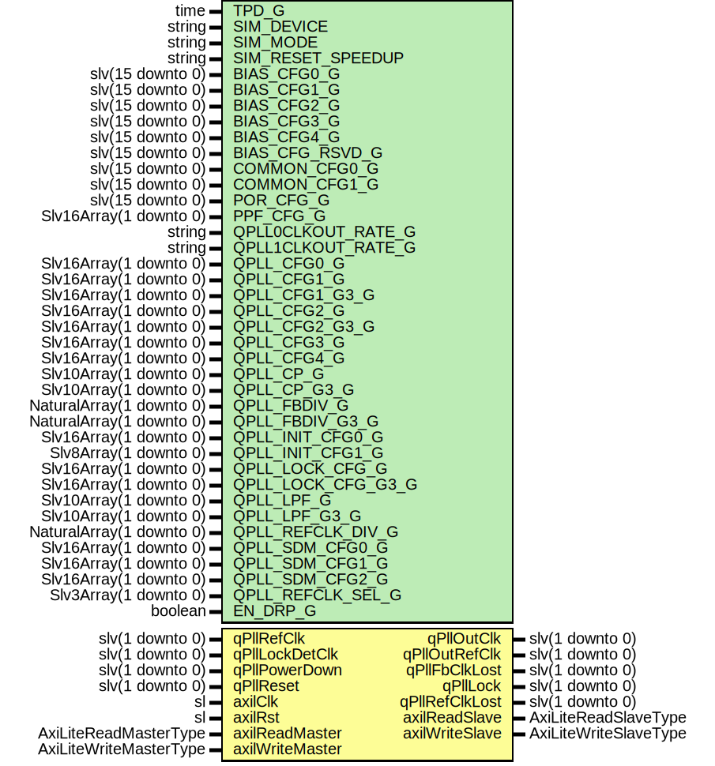

# Entity: GthUltraScaleQuadPll

## Diagram

## Description

Company    : SLAC National Accelerator Laboratory
Description: Wrapper for Ultrascale GTH QPLL primitive
This file is part of 'SLAC MGT Library'.
It is subject to the license terms in the LICENSE.txt file found in the
top-level directory of this distribution and at:
   https://confluence.slac.stanford.edu/display/ppareg/LICENSE.html.
No part of 'SLAC MGT Library', including this file,
may be copied, modified, propagated, or distributed except according to
the terms contained in the LICENSE.txt file.
## Generics

| Generic name       | Type                     | Value                    | Description                    |
| ------------------ | ------------------------ | ------------------------ | ------------------------------ |
| TPD_G              | time                     | 1 ns                     | Simulation Parameters          |
| SIM_DEVICE         | string                   | "ULTRASCALE_PLUS"        |                                |
| SIM_MODE           | string                   | "FAST"                   |                                |
| SIM_RESET_SPEEDUP  | string                   | "TRUE"                   |                                |
| BIAS_CFG0_G        | slv(15 downto 0)         | x"0000"                  | QPLL Configuration Parameters  |
| BIAS_CFG1_G        | slv(15 downto 0)         | x"0000"                  |                                |
| BIAS_CFG2_G        | slv(15 downto 0)         | x"0124"                  |                                |
| BIAS_CFG3_G        | slv(15 downto 0)         | x"0041"                  |                                |
| BIAS_CFG4_G        | slv(15 downto 0)         | x"0010"                  |                                |
| BIAS_CFG_RSVD_G    | slv(15 downto 0)         | X"0000"                  |                                |
| COMMON_CFG0_G      | slv(15 downto 0)         | x"0000"                  |                                |
| COMMON_CFG1_G      | slv(15 downto 0)         | x"0000"                  |                                |
| POR_CFG_G          | slv(15 downto 0)         | x"0000"                  |                                |
| PPF_CFG_G          | Slv16Array(1 downto 0)   | (others => x"0600")      |                                |
| QPLL0CLKOUT_RATE_G | string                   | "HALF"                   |                                |
| QPLL1CLKOUT_RATE_G | string                   | "HALF"                   |                                |
| QPLL_CFG0_G        | Slv16Array(1 downto 0)   | (others => x"331C")      |                                |
| QPLL_CFG1_G        | Slv16Array(1 downto 0)   | (others => x"D038")      |                                |
| QPLL_CFG1_G3_G     | Slv16Array(1 downto 0)   | (others => x"D038")      |                                |
| QPLL_CFG2_G        | Slv16Array(1 downto 0)   | (others => x"0FC0")      |                                |
| QPLL_CFG2_G3_G     | Slv16Array(1 downto 0)   | (others => x"0FC0")      |                                |
| QPLL_CFG3_G        | Slv16Array(1 downto 0)   | (others => x"0120")      |                                |
| QPLL_CFG4_G        | Slv16Array(1 downto 0)   | (others => x"0003")      |                                |
| QPLL_CP_G          | Slv10Array(1 downto 0)   | (others => "0011111111") |                                |
| QPLL_CP_G3_G       | Slv10Array(1 downto 0)   | (others => "0000001111") |                                |
| QPLL_FBDIV_G       | NaturalArray(1 downto 0) | (others => 66)           |                                |
| QPLL_FBDIV_G3_G    | NaturalArray(1 downto 0) | (others => 160)          |                                |
| QPLL_INIT_CFG0_G   | Slv16Array(1 downto 0)   | (others => x"02B2")      |                                |
| QPLL_INIT_CFG1_G   | Slv8Array(1 downto 0)    | (others => x"00")        |                                |
| QPLL_LOCK_CFG_G    | Slv16Array(1 downto 0)   | (others => x"25E8")      |                                |
| QPLL_LOCK_CFG_G3_G | Slv16Array(1 downto 0)   | (others => x"25E8")      |                                |
| QPLL_LPF_G         | Slv10Array(1 downto 0)   | (others => "1000111111") |                                |
| QPLL_LPF_G3_G      | Slv10Array(1 downto 0)   | (others => "0111010101") |                                |
| QPLL_REFCLK_DIV_G  | NaturalArray(1 downto 0) | (others => 1)            |                                |
| QPLL_SDM_CFG0_G    | Slv16Array(1 downto 0)   | (others => x"0080")      |                                |
| QPLL_SDM_CFG1_G    | Slv16Array(1 downto 0)   | (others => x"0000")      |                                |
| QPLL_SDM_CFG2_G    | Slv16Array(1 downto 0)   | (others => x"0000")      |                                |
| QPLL_REFCLK_SEL_G  | Slv3Array(1 downto 0)    | (others => "001")        | Clock Selects                  |
| EN_DRP_G           | boolean                  | true                     |                                |
## Ports

| Port name       | Direction | Type                   | Description        |
| --------------- | --------- | ---------------------- | ------------------ |
| qPllRefClk      | in        | slv(1 downto 0)        |                    |
| qPllOutClk      | out       | slv(1 downto 0)        |                    |
| qPllOutRefClk   | out       | slv(1 downto 0)        |                    |
| qPllFbClkLost   | out       | slv(1 downto 0)        |                    |
| qPllLock        | out       | slv(1 downto 0)        |                    |
| qPllLockDetClk  | in        | slv(1 downto 0)        |                    |
| qPllRefClkLost  | out       | slv(1 downto 0)        |                    |
| qPllPowerDown   | in        | slv(1 downto 0)        |                    |
| qPllReset       | in        | slv(1 downto 0)        |                    |
| axilClk         | in        | sl                     | AXI-Lite Interface |
| axilRst         | in        | sl                     |                    |
| axilReadMaster  | in        | AxiLiteReadMasterType  |                    |
| axilReadSlave   | out       | AxiLiteReadSlaveType   |                    |
| axilWriteMaster | in        | AxiLiteWriteMasterType |                    |
| axilWriteSlave  | out       | AxiLiteWriteSlaveType  |                    |
## Signals

| Name           | Type             | Description |
| -------------- | ---------------- | ----------- |
| gtRefClk0      | slv(1 downto 0)  |             |
| gtRefClk1      | slv(1 downto 0)  |             |
| gtNorthRefClk0 | slv(1 downto 0)  |             |
| gtNorthRefClk1 | slv(1 downto 0)  |             |
| gtSouthRefClk0 | slv(1 downto 0)  |             |
| gtSouthRefClk1 | slv(1 downto 0)  |             |
| gtGRefClk      | slv(1 downto 0)  |             |
| drpEn          | sl               |             |
| drpWe          | sl               |             |
| drpRdy         | sl               |             |
| drpAddr        | slv(15 downto 0) |             |
| drpDi          | slv(15 downto 0) |             |
| drpDo          | slv(15 downto 0) |             |
## Instantiations

- GTHE4_COMMON_Inst: GTHE4_COMMON
