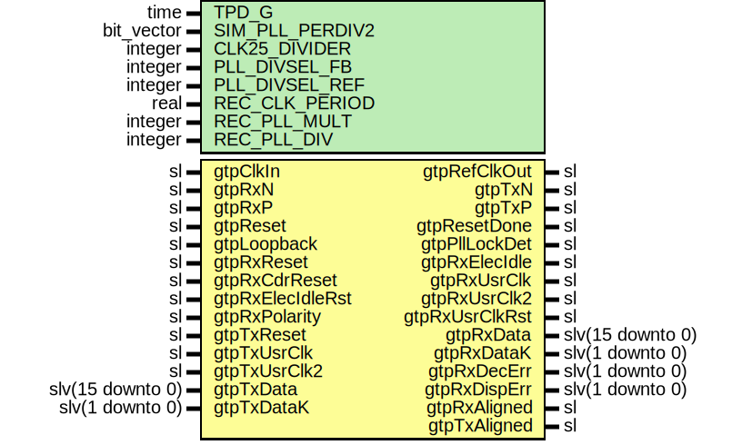

# Entity: Gtp16FixedLatCore

- **File**: Gtp16FixedLatCore.vhd
## Diagram

## Description

-----------------------------------------------------------------------------
 Company    : SLAC National Accelerator Laboratory
-----------------------------------------------------------------------------
 Description: Pgp2 Gtp Low Latency Core
-----------------------------------------------------------------------------
 This file is part of 'SLAC Firmware Standard Library'.
 It is subject to the license terms in the LICENSE.txt file found in the
 top-level directory of this distribution and at:
    https://confluence.slac.stanford.edu/display/ppareg/LICENSE.html.
 No part of 'SLAC Firmware Standard Library', including this file,
 may be copied, modified, propagated, or distributed except according to
 the terms contained in the LICENSE.txt file.
-----------------------------------------------------------------------------
## Generics

| Generic name    | Type       | Value  | Description                 |
| --------------- | ---------- | ------ | --------------------------- |
| TPD_G           | time       | 1 ns   |                             |
| SIM_PLL_PERDIV2 | bit_vector | X"0C8" | GTP Parameters              |
| CLK25_DIVIDER   | integer    | 5      |                             |
| PLL_DIVSEL_FB   | integer    | 2      |                             |
| PLL_DIVSEL_REF  | integer    | 1      |                             |
| REC_CLK_PERIOD  | real       | 4.000  | Recovered clock parameters  |
| REC_PLL_MULT    | integer    | 4      |                             |
| REC_PLL_DIV     | integer    | 1      |                             |
## Ports

| Port name        | Direction | Type             | Description                   |
| ---------------- | --------- | ---------------- | ----------------------------- |
| gtpClkIn         | in        | sl               |  GTP Reference Clock In       |
| gtpRefClkOut     | out       | sl               |  GTP Reference Clock Output   |
| gtpRxN           | in        | sl               |  GTP Serial Receive Negative  |
| gtpRxP           | in        | sl               |  GTP Serial Receive Positive  |
| gtpTxN           | out       | sl               |  GTP Serial Transmit Negative |
| gtpTxP           | out       | sl               |  GTP Serial Transmit Positive |
| gtpReset         | in        | sl               | Shared                        |
| gtpResetDone     | out       | sl               |                               |
| gtpPllLockDet    | out       | sl               |                               |
| gtpLoopback      | in        | sl               |                               |
| gtpRxReset       | in        | sl               | Rx Resets                     |
| gtpRxCdrReset    | in        | sl               |                               |
| gtpRxElecIdle    | out       | sl               |                               |
| gtpRxElecIdleRst | in        | sl               |                               |
| gtpRxUsrClk      | out       | sl               |  1 byte clock (recovered)     |
| gtpRxUsrClk2     | out       | sl               |  2 byte clock (recovered)     |
| gtpRxUsrClkRst   | out       | sl               |  Reset for 2 byte clock       |
| gtpRxData        | out       | slv(15 downto 0) | Rx Data                       |
| gtpRxDataK       | out       | slv(1 downto 0)  |                               |
| gtpRxDecErr      | out       | slv(1 downto 0)  |                               |
| gtpRxDispErr     | out       | slv(1 downto 0)  |                               |
| gtpRxPolarity    | in        | sl               |                               |
| gtpRxAligned     | out       | sl               |                               |
| gtpTxReset       | in        | sl               | Tx Resets                     |
| gtpTxUsrClk      | in        | sl               | Tx Clocks                     |
| gtpTxUsrClk2     | in        | sl               |                               |
| gtpTxAligned     | out       | sl               |                               |
| gtpTxData        | in        | slv(15 downto 0) | Tx Data                       |
| gtpTxDataK       | in        | slv(1 downto 0)  |                               |
## Signals

| Name                 | Type             | Description                                          |
| -------------------- | ---------------- | ---------------------------------------------------- |
| gtpPllLockDetInt     | sl               |                                                      |
| tmpRefClkOut         | sl               |                                                      |
| gtpRxRecClk          | sl               |  Raw rxrecclk from GTP, not square, needs DCM or PLL |
| gtpRxRecClkBufG      | sl               |                                                      |
| rxRecClkPllOut0      | sl               |  1 byte clock                                        |
| rxRecClkPllOut1      | sl               |  2 byte clock                                        |
| rxRecClkPllOut2      | sl               |  2 byte clock (180 deg phase shift)                  |
| rxRecClkPllFbIn      | sl               |                                                      |
| rxRecClkPllFbOut     | sl               |                                                      |
| rxRecClkPllLocked    | sl               |                                                      |
| rxUsrClk2Sel         | sl               |  Selects which 2 byte clock is used                  |
| gtpRxUsrClkInt       | sl               |                                                      |
| gtpRxUsrClk2Int      | sl               |                                                      |
| gtpRxUsrClkRstInt    | sl               |                                                      |
| gtpRxDataRaw         | slv(19 downto 0) |  Rx Data                                             |
| gtpRxDecErrInt       | slv(1 downto 0)  |                                                      |
| gtpRxDispErrInt      | slv(1 downto 0)  |                                                      |
| gtpRxSlide           | sl               |  Rx Phase Alignment                                  |
| gtpTxEnPmaPhaseAlign | sl               |  Tx Phase Alignment                                  |
| gtpTxPmaSetPhase     | sl               |                                                      |
| gtpRxCdrResetFinal   | sl               |  Resets                                              |
| rxCommaAlignReset    | sl               |                                                      |
## Instantiations

- RX_REC_CLK_BUFG: BUFG
- RX_REC_CLK_PLL: PLL_BASE
 **Description**
 From GTP RXRECCLK

- RX_REC_CLK_PLL_FB_BUFG: BUFG
 **Description**
 Feedback for PLL

- RX_USR_CLK_BUFG: BUFG
 **Description**
 Buffer pll outputs

- RX_USR_CLK2_BUFMUX: BUFGMUX_CTRL
- RstSync_1: surf.RstSync
- GtpRxCommaAligner_1: surf.GtpRxCommaAligner
 **Description**
 Manual comma aligner

- Decoder8b10b_1: surf.Decoder8b10b
- GtpTxPhaseAligner_1: surf.GtpTxPhaseAligner
 **Description**
------------------------------------------------------------------------------------------------
 Tx Data Path
------------------------------------------------------------------------------------------------

- REFCLK_BUFG: BUFG
- UGtpDual: GTP_DUAL
 **Description**
------------------------------------------------------------------------------------------------
 GTP Instance
------------------------------------------------------------------------------------------------
--------------------------- GTP_DUAL Instance  --------------------------

