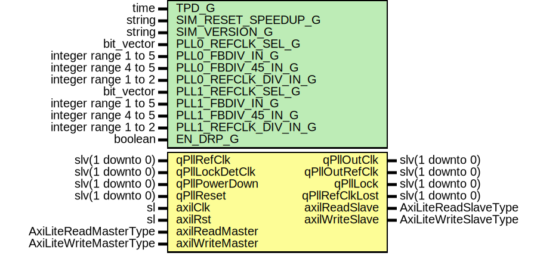

# Entity: Gtp7QuadPll

- **File**: Gtp7QuadPll.vhd
## Diagram

## Description

-----------------------------------------------------------------------------
 Company    : SLAC National Accelerator Laboratory
-----------------------------------------------------------------------------
 Description: Wrapper for Xilinx 7-series GTP's QPLL
-----------------------------------------------------------------------------
 This file is part of 'SLAC Firmware Standard Library'.
 It is subject to the license terms in the LICENSE.txt file found in the
 top-level directory of this distribution and at:
    https://confluence.slac.stanford.edu/display/ppareg/LICENSE.html.
 No part of 'SLAC Firmware Standard Library', including this file,
 may be copied, modified, propagated, or distributed except according to
 the terms contained in the LICENSE.txt file.
-----------------------------------------------------------------------------
## Generics

| Generic name         | Type                 | Value  | Description |
| -------------------- | -------------------- | ------ | ----------- |
| TPD_G                | time                 | 1 ns   |             |
| SIM_RESET_SPEEDUP_G  | string               | "TRUE" |             |
| SIM_VERSION_G        | string               | "1.0"  |             |
| PLL0_REFCLK_SEL_G    | bit_vector           | "001"  |             |
| PLL0_FBDIV_IN_G      | integer range 1 to 5 | 4      |             |
| PLL0_FBDIV_45_IN_G   | integer range 4 to 5 | 5      |             |
| PLL0_REFCLK_DIV_IN_G | integer range 1 to 2 | 1      |             |
| PLL1_REFCLK_SEL_G    | bit_vector           | "001"  |             |
| PLL1_FBDIV_IN_G      | integer range 1 to 5 | 4      |             |
| PLL1_FBDIV_45_IN_G   | integer range 4 to 5 | 5      |             |
| PLL1_REFCLK_DIV_IN_G | integer range 1 to 2 | 1      |             |
| EN_DRP_G             | boolean              | true   |             |
## Ports

| Port name       | Direction | Type                   | Description        |
| --------------- | --------- | ---------------------- | ------------------ |
| qPllRefClk      | in        | slv(1 downto 0)        |                    |
| qPllOutClk      | out       | slv(1 downto 0)        |                    |
| qPllOutRefClk   | out       | slv(1 downto 0)        |                    |
| qPllLock        | out       | slv(1 downto 0)        |                    |
| qPllLockDetClk  | in        | slv(1 downto 0)        |  Lock detect clock |
| qPllRefClkLost  | out       | slv(1 downto 0)        |                    |
| qPllPowerDown   | in        | slv(1 downto 0)        |                    |
| qPllReset       | in        | slv(1 downto 0)        |                    |
| axilClk         | in        | sl                     | AXI-Lite Interface |
| axilRst         | in        | sl                     |                    |
| axilReadMaster  | in        | AxiLiteReadMasterType  |                    |
| axilReadSlave   | out       | AxiLiteReadSlaveType   |                    |
| axilWriteMaster | in        | AxiLiteWriteMasterType |                    |
| axilWriteSlave  | out       | AxiLiteWriteSlaveType  |                    |
## Signals

| Name          | Type             | Description |
| ------------- | ---------------- | ----------- |
| gtRefClk0     | sl               |             |
| gtRefClk1     | sl               |             |
| gtEastRefClk0 | sl               |             |
| gtEastRefClk1 | sl               |             |
| gtWestRefClk0 | sl               |             |
| gtWestRefClk1 | sl               |             |
| gtGRefClk0    | sl               |             |
| gtGRefClk1    | sl               |             |
| drpEn         | sl               |             |
| drpWe         | sl               |             |
| drpRdy        | sl               |             |
| drpAddr       | slv(7 downto 0)  |             |
| drpDi         | slv(15 downto 0) |             |
| drpDo         | slv(15 downto 0) |             |
## Instantiations

- gtpe2_common_0_i: GTPE2_COMMON
