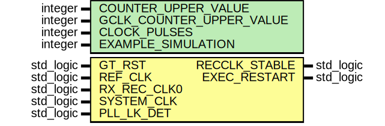

# Entity: Gtp7RecClkMonitor

- **File**: Gtp7RecClkMonitor.vhd
## Diagram

## Description

////////////////////////////////////////////////////////////////////////////////
//   ____  ____
//  /   /\/   /
// /___/  \  /    Vendor: Xilinx
// \   \   \/     Version : 2.2
//  \   \         Application : 7 Series FPGAs Transceivers Wizard
//  /   /         Filename : Gtp7RecClkMonitor.vhd
// /___/   /\
// \   \  /  \
//  \___\/\___\
//
//
  Description :     This module is the ppm monitor between the
  		      GT RxRecClk and the reference clock

                    This module will declare that the Rx RECCLK is stable if the
                    recovered clock is within +/-5000PPM of the reference clock.

                    There are 3 counters running on local clocks for both
                    recovered clocks and one for the reference clock.  The
                    COUNTER_UPPER_VALUE parameter is the width of these
                    counters. The PPM offset is checked when these counters
                    roll over.

                    There is also a counter running on the system clock.
                    This can be running at a much lower frequency and is
                    running on a BUFG.

                    To set the parameters correctly here is what you need to
                    do.  Lets assume taht the reference and recovered
                    clocks are running at 156MHz and the system clock is
                    running at 50MHz.

                    To ensure that the interval is long enough we want to
                    to make the COUNTER_UPPER_VALUE to be reasonable.  The
                    CLOCK_PULSES is the number of sytem clock cycles we can
                    expect to be off based on these frequencies:

                    Example: Rec Clk and Ref Clk 156MHz, System clock 50MHz
                             PPM Offset to tolerate +/- 5000PPM

                    COUNTER_UPPER_VALUE = 15 -> 2^15 counter = 32768
                    GCLK_COUNTER_UPPER_VALUE = 15 -> 2^15 counter = 32768

                    PPM OFFSET = 5000 => 32768 * 5000/1000000 = 164

                    Now we are using the system clock to do the
                    calculations, therfore we need to scale the PPM_OFFSET
                    accordingly.

                    CLOCK_PULSES = PPM_OFFSET * sysclk_freq/refclk_freq
                                 = 164 * 50/156 = 52

                    When the counters are checked if they are off by less
                    than 52, we can delcare that the particular RECCLK is
                    stable.

                    All FFs that have the _meta are metastability FFs and
                    can be ignored from a timing perspective. The following
                    constraint can be added to the UCF to ensure that they
                    are ignored:

                    INST "*_meta" TNM = "METASTABILITY_FFS";
                    TIMESPEC "TS_METASTABILITY" = FROM FFS TO "METASTABILITY_FFS" TIG;

 Module KintexGtxLowLat_RECCLK_MONITOR
 Generated by Xilinx 7 Series FPGAs Transceivers Wizard

 (c) Copyright 2010-2012 Xilinx, Inc. All rights reserved.

 This file contains confidential and proprietary information
 of Xilinx, Inc. and is protected under U.S. and
 international copyright and other intellectual property
 laws.

 DISCLAIMER
 This disclaimer is not a license and does not grant any
 rights to the materials distributed herewith. Except as
 otherwise provided in a valid license issued to you by
 Xilinx, and to the maximum extent permitted by applicable
 law: (1) THESE MATERIALS ARE MADE AVAILABLE "AS IS" AND
 WITH ALL FAULTS, AND XILINX HEREBY DISCLAIMS ALL WARRANTIES
 AND CONDITIONS, EXPRESS, IMPLIED, OR STATUTORY, INCLUDING
 BUT NOT LIMITED TO WARRANTIES OF MERCHANTABILITY, NON-
 INFRINGEMENT, OR FITNESS FOR ANY PARTICULAR PURPOSE; and
 (2) Xilinx shall not be liable (whether in contract or tort,
 including negligence, or under any other theory of
 liability) for any loss or damage of any kind or nature
 related to, arising under or in connection with these
 materials, including for any direct, or any indirect,
 special, incidental, or consequential loss or damage
 (including loss of data, profits, goodwill, or any type of
 loss or damage suffered as a result of any action brought
 by a third party) even if such damage or loss was
 reasonably foreseeable or Xilinx had been advised of the
 possibility of the same.

 CRITICAL APPLICATIONS
 Xilinx products are not designed or intended to be fail-
 safe, or for use in any application requiring fail-safe
 performance, such as life-support or safety devices or
 systems, Class III medical devices, nuclear facilities,
 applications related to the deployment of airbags, or any
 other applications that could lead to death, personal
 injury, or severe property or environmental damage
 (individually and collectively, "Critical
 Applications"). Customer assumes the sole risk and
 liability of any use of Xilinx products in Critical
 Applications, subject only to applicable laws and
 regulations governing limitations on product liability.

 THIS COPYRIGHT NOTICE AND DISCLAIMER MUST BE RETAINED AS
 PART OF THIS FILE AT ALL TIMES.
*******************************************************************************
## Generics

| Generic name             | Type    | Value | Description                                         |
| ------------------------ | ------- | ----- | --------------------------------------------------- |
| COUNTER_UPPER_VALUE      | integer | 20    | ppm counter. For 2^20 cntr.                         |
| GCLK_COUNTER_UPPER_VALUE | integer | 20    | ppm counter. For 2^20 cntr.                         |
| CLOCK_PULSES             | integer | 5000  |                                                     |
| EXAMPLE_SIMULATION       | integer | 0     | The simulation-only constructs are not used but the |
## Ports

| Port name     | Direction | Type      | Description                                                                        |
| ------------- | --------- | --------- | ---------------------------------------------------------------------------------- |
| GT_RST        | in        | std_logic |                                                                                    |
| REF_CLK       | in        | std_logic |                                                                                    |
| RX_REC_CLK0   | in        | std_logic |                                                                                    |
| SYSTEM_CLK    | in        | std_logic |  This would be your System Clock;                                                  |
| PLL_LK_DET    | in        | std_logic |  This signal is verified in the Rx-FSM,                                            |
| RECCLK_STABLE | out       | std_logic | it can be tied high as the PLL-LK has already beenverified in the previous state.  |
| EXEC_RESTART  | out       | std_logic |                                                                                    |
## Signals

| Name                       | Type                                                    | Description |
| -------------------------- | ------------------------------------------------------- | ----------- |
| state                      | FSM                                                     |             |
| ref_clk_cnt                | std_logic_vector (COUNTER_UPPER_VALUE-1 downto  0)      |             |
| rec_clk0_cnt               | std_logic_vector (COUNTER_UPPER_VALUE-1 downto  0)      |             |
| rec_clk0_msb               | std_logic_vector (2 downto  1)                          |             |
| ref_clk_msb                | std_logic_vector (2 downto  1)                          |             |
| rec_clk_0_msb_meta         | std_logic                                               |             |
| ref_clk_msb_meta           | std_logic                                               |             |
| sys_clk_counter            | std_logic_vector (GCLK_COUNTER_UPPER_VALUE-1 downto  0) |             |
| rec_clk0_compare_cnt_latch | std_logic_vector (GCLK_COUNTER_UPPER_VALUE-1 downto  0) |             |
| ref_clk_compare_cnt_latch  | std_logic_vector (GCLK_COUNTER_UPPER_VALUE-1 downto  0) |             |
| g_clk_rst_meta             | std_logic                                               |             |
| g_clk_rst_sync             | std_logic                                               |             |
| gt_pll_locked_meta         | std_logic                                               |             |
| gt_pll_locked_sync         | std_logic                                               |             |
| reset_logic_rec0_meta      | std_logic                                               |             |
| reset_logic_rec0_sync      | std_logic                                               |             |
| reset_logic_ref_meta       | std_logic                                               |             |
| reset_logic_ref_sync       | std_logic                                               |             |
| rec_clk0_edge_event        | std_logic                                               |             |
| ref_clk_edge_event         | std_logic_vector (1 downto 0)                           |             |
| ppm0                       | std_logic_vector (GCLK_COUNTER_UPPER_VALUE-1 downto  0) |             |
| recclk_stable0             | std_logic                                               |             |
| reset_logic                | std_logic_vector (3 downto  0)                          |             |
| ref_clk_edge_rt            | std_logic_vector (1 downto  0)                          |             |
| g_clk_rst                  | std_logic                                               |             |
| gt_pll_locked              | std_logic                                               |             |
| rec_clk0_edge              | std_logic                                               |             |
| ref_clk_edge               | std_logic                                               |             |
| recclk_stable0_int         | std_logic                                               |             |
## Constants

| Name       | Type    | Value            | Description |
| ---------- | ------- | ---------------- | ----------- |
| simulation | boolean |  simulation_func |             |
## Types

| Name | Type                                                                                                                                                                                                                                                         | Description |
| ---- | ------------------------------------------------------------------------------------------------------------------------------------------------------------------------------------------------------------------------------------------------------------ | ----------- |
| FSM  | (WAIT_FOR_LOCK, REFCLK_EVENT, CALC_PPM_DIFF, CHECK_SIGN, COMP_CNTR, RESTART)  |             |
## Functions
- simulation_func () return boolean 
