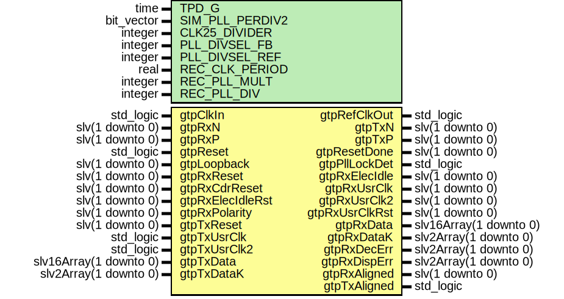

# Entity: GtpDualFixedLatCore

- **File**: GtpDualFixedLatCore.vhd
## Diagram

## Description

Company    : SLAC National Accelerator Laboratory
Description: Pgp2 Gtp Low Latency Core
This file is part of 'SLAC Firmware Standard Library'.
It is subject to the license terms in the LICENSE.txt file found in the
top-level directory of this distribution and at:
   https://confluence.slac.stanford.edu/display/ppareg/LICENSE.html.
No part of 'SLAC Firmware Standard Library', including this file,
may be copied, modified, propagated, or distributed except according to
the terms contained in the LICENSE.txt file.
## Generics

| Generic name    | Type       | Value  | Description                 |
| --------------- | ---------- | ------ | --------------------------- |
| TPD_G           | time       | 1 ns   |                             |
| SIM_PLL_PERDIV2 | bit_vector | X"0C8" | "011001000";                |
| CLK25_DIVIDER   | integer    | 5      |                             |
| PLL_DIVSEL_FB   | integer    | 2      |                             |
| PLL_DIVSEL_REF  | integer    | 1      |                             |
| REC_CLK_PERIOD  | real       | 4.000  | Recovered clock parameters  |
| REC_PLL_MULT    | integer    | 4      |                             |
| REC_PLL_DIV     | integer    | 1      |                             |
## Ports

| Port name        | Direction | Type                   | Description                  |
| ---------------- | --------- | ---------------------- | ---------------------------- |
| gtpClkIn         | in        | std_logic              | GTP Reference Clock In       |
| gtpRefClkOut     | out       | std_logic              | GTP Reference Clock Output   |
| gtpRxN           | in        | slv(1 downto 0)        | GTP Serial Receive Negative  |
| gtpRxP           | in        | slv(1 downto 0)        | GTP Serial Receive Positive  |
| gtpTxN           | out       | slv(1 downto 0)        | GTP Serial Transmit Negative |
| gtpTxP           | out       | slv(1 downto 0)        | GTP Serial Transmit Positive |
| gtpReset         | in        | std_logic              | Shared                       |
| gtpResetDone     | out       | slv(1 downto 0)        |                              |
| gtpPllLockDet    | out       | std_logic              |                              |
| gtpLoopback      | in        | slv(1 downto 0)        |                              |
| gtpRxReset       | in        | slv(1 downto 0)        | Rx Resets                    |
| gtpRxCdrReset    | in        | slv(1 downto 0)        |                              |
| gtpRxElecIdle    | out       | slv(1 downto 0)        |                              |
| gtpRxElecIdleRst | in        | slv(1 downto 0)        |                              |
| gtpRxUsrClk      | out       | slv(1 downto 0)        | 1 byte clock (recovered)     |
| gtpRxUsrClk2     | out       | slv(1 downto 0)        | 2 byte clock (recovered)     |
| gtpRxUsrClkRst   | out       | slv(1 downto 0)        | Reset for 2 byte clock       |
| gtpRxData        | out       | slv16Array(1 downto 0) | Rx Data                      |
| gtpRxDataK       | out       | slv2Array(1 downto 0)  |                              |
| gtpRxDecErr      | out       | slv2Array(1 downto 0)  |                              |
| gtpRxDispErr     | out       | slv2Array(1 downto 0)  |                              |
| gtpRxPolarity    | in        | slv(1 downto 0)        |                              |
| gtpRxAligned     | out       | slv(1 downto 0)        |                              |
| gtpTxReset       | in        | slv(1 downto 0)        | Tx Resets                    |
| gtpTxUsrClk      | in        | std_logic              | Tx Clocks                    |
| gtpTxUsrClk2     | in        | std_logic              |                              |
| gtpTxAligned     | out       | std_logic              |                              |
| gtpTxData        | in        | slv16Array(1 downto 0) | Tx Data                      |
| gtpTxDataK       | in        | slv2Array(1 downto 0)  |                              |
## Signals

| Name                 | Type                   | Description                                         |
| -------------------- | ---------------------- | --------------------------------------------------- |
| gtpPllLockDetInt     | std_logic              |                                                     |
| tmpRefClkOut         | std_logic              |                                                     |
| gtpRxRecClk          | slv(1 downto 0)        | Raw rxrecclk from GTP, not square, needs DCM or PLL |
| gtpRxRecClkBufG      | slv(1 downto 0)        |                                                     |
| rxRecClkPllOut0      | slv(1 downto 0)        | 1 byte clock                                        |
| rxRecClkPllOut1      | slv(1 downto 0)        | 2 byte clock                                        |
| rxRecClkPllOut2      | slv(1 downto 0)        | 2 byte clock (180 deg phase shift)                  |
| rxRecClkPllFbIn      | slv(1 downto 0)        |                                                     |
| rxRecClkPllFbOut     | slv(1 downto 0)        |                                                     |
| rxRecClkPllLocked    | slv(1 downto 0)        |                                                     |
| rxUsrClk2Sel         | slv(1 downto 0)        | Selects which 2 byte clock is used                  |
| gtpRxUsrClkInt       | slv(1 downto 0)        |                                                     |
| gtpRxUsrClk2Int      | slv(1 downto 0)        |                                                     |
| gtpRxUsrClkRstInt    | slv(1 downto 0)        |                                                     |
| gtpRxDataRaw         | slv20Array(1 downto 0) | Rx Data                                             |
| gtpRxDecErrInt       | slv2Array(1 downto 0)  |                                                     |
| gtpRxDispErrInt      | slv2Array(1 downto 0)  |                                                     |
| gtpRxSlide           | slv(1 downto 0)        | Rx Phase Alignment                                  |
| gtpTxEnPmaPhaseAlign | std_logic              | Tx Phase Alignment                                  |
| gtpTxPmaSetPhase     | std_logic              |                                                     |
| gtpRxCdrResetFinal   | slv(1 downto 0)        | Resets                                              |
| rxCommaAlignReset    | slv(1 downto 0)        |                                                     |
## Instantiations

- GtpTxPhaseAligner_1: surf.GtpTxPhaseAligner
**Description**
Tx Data Path

- REFCLK_BUFG: BUFG
- UGtpDual: GTP_DUAL
**Description**
GTP Instance

