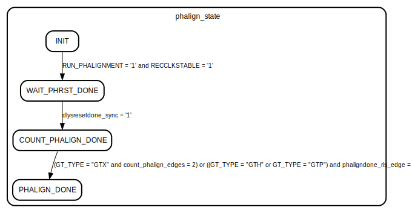

# Entity: Gtx7AutoPhaseAligner

- **File**: Gtx7AutoPhaseAligner.vhd
## Diagram

## Description

////////////////////////////////////////////////////////////////////////////////
//   ____  ____
//  /   /\/   /
// /___/  \  /    Vendor: Xilinx
// \   \   \/     Version : 2.5
//  \   \         Application : 7 Series FPGAs Transceivers Wizard
//  /   /         Filename : gtwizard_v2_5_auto_phase_align.vhd
// /___/   /\
// \   \  /  \
//  \___\/\___\
//
//
  Description : The logic below implements the procedure to do automatic phase-alignment
                on the 7-series GTX as described in ug476pdf, version 1.3,
                Chapters "Using the TX Phase Alignment to Bypass the TX Buffer"
                and "Using the RX Phase Alignment to Bypass the RX Elastic Buffer"
                Should the logic below differ from what is described in a later version
                of the user-guide, you are using an auto-alignment block, which is
                out of date and needs to be updated for safe operation.

 Module gtwizard_v2_5_AUTO_PHASE_ALIGN
 Generated by Xilinx 7 Series FPGAs Transceivers Wizard

 (c) Copyright 2010-2012 Xilinx, Inc. All rights reserved.

 This file contains confidential and proprietary information
 of Xilinx, Inc. and is protected under U.S. and
 international copyright and other intellectual property
 laws.

 DISCLAIMER
 This disclaimer is not a license and does not grant any
 rights to the materials distributed herewith. Except as
 otherwise provided in a valid license issued to you by
 Xilinx, and to the maximum extent permitted by applicable
 law: (1) THESE MATERIALS ARE MADE AVAILABLE "AS IS" AND
 WITH ALL FAULTS, AND XILINX HEREBY DISCLAIMS ALL WARRANTIES
 AND CONDITIONS, EXPRESS, IMPLIED, OR STATUTORY, INCLUDING
 BUT NOT LIMITED TO WARRANTIES OF MERCHANTABILITY, NON-
 INFRINGEMENT, OR FITNESS FOR ANY PARTICULAR PURPOSE; and
 (2) Xilinx shall not be liable (whether in contract or tort,
 including negligence, or under any other theory of
 liability) for any loss or damage of any kind or nature
 related to, arising under or in connection with these
 materials, including for any direct, or any indirect,
 special, incidental, or consequential loss or damage
 (including loss of data, profits, goodwill, or any type of
 loss or damage suffered as a result of any action brought
 by a third party) even if such damage or loss was
 reasonably foreseeable or Xilinx had been advised of the
 possibility of the same.

 CRITICAL APPLICATIONS
 Xilinx products are not designed or intended to be fail-
 safe, or for use in any application requiring fail-safe
 performance, such as life-support or safety devices or
 systems, Class III medical devices, nuclear facilities,
 applications related to the deployment of airbags, or any
 other applications that could lead to death, personal
 injury, or severe property or environmental damage
 (individually and collectively, "Critical
 Applications"). Customer assumes the sole risk and
 liability of any use of Xilinx products in Critical
 Applications, subject only to applicable laws and
 regulations governing limitations on product liability.

 THIS COPYRIGHT NOTICE AND DISCLAIMER MUST BE RETAINED AS
 PART OF THIS FILE AT ALL TIMES.
*****************************************************************************
## Generics

| Generic name | Type   | Value | Description |
| ------------ | ------ | ----- | ----------- |
| GT_TYPE      | string | "GTX" |             |
## Ports

| Port name            | Direction | Type      | Description                                                              |
| -------------------- | --------- | --------- | ------------------------------------------------------------------------ |
| STABLE_CLOCK         | in        | STD_LOGIC | Stable Clock, either a stable clock from the PCB                         |
| RUN_PHALIGNMENT      | in        | STD_LOGIC | Signal from the main Reset-FSM to run the auto phase-alignment procedure |
| PHASE_ALIGNMENT_DONE | out       | STD_LOGIC |  Auto phase-alignment performed sucessfully                              |
| PHALIGNDONE          | in        | STD_LOGIC | \ Phase-alignment signals from and to the                                |
| DLYSRESET            | out       | STD_LOGIC |  |transceiver.                                                           |
| DLYSRESETDONE        | in        | STD_LOGIC | /                                                                        |
| RECCLKSTABLE         | in        | STD_LOGIC | /on the RX-side.                                                         |
## Signals

| Name                 | Type                 | Description |
| -------------------- | -------------------- | ----------- |
| phalign_state        | phase_align_auto_fsm |             |
| phaligndone_prev     | std_logic            |             |
| phaligndone_ris_edge | std_logic            |             |
| count_phalign_edges  | integer range 0 to 3 |             |
| phaligndone_sync     | std_logic            |             |
| dlysresetdone_sync   | std_logic            |             |
## Types

| Name                 | Type                                                                                                                                                                     | Description |
| -------------------- | ------------------------------------------------------------------------------------------------------------------------------------------------------------------------ | ----------- |
| phase_align_auto_fsm | ( INIT,  WAIT_PHRST_DONE,  COUNT_PHALIGN_DONE,  PHALIGN_DONE )  |             |
## Processes
- unnamed: ( STABLE_CLOCK )
- unnamed: ( STABLE_CLOCK )
## Instantiations

- sync_PHALIGNDONE: surf.Synchronizer
- sync_DLYSRESETDONE: surf.Synchronizer
## State machines

