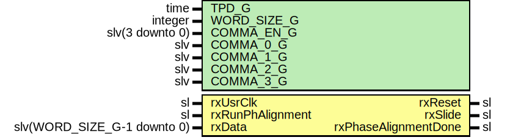

# Entity: Gtx7RxFixedLatPhaseAligner

## Diagram

## Description

Company    : SLAC National Accelerator Laboratory
Description:
Used in conjunction for a Xilinx 7 Series GTX.
Given raw 8b10b encoded data presented 2 bytes at a time (20 bits),
attempts to align any observed comma to the lower byte.
Assumes GTX comma align is enabled and in PMA mode.
Comma is configurable through the COMMA_G generic.
If an odd number of rxSlides is required for alignment, resets the GTX RX
so that a new CDR lock can be obtained. The GTX in PMA Slide Mode shifts
the phase of the output clock only every other slide. This module's
purpose is to obtain an output clock that exactly matches the phase of the
commas.
This file is part of 'SLAC Firmware Standard Library'.
It is subject to the license terms in the LICENSE.txt file found in the
top-level directory of this distribution and at:
   https://confluence.slac.stanford.edu/display/ppareg/LICENSE.html.
No part of 'SLAC Firmware Standard Library', including this file,
may be copied, modified, propagated, or distributed except according to
the terms contained in the LICENSE.txt file.
## Generics

| Generic name | Type            | Value                  | Description |
| ------------ | --------------- | ---------------------- | ----------- |
| TPD_G        | time            | 1 ns                   |             |
| WORD_SIZE_G  | integer         | 20                     |             |
| COMMA_EN_G   | slv(3 downto 0) | "0011"                 |             |
| COMMA_0_G    | slv             | "----------0101111100" |             |
| COMMA_1_G    | slv             | "----------1010000011" |             |
| COMMA_2_G    | slv             | "XXXXXXXXXXXXXXXXXXXX" |             |
| COMMA_3_G    | slv             | "XXXXXXXXXXXXXXXXXXXX" |             |
## Ports

| Port name            | Direction | Type                        | Description                                           |
| -------------------- | --------- | --------------------------- | ----------------------------------------------------- |
| rxUsrClk             | in        | sl                          |                                                       |
| rxRunPhAlignment     | in        | sl                          | From RxRst, active low reset, not clocked by rxUsrClk |
| rxData               | in        | slv(WORD_SIZE_G-1 downto 0) | Encoded raw rx data                                   |
| rxReset              | out       | sl                          |                                                       |
| rxSlide              | out       | sl                          | RXSLIDE input to GTX                                  |
| rxPhaseAlignmentDone | out       | sl                          |                                                       |
## Signals

| Name                 | Type    | Description |
| -------------------- | ------- | ----------- |
| r                    | RegType |             |
|  rin                 | RegType |             |
| rxRunPhAlignmentSync | sl      |             |
## Constants

| Name         | Type    | Value                                                                                                                                                                                                                                                                                                                                                                                                                                                                                                                                                                                               | Description                            |
| ------------ | ------- | --------------------------------------------------------------------------------------------------------------------------------------------------------------------------------------------------------------------------------------------------------------------------------------------------------------------------------------------------------------------------------------------------------------------------------------------------------------------------------------------------------------------------------------------------------------------------------------------------- | -------------------------------------- |
| SLIDE_WAIT_C | integer |  32                                                                                                                                                                                                                                                                                                                                                                                                                                                                                                                                                                                                 | Dictated by UG476 GTX Tranceiver Guide |
| REG_RESET_C  | RegType |        (state                => SEARCH_S,         alignmentValue       => 0,         last                 => (others => '0'),         slideCount           => (others => '0'),         slideWaitCounter     => (others => '0'),         rxReset              => '0',         rxSlide              => '0',         rxPhaseAlignmentDone => '0') |                                        |
## Types

| Name      | Type                                                                                                                                                                                                   | Description |
| --------- | ------------------------------------------------------------------------------------------------------------------------------------------------------------------------------------------------------ | ----------- |
| StateType | (SEARCH_S,  RESET_S,  SLIDE_S,  SLIDE_WAIT_S,  ALIGNED_S)  |             |
| RegType   |                                                                                                                                                                                                        |             |
## Processes
- comb: ( r, rxData )
- seq: ( rxRunPhAlignmentSync, rxUsrClk )
## Instantiations

- RstSync_1: surf.RstSync
