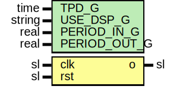

# Entity: Heartbeat

## Diagram

## Description

Company    : SLAC National Accelerator Laboratory
Description: Heartbeat LED output
This file is part of 'SLAC Firmware Standard Library'.
It is subject to the license terms in the LICENSE.txt file found in the
top-level directory of this distribution and at:
   https://confluence.slac.stanford.edu/display/ppareg/LICENSE.html.
No part of 'SLAC Firmware Standard Library', including this file,
may be copied, modified, propagated, or distributed except according to
the terms contained in the LICENSE.txt file.
## Generics

| Generic name | Type   | Value  | Description |
| ------------ | ------ | ------ | ----------- |
| TPD_G        | time   | 1 ns   |             |
| USE_DSP_G    | string | "no"   |             |
| PERIOD_IN_G  | real   | 6.4E-9 |             |
| PERIOD_OUT_G | real   | 1.0E-0 |             |
## Ports

| Port name | Direction | Type | Description |
| --------- | --------- | ---- | ----------- |
| clk       | in        | sl   |             |
| rst       | in        | sl   |             |
| o         | out       | sl   |             |
## Signals

| Name | Type    | Description |
| ---- | ------- | ----------- |
| r    | RegType |             |
| rin  | RegType |             |
## Constants

| Name       | Type    | Value                                                                                  | Description |
| ---------- | ------- | -------------------------------------------------------------------------------------- | ----------- |
| CNT_MAX_C  | natural |  getTimeRatio(PERIOD_OUT_G,  (2.0 * PERIOD_IN_G))   |             |
| CNT_SIZE_C | natural |  bitSize(CNT_MAX_C)                                                                    |             |
| REG_INIT_C | RegType |  (       cnt => (others => '0'),        o   => '0') |             |
## Types

| Name    | Type | Description |
| ------- | ---- | ----------- |
| RegType |      |             |
## Processes
- comb: ( r, rst )
- seq: ( clk )
