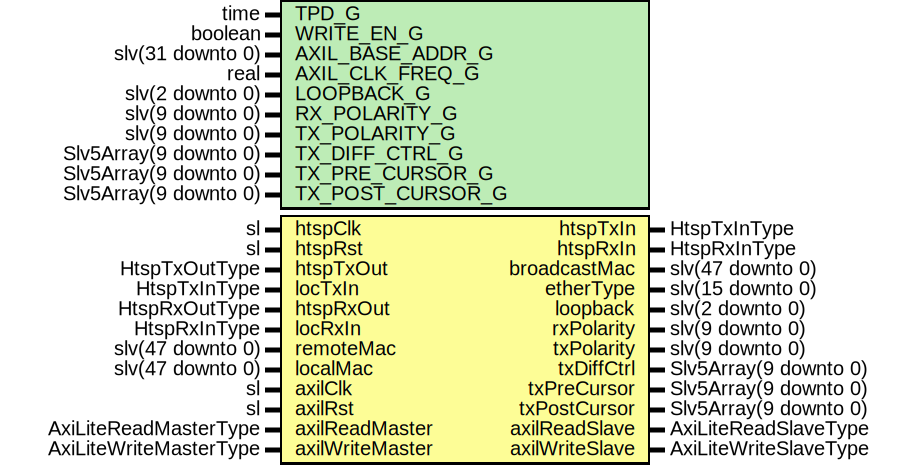

# Entity: HtspAxiL

## Diagram

## Description

Title      : HTSP: https://confluence.slac.stanford.edu/x/pQmODw
Company    : SLAC National Accelerator Laboratory
Description: AXI-Lite block to manage the HTSP Ethernet interface.
This file is part of 'SLAC Firmware Standard Library'.
It is subject to the license terms in the LICENSE.txt file found in the
top-level directory of this distribution and at:
   https://confluence.slac.stanford.edu/display/ppareg/LICENSE.html.
No part of 'SLAC Firmware Standard Library', including this file,
may be copied, modified, propagated, or distributed except according to
the terms contained in the LICENSE.txt file.
## Generics

| Generic name     | Type                  | Value               | Description                               |
| ---------------- | --------------------- | ------------------- | ----------------------------------------- |
| TPD_G            | time                  | 1 ns                |                                           |
| WRITE_EN_G       | boolean               | false               | Set to false when on remote end of a link |
| AXIL_BASE_ADDR_G | slv(31 downto 0)      | (others => '0')     |                                           |
| AXIL_CLK_FREQ_G  | real                  | 156.25E+6           |                                           |
| LOOPBACK_G       | slv(2 downto 0)       | (others => '0')     |                                           |
| RX_POLARITY_G    | slv(9 downto 0)       | (others => '0')     |                                           |
| TX_POLARITY_G    | slv(9 downto 0)       | (others => '0')     |                                           |
| TX_DIFF_CTRL_G   | Slv5Array(9 downto 0) | (others => "11000") |                                           |
| TX_PRE_CURSOR_G  | Slv5Array(9 downto 0) | (others => "00000") |                                           |
| TX_POST_CURSOR_G | Slv5Array(9 downto 0) | (others => "00000") |                                           |
## Ports

| Port name       | Direction | Type                   | Description                                  |
| --------------- | --------- | ---------------------- | -------------------------------------------- |
| htspClk         | in        | sl                     | Clock and Reset                              |
| htspRst         | in        | sl                     |                                              |
| htspTxIn        | out       | HtspTxInType           | Tx User interface (htspClk domain)           |
| htspTxOut       | in        | HtspTxOutType          |                                              |
| locTxIn         | in        | HtspTxInType           |                                              |
| htspRxIn        | out       | HtspRxInType           | RX HTSP Interface (htspClk domain)           |
| htspRxOut       | in        | HtspRxOutType          |                                              |
| locRxIn         | in        | HtspRxInType           |                                              |
| remoteMac       | in        | slv(47 downto 0)       | Ethernet Configuration                       |
| localMac        | in        | slv(47 downto 0)       |                                              |
| broadcastMac    | out       | slv(47 downto 0)       |                                              |
| etherType       | out       | slv(15 downto 0)       |                                              |
| loopback        | out       | slv(2 downto 0)        | Misc Debug Interfaces                        |
| rxPolarity      | out       | slv(9 downto 0)        |                                              |
| txPolarity      | out       | slv(9 downto 0)        |                                              |
| txDiffCtrl      | out       | Slv5Array(9 downto 0)  |                                              |
| txPreCursor     | out       | Slv5Array(9 downto 0)  |                                              |
| txPostCursor    | out       | Slv5Array(9 downto 0)  |                                              |
| axilClk         | in        | sl                     | AXI-Lite Register Interface (axilClk domain) |
| axilRst         | in        | sl                     |                                              |
| axilReadMaster  | in        | AxiLiteReadMasterType  |                                              |
| axilReadSlave   | out       | AxiLiteReadSlaveType   |                                              |
| axilWriteMaster | in        | AxiLiteWriteMasterType |                                              |
| axilWriteSlave  | out       | AxiLiteWriteSlaveType  |                                              |
## Signals

| Name             | Type                                                   | Description |
| ---------------- | ------------------------------------------------------ | ----------- |
| r                | RegType                                                |             |
| rin              | RegType                                                |             |
| axilReadMasters  | AxiLiteReadMasterArray(NUM_AXIL_MASTERS_C-1 downto 0)  |             |
| axilReadSlaves   | AxiLiteReadSlaveArray(NUM_AXIL_MASTERS_C-1 downto 0)   |             |
| axilWriteMasters | AxiLiteWriteMasterArray(NUM_AXIL_MASTERS_C-1 downto 0) |             |
| axilWriteSlaves  | AxiLiteWriteSlaveArray(NUM_AXIL_MASTERS_C-1 downto 0)  |             |
| freqMeasured     | slv(31 downto 0)                                       |             |
| frameTxMinSize   | slv(15 downto 0)                                       |             |
| frameTxMaxSize   | slv(15 downto 0)                                       |             |
| frameRxMinSize   | slv(15 downto 0)                                       |             |
| frameRxMaxSize   | slv(15 downto 0)                                       |             |
| statusOut        | slv(STATUS_SIZE_C-1 downto 0)                          |             |
| syncTxIn         | HtspTxInType                                           |             |
## Constants

| Name               | Type                                                            | Value                                                                                                                                                                                                                                                                                                                                                                                                                                                                                                                                                                                                                                                                                                                                                                                                                                                                                                                                                                                                                                                                                                                                        | Description |
| ------------------ | --------------------------------------------------------------- | -------------------------------------------------------------------------------------------------------------------------------------------------------------------------------------------------------------------------------------------------------------------------------------------------------------------------------------------------------------------------------------------------------------------------------------------------------------------------------------------------------------------------------------------------------------------------------------------------------------------------------------------------------------------------------------------------------------------------------------------------------------------------------------------------------------------------------------------------------------------------------------------------------------------------------------------------------------------------------------------------------------------------------------------------------------------------------------------------------------------------------------------- | ----------- |
| NUM_AXIL_MASTERS_C | positive                                                        |  2                                                                                                                                                                                                                                                                                                                                                                                                                                                                                                                                                                                                                                                                                                                                                                                                                                                                                                                                                                                                                                                                                                                                           |             |
| XBAR_CONFIG_C      | AxiLiteCrossbarMasterConfigArray(NUM_AXIL_MASTERS_C-1 downto 0) |  genAxiLiteConfig(NUM_AXIL_MASTERS_C,  AXIL_BASE_ADDR_G,  10,  8)                                                                                                                                                                                                                                                                                                                                                                                                                                                                                                                                                                                                                                                                                                                                                                                                                                                                                                                                                                   |             |
| STATUS_SIZE_C      | positive                                                        |  61                                                                                                                                                                                                                                                                                                                                                                                                                                                                                                                                                                                                                                                                                                                                                                                                                                                                                                                                                                                                                                                                                                                                          |             |
| STATUS_CNT_WIDTH_C | positive                                                        |  12                                                                                                                                                                                                                                                                                                                                                                                                                                                                                                                                                                                                                                                                                                                                                                                                                                                                                                                                                                                                                                                                                                                                          |             |
| REG_INIT_C         | RegType                                                         |  (       cntRst         => '0',        rollOverEn     => x"0C05_0000_FFFF_FFFF",        broadcastMac   => x"FF_FF_FF_FF_FF_FF",        etherType      => x"11_01",        -- EtherType = 0x0111 ("Experimental")       loopBack       => LOOPBACK_G,        rxPolarity     => RX_POLARITY_G,        txPolarity     => TX_POLARITY_G,        txDiffCtrl     => TX_DIFF_CTRL_G,        txPreCursor    => TX_PRE_CURSOR_G,        txPostCursor   => TX_POST_CURSOR_G,        htspTxIn       => HTSP_TX_IN_INIT_C,        htspRxIn       => HTSP_RX_IN_INIT_C,        axilWriteSlave => AXI_LITE_WRITE_SLAVE_INIT_C,        axilReadSlave  => AXI_LITE_READ_SLAVE_INIT_C) |             |
## Types

| Name    | Type | Description |
| ------- | ---- | ----------- |
| RegType |      |             |
## Processes
- unnamed: ( axilReadMasters, axilRst, axilWriteMasters, frameRxMaxSize,
            frameRxMinSize, frameTxMaxSize, frameTxMinSize, freqMeasured,
            localMac, r, remoteMac, statusOut )
- unnamed: ( axilClk )
## Instantiations

- U_XBAR: surf.AxiLiteCrossbar
- U_SyncStatusVector: surf.AxiLiteRamSyncStatusVector
- U_ClockFreq: surf.SyncClockFreq
- U_frameTxSize: surf.SyncMinMax
- U_frameRxSize: surf.SyncMinMax
- U_etherType: surf.SynchronizerVector
- U_broadcastMac: surf.SynchronizerVector
- U_nullInterval: surf.SynchronizerVector
- U_SyncBits: surf.SynchronizerVector
