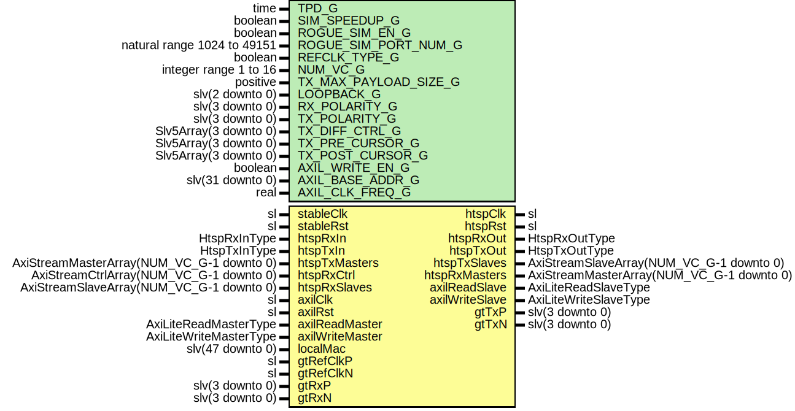

# Entity: HtspCaui4Gty

## Diagram

## Description

Title      : HTSP: https://confluence.slac.stanford.edu/x/pQmODw
Company    : SLAC National Accelerator Laboratory
Description: Wrapper for HTSP Ethernet with GTY-based CAUI4 PHY
This file is part of 'SLAC Firmware Standard Library'.
It is subject to the license terms in the LICENSE.txt file found in the
top-level directory of this distribution and at:
   https://confluence.slac.stanford.edu/display/ppareg/LICENSE.html.
No part of 'SLAC Firmware Standard Library', including this file,
may be copied, modified, propagated, or distributed except according to
the terms contained in the LICENSE.txt file.
## Generics

| Generic name          | Type                        | Value               | Description                                   |
| --------------------- | --------------------------- | ------------------- | --------------------------------------------- |
| TPD_G                 | time                        | 1 ns                |                                               |
| SIM_SPEEDUP_G         | boolean                     | false               |                                               |
| ROGUE_SIM_EN_G        | boolean                     | false               |                                               |
| ROGUE_SIM_PORT_NUM_G  | natural range 1024 to 49151 | 9000                |                                               |
| REFCLK_TYPE_G         | boolean                     | true                | false = 156.25 MHz, true = 161.1328125 MHz    |
| NUM_VC_G              | integer range 1 to 16       | 4                   | HTSP Settings                                 |
| TX_MAX_PAYLOAD_SIZE_G | positive                    | 8192                | Must be a multiple of 64B (in units of bytes) |
| LOOPBACK_G            | slv(2 downto 0)             | (others => '0')     | Misc Debug Settings                           |
| RX_POLARITY_G         | slv(3 downto 0)             | (others => '0')     |                                               |
| TX_POLARITY_G         | slv(3 downto 0)             | (others => '0')     |                                               |
| TX_DIFF_CTRL_G        | Slv5Array(3 downto 0)       | (others => "11000") |                                               |
| TX_PRE_CURSOR_G       | Slv5Array(3 downto 0)       | (others => "00000") |                                               |
| TX_POST_CURSOR_G      | Slv5Array(3 downto 0)       | (others => "00000") |                                               |
| AXIL_WRITE_EN_G       | boolean                     | false               | Set to false when on remote end of a link     |
| AXIL_BASE_ADDR_G      | slv(31 downto 0)            | (others => '0')     |                                               |
| AXIL_CLK_FREQ_G       | real                        | 156.25E+6           |                                               |
## Ports

| Port name       | Direction | Type                                      | Description                                  |
| --------------- | --------- | ----------------------------------------- | -------------------------------------------- |
| stableClk       | in        | sl                                        | GT needs a stable clock to "boot up"         |
| stableRst       | in        | sl                                        |                                              |
| htspClk         | out       | sl                                        | HTSP Clock and Reset                         |
| htspRst         | out       | sl                                        |                                              |
| htspRxIn        | in        | HtspRxInType                              | Non VC Rx Signals                            |
| htspRxOut       | out       | HtspRxOutType                             |                                              |
| htspTxIn        | in        | HtspTxInType                              | Non VC Tx Signals                            |
| htspTxOut       | out       | HtspTxOutType                             |                                              |
| htspTxMasters   | in        | AxiStreamMasterArray(NUM_VC_G-1 downto 0) | Frame Transmit Interface                     |
| htspTxSlaves    | out       | AxiStreamSlaveArray(NUM_VC_G-1 downto 0)  |                                              |
| htspRxMasters   | out       | AxiStreamMasterArray(NUM_VC_G-1 downto 0) | Frame Receive Interface                      |
| htspRxCtrl      | in        | AxiStreamCtrlArray(NUM_VC_G-1 downto 0)   |                                              |
| htspRxSlaves    | in        | AxiStreamSlaveArray(NUM_VC_G-1 downto 0)  | Simulation Only                              |
| axilClk         | in        | sl                                        | AXI-Lite Register Interface (axilClk domain) |
| axilRst         | in        | sl                                        |                                              |
| axilReadMaster  | in        | AxiLiteReadMasterType                     |                                              |
| axilReadSlave   | out       | AxiLiteReadSlaveType                      |                                              |
| axilWriteMaster | in        | AxiLiteWriteMasterType                    |                                              |
| axilWriteSlave  | out       | AxiLiteWriteSlaveType                     |                                              |
| localMac        | in        | slv(47 downto 0)                          | 00:44:56:03:02:01                            |
| gtRefClkP       | in        | sl                                        | GT Ports                                     |
| gtRefClkN       | in        | sl                                        |                                              |
| gtRxP           | in        | slv(3 downto 0)                           |                                              |
| gtRxN           | in        | slv(3 downto 0)                           |                                              |
| gtTxP           | out       | slv(3 downto 0)                           |                                              |
| gtTxN           | out       | slv(3 downto 0)                           |                                              |
## Signals

| Name            | Type                  | Description |
| --------------- | --------------------- | ----------- |
| phyClk          | sl                    |             |
| phyRst          | sl                    |             |
| phyUsrRst       | sl                    |             |
| htspRefClk      | sl                    |             |
| phyRxMaster     | AxiStreamMasterType   |             |
| phyRxMasterReg0 | AxiStreamMasterType   |             |
| phyRxMasterReg1 | AxiStreamMasterType   |             |
| phyTxMaster     | AxiStreamMasterType   |             |
| phyTxSlave      | AxiStreamSlaveType    |             |
| loopback        | slv(2 downto 0)       |             |
| rxPolarity      | slv(9 downto 0)       |             |
| txPolarity      | slv(9 downto 0)       |             |
| txDiffCtrl      | Slv5Array(9 downto 0) |             |
| txPreCursor     | Slv5Array(9 downto 0) |             |
| txPostCursor    | Slv5Array(9 downto 0) |             |
| stableReset     | sl                    |             |
| phyReady        | sl                    |             |
## Constants

| Name             | Type                  | Value                                                                                                                                                                                                                                                                                                                                                                                                                                                                                                                                                                                          | Description |
| ---------------- | --------------------- | ---------------------------------------------------------------------------------------------------------------------------------------------------------------------------------------------------------------------------------------------------------------------------------------------------------------------------------------------------------------------------------------------------------------------------------------------------------------------------------------------------------------------------------------------------------------------------------------------- | ----------- |
| RX_POLARITY_C    | slv(9 downto 0)       |  ("000000" & RX_POLARITY_G)                                                                                                                                                                                                                                                                                                                                                                                                                                                                                                                                                                    |             |
| TX_POLARITY_C    | slv(9 downto 0)       |  ("000000" & TX_POLARITY_G)                                                                                                                                                                                                                                                                                                                                                                                                                                                                                                                                                                    |             |
| TX_DIFF_CTRL_C   | Slv5Array(9 downto 0) |  (       0 => TX_DIFF_CTRL_G(0),        1 => TX_DIFF_CTRL_G(1),        2 => TX_DIFF_CTRL_G(2),        3 => TX_DIFF_CTRL_G(3),        4 => "11111",        5 => "11111",        6 => "11111",        7 => "11111",        8 => "11111",        9 => "11111")         |             |
| TX_PRE_CURSOR_C  | Slv5Array(9 downto 0) |  (       0 => TX_PRE_CURSOR_G(0),        1 => TX_PRE_CURSOR_G(1),        2 => TX_PRE_CURSOR_G(2),        3 => TX_PRE_CURSOR_G(3),        4 => "11111",        5 => "11111",        6 => "11111",        7 => "11111",        8 => "11111",        9 => "11111")     |             |
| TX_POST_CURSOR_C | Slv5Array(9 downto 0) |  (       0 => TX_POST_CURSOR_G(0),        1 => TX_POST_CURSOR_G(1),        2 => TX_POST_CURSOR_G(2),        3 => TX_POST_CURSOR_G(3),        4 => "11111",        5 => "11111",        6 => "11111",        7 => "11111",        8 => "11111",        9 => "11111") |             |
