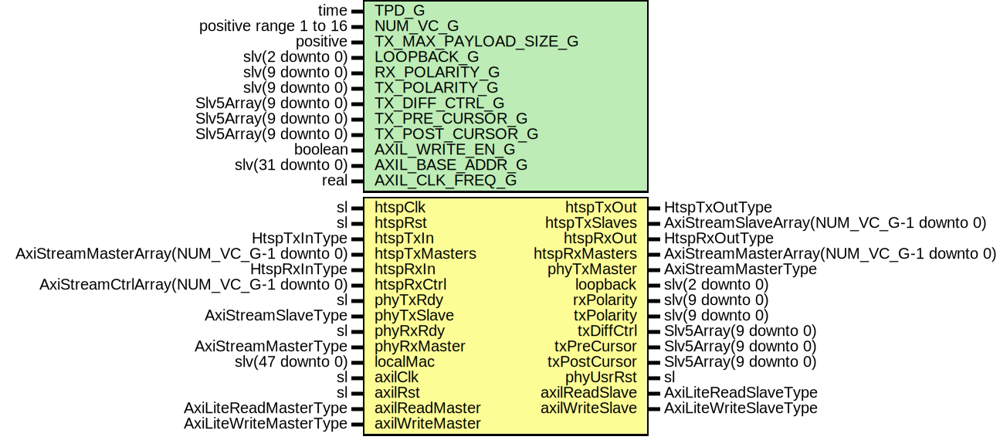

# Entity: HtspCore

- **File**: HtspCore.vhd
## Diagram

## Description

-----------------------------------------------------------------------------
 Title      : HTSP: https://confluence.slac.stanford.edu/x/pQmODw
-----------------------------------------------------------------------------
 Company    : SLAC National Accelerator Laboratory
-----------------------------------------------------------------------------
 Description: HTSP Ethernet Core
-----------------------------------------------------------------------------
 This file is part of 'SLAC Firmware Standard Library'.
 It is subject to the license terms in the LICENSE.txt file found in the
 top-level directory of this distribution and at:
    https://confluence.slac.stanford.edu/display/ppareg/LICENSE.html.
 No part of 'SLAC Firmware Standard Library', including this file,
 may be copied, modified, propagated, or distributed except according to
 the terms contained in the LICENSE.txt file.
-----------------------------------------------------------------------------
## Generics

| Generic name          | Type                   | Value               | Description                                    |
| --------------------- | ---------------------- | ------------------- | ---------------------------------------------- |
| TPD_G                 | time                   | 1 ns                |                                                |
| NUM_VC_G              | positive range 1 to 16 | 4                   | HTSP Settings                                  |
| TX_MAX_PAYLOAD_SIZE_G | positive               | 8192                |  Must be a multiple of 64B (in units of bytes) |
| LOOPBACK_G            | slv(2 downto 0)        | (others => '0')     | Misc Debug Settings                            |
| RX_POLARITY_G         | slv(9 downto 0)        | (others => '0')     |                                                |
| TX_POLARITY_G         | slv(9 downto 0)        | (others => '0')     |                                                |
| TX_DIFF_CTRL_G        | Slv5Array(9 downto 0)  | (others => "11000") |                                                |
| TX_PRE_CURSOR_G       | Slv5Array(9 downto 0)  | (others => "00000") |                                                |
| TX_POST_CURSOR_G      | Slv5Array(9 downto 0)  | (others => "00000") |                                                |
| AXIL_WRITE_EN_G       | boolean                | false               |  Set to false when on remote end of a link     |
| AXIL_BASE_ADDR_G      | slv(31 downto 0)       | (others => '0')     |                                                |
| AXIL_CLK_FREQ_G       | real                   | 156.25E+6           |                                                |
## Ports

| Port name       | Direction | Type                                      | Description                                  |
| --------------- | --------- | ----------------------------------------- | -------------------------------------------- |
| htspClk         | in        | sl                                        | Clock and Reset                              |
| htspRst         | in        | sl                                        |                                              |
| htspTxIn        | in        | HtspTxInType                              | Tx User interface                            |
| htspTxOut       | out       | HtspTxOutType                             |                                              |
| htspTxMasters   | in        | AxiStreamMasterArray(NUM_VC_G-1 downto 0) |                                              |
| htspTxSlaves    | out       | AxiStreamSlaveArray(NUM_VC_G-1 downto 0)  |                                              |
| htspRxIn        | in        | HtspRxInType                              | Rx User interface                            |
| htspRxOut       | out       | HtspRxOutType                             |                                              |
| htspRxMasters   | out       | AxiStreamMasterArray(NUM_VC_G-1 downto 0) |                                              |
| htspRxCtrl      | in        | AxiStreamCtrlArray(NUM_VC_G-1 downto 0)   |                                              |
| phyTxRdy        | in        | sl                                        | Tx PHY interface                             |
| phyTxMaster     | out       | AxiStreamMasterType                       |                                              |
| phyTxSlave      | in        | AxiStreamSlaveType                        |                                              |
| phyRxRdy        | in        | sl                                        | Rx PHY interface                             |
| phyRxMaster     | in        | AxiStreamMasterType                       |                                              |
| localMac        | in        | slv(47 downto 0)                          |  00:44:56:03:02:01                           |
| loopback        | out       | slv(2 downto 0)                           |                                              |
| rxPolarity      | out       | slv(9 downto 0)                           |                                              |
| txPolarity      | out       | slv(9 downto 0)                           |                                              |
| txDiffCtrl      | out       | Slv5Array(9 downto 0)                     |                                              |
| txPreCursor     | out       | Slv5Array(9 downto 0)                     |                                              |
| txPostCursor    | out       | Slv5Array(9 downto 0)                     |                                              |
| phyUsrRst       | out       | sl                                        |                                              |
| axilClk         | in        | sl                                        | AXI-Lite Register Interface (axilClk domain) |
| axilRst         | in        | sl                                        |                                              |
| axilReadMaster  | in        | AxiLiteReadMasterType                     |                                              |
| axilReadSlave   | out       | AxiLiteReadSlaveType                      |                                              |
| axilWriteMaster | in        | AxiLiteWriteMasterType                    |                                              |
| axilWriteSlave  | out       | AxiLiteWriteSlaveType                     |                                              |
## Signals

| Name              | Type                                    | Description |
| ----------------- | --------------------------------------- | ----------- |
| locRxLinkReady    | sl                                      |             |
| remRxFifoCtrl     | AxiStreamCtrlArray(NUM_VC_G-1 downto 0) |             |
| remRxLinkReady    | sl                                      |             |
| htspTxInInt       | HtspTxInType                            |             |
| htspTxOutInt      | HtspTxOutType                           |             |
| htspRxInInt       | HtspRxInType                            |             |
| htspRxOutInt      | HtspRxOutType                           |             |
| broadcastMac      | slv(47 downto 0)                        |             |
| remoteMac         | slv(47 downto 0)                        |             |
| etherType         | slv(15 downto 0)                        |             |
| remRxFifoCtrlReg  | AxiStreamCtrlArray(NUM_VC_G-1 downto 0) |             |
| remRxLinkReadyReg | sl                                      |             |
| locRxLinkReadyReg | sl                                      |             |
## Processes
- unnamed: ( htspClk )
 **Description**
 Help with making timing 
## Instantiations

- U_Tx: surf.HtspTx
- U_Rx: surf.HtspRx
- U_AxiLite: surf.HtspAxiL
