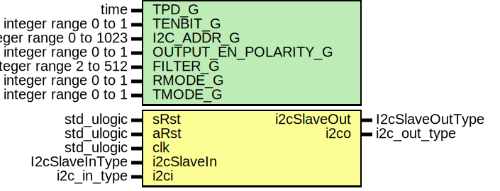

# Entity: I2cSlave

- **File**: I2cSlave.vhd
## Diagram

## Description

 This file is a part of the GRLIB VHDL IP LIBRARY
 Copyright (C) 2003 - 2008, Gaisler Research
 Copyright (C) 2008 - 2012, Aeroflex Gaisler
 This program is free software; you can redistribute it and/or modify
 it under the terms of the GNU General Public License as published by
 the Free Software Foundation; either version 2 of the License, or
 (at your option) any later version.
 This program is distributed in the hope that it will be useful,
 but WITHOUT ANY WARRANTY; without even the implied warranty of
 MERCHANTABILITY or FITNESS FOR A PARTICULAR PURPOSE.  See the
 GNU General Public License for more details.
 You should have received a copy of the GNU General Public License
 along with this program; if not, write to the Free Software
 Foundation, Inc., 59 Temple Place, Suite 330, Boston, MA  02111-1307  USA
Entity: i2cslv
File:   i2cslv.vhd
Author: Jan Andersson - Gaisler Research
        jan@gaisler.com
Documentation of generics:
[TENBIT_G]
Support for ten bit addresses.
[I2C_ADDR_G]
The slave's i2c address.
[OUTPUT_EN_POLARITY_G]
Output enable polarity
[FILTER_G]
Length of filters used on SCL and SDA.
This generic should specify, in number of system clock cycles plus one,
the time of the shortest pulse on the I2C bus to be registered as a valid
value. For instance, to disregard any pulse that is 50 ns or shorter in
a system with a system frequency of 54 MHz this generic should be set to:
((pulse time) / (clock period)) + 1 =  (50 ns) / ((1/(54 MHz)) + 1 = 3.7
The value from this calculation should always be rounded up.
In other words an appropriate filter length for a 54 MHz system is 4.
The slave has four different modes operation. The mode is defined by the
value of the bits RMODE and TMODE.
RMODE TMODE   I2CSLAVE Mode
  0     0          0
  0     1          1
  1     0          2
  1     1          3
RMODE_G 0:
The slave accepts one byte and NAKs all other transfers until software has
acknowledged the received byte.
RMODE_G 1:
The slave accepts one byte and keeps SCL low until software has acknowledged
the received byte
TMODE_G 0:
The slave transmits the same byte to all if the master requests more than
one byte in the transfer. The slave then NAKs all read requests unless the
Transmit Always Valid (TAV) bit in the control register is set.
TMODE_G 1:
The slave transmits one byte and then keeps SCL low until software has
acknowledged that the byte has been transmitted.
Modified by Benjamin Reese <bareese@slac.stanford.edu>
Removed APB interface and replaced with generic IO.
## Generics

| Generic name         | Type                    | Value | Description        |
| -------------------- | ----------------------- | ----- | ------------------ |
| TPD_G                | time                    | 1 ns  |                    |
| TENBIT_G             | integer range 0 to 1    | 0     | I2C configuration  |
| I2C_ADDR_G           | integer range 0 to 1023 | 0     |                    |
| OUTPUT_EN_POLARITY_G | integer range 0 to 1    | 0     |                    |
| FILTER_G             | integer range 2 to 512  | 4     |                    |
| RMODE_G              | integer range 0 to 1    | 0     |                    |
| TMODE_G              | integer range 0 to 1    | 0     |                    |
## Ports

| Port name   | Direction | Type            | Description                      |
| ----------- | --------- | --------------- | -------------------------------- |
| sRst        | in        | std_ulogic      | Synchronous Reset - active high  |
| aRst        | in        | std_ulogic      | Asynchronous Reset - active high |
| clk         | in        | std_ulogic      |                                  |
| i2cSlaveIn  | in        | I2cSlaveInType  | Front End                        |
| i2cSlaveOut | out       | I2cSlaveOutType |                                  |
| i2ci        | in        | i2c_in_type     | I2C signals                      |
| i2co        | out       | i2c_out_type    |                                  |
## Signals

| Name | Type            | Description        |
| ---- | --------------- | ------------------ |
| r    | i2cslv_reg_type | Register interface |
| rin  | i2cslv_reg_type |                    |
## Constants

| Name                | Type                                          | Value                                                                                                                                                                                                                                                                                                                                                                                                                                                                                                                                                                                                                                                                                                                          | Description |
| ------------------- | --------------------------------------------- | ------------------------------------------------------------------------------------------------------------------------------------------------------------------------------------------------------------------------------------------------------------------------------------------------------------------------------------------------------------------------------------------------------------------------------------------------------------------------------------------------------------------------------------------------------------------------------------------------------------------------------------------------------------------------------------------------------------------------------ | ----------- |
| I2C_ADDR_LEN_C      | integer                                       |  7 + TENBIT_G*3                                                                                                                                                                                                                                                                                                                                                                                                                                                                                                                                                                                                                                                                                                                |             |
| I2C_SLAVE_ADDR_C    | std_logic_vector((I2C_ADDR_LEN_C-1) downto 0) |        conv_std_logic_vector(I2C_ADDR_G,  I2C_ADDR_LEN_C)                                                                                                                                                                                                                                                                                                                                                                                                                                                                                                                                                                                                                                   |             |
| I2C_READ_C          | std_ulogic                                    |  '1'                                                                                                                                                                                                                                                                                                                                                                                                                                                                                                                                                                                                                                                                                                                           | R/Wn bit    |
| I2C_WRITE_C         | std_ulogic                                    |  '0'                                                                                                                                                                                                                                                                                                                                                                                                                                                                                                                                                                                                                                                                                                                           |             |
| OEPOL_LEVEL_C       | std_ulogic                                    |  conv_std_logic(OUTPUT_EN_POLARITY_G = 1)                                                                                                                                                                                                                                                                                                                                                                                                                                                                                                                                                                                                                                                                                      |             |
| I2C_LOW_C           | std_ulogic                                    |  OEPOL_LEVEL_C                                                                                                                                                                                                                                                                                                                                                                                                                                                                                                                                                                                                                                                                                                                 | OE          |
| I2C_HIZ_C           | std_ulogic                                    |  not OEPOL_LEVEL_C                                                                                                                                                                                                                                                                                                                                                                                                                                                                                                                                                                                                                                                                                                             |             |
| I2C_ACK_C           | std_ulogic                                    |  '0'                                                                                                                                                                                                                                                                                                                                                                                                                                                                                                                                                                                                                                                                                                                           |             |
| TENBIT_ADDR_START_C | std_logic_vector(4 downto 0)                  |  "11110"                                                                                                                                                                                                                                                                                                                                                                                                                                                                                                                                                                                                                                                                                                                       |             |
| REG_INIT_C          | i2cslv_reg_type                               |  (       slvstate => idle,        active => false,        addr => false,        sreg => (others => '0'),        cnt => (others => '0'),        scl => '0',        sda => '0',        i2ci => (others => (scl => '0',  sda => '0')),        scloen => I2C_HIZ_C,        sdaoen => I2C_HIZ_C,        o => I2C_SLAVE_OUT_INIT_C) |             |
## Types

| Name            | Type                                                                                                                                                                                                                                                 | Description |
| --------------- | ---------------------------------------------------------------------------------------------------------------------------------------------------------------------------------------------------------------------------------------------------- | ----------- |
| i2c_in_array    |                                                                                                                                                                                                                                                      |             |
| slv_state_type  | (idle,  checkaddr,  check10bitaddr,  sclhold,  movebyte,  handshake)  |             |
| i2cslv_reg_type |                                                                                                                                                                                                                                                      |             |
## Functions
- compaddr1stb ( ibyte : std_logic_vector(7 downto 0))  return boolean 
**Description**
purpose: Compares the first byte of a received address with the slave'saddress. The tba input determines if the slave is using a ten bit address.
- compaddr2ndb ( ibyte : std_logic_vector(7 downto 0))  return boolean 
**Description**
purpose: Compares the 2nd byte of a ten bit address with the slave address
## Processes
- comb: ( r, sRst, i2ci, i2cSlaveIn )
- reg: ( clk, aRst )
