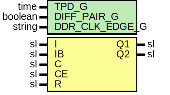

# Entity: InputBufferReg

- **File**: InputBufferReg.vhd
## Diagram

## Description

Company    : SLAC National Accelerator Laboratory
Description: Output Registers
This file is part of 'SLAC Firmware Standard Library'.
It is subject to the license terms in the LICENSE.txt file found in the
top-level directory of this distribution and at:
   https://confluence.slac.stanford.edu/display/ppareg/LICENSE.html.
No part of 'SLAC Firmware Standard Library', including this file,
may be copied, modified, propagated, or distributed except according to
the terms contained in the LICENSE.txt file.
## Generics

| Generic name   | Type    | Value           | Description |
| -------------- | ------- | --------------- | ----------- |
| TPD_G          | time    | 1 ns            |             |
| DIFF_PAIR_G    | boolean | false           |             |
| DDR_CLK_EDGE_G | string  | "OPPOSITE_EDGE" |             |
## Ports

| Port name | Direction | Type | Description |
| --------- | --------- | ---- | ----------- |
| I         | in        | sl   |             |
| IB        | in        | sl   |             |
| C         | in        | sl   |             |
| CE        | in        | sl   |             |
| R         | in        | sl   |             |
| Q1        | out       | sl   |             |
| Q2        | out       | sl   |             |
## Signals

| Name     | Type | Description |
| -------- | ---- | ----------- |
| inputSig | sl   |             |
| CB       | sl   |             |
## Instantiations

- U_IDDR: IDDRE1
