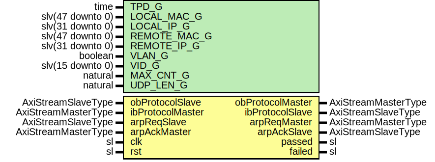

# Entity: IpV4EngineCoreTb

- **File**: IpV4EngineCoreTb.vhd
## Diagram

## Description

-----------------------------------------------------------------------------
 Company    : SLAC National Accelerator Laboratory
-----------------------------------------------------------------------------
 Description: Simulation Testbed for testing the IpV4EngineCore
-----------------------------------------------------------------------------
 This file is part of 'SLAC Firmware Standard Library'.
 It is subject to the license terms in the LICENSE.txt file found in the
 top-level directory of this distribution and at:
    https://confluence.slac.stanford.edu/display/ppareg/LICENSE.html.
 No part of 'SLAC Firmware Standard Library', including this file,
 may be copied, modified, propagated, or distributed except according to
 the terms contained in the LICENSE.txt file.
-----------------------------------------------------------------------------
## Generics

| Generic name | Type             | Value | Description |
| ------------ | ---------------- | ----- | ----------- |
| TPD_G        | time             | 1 ns  |             |
| LOCAL_MAC_G  | slv(47 downto 0) |       |             |
| LOCAL_IP_G   | slv(31 downto 0) |       |             |
| REMOTE_MAC_G | slv(47 downto 0) |       |             |
| REMOTE_IP_G  | slv(31 downto 0) |       |             |
| VLAN_G       | boolean          |       |             |
| VID_G        | slv(15 downto 0) |       |             |
| MAX_CNT_G    | natural          |       |             |
| UDP_LEN_G    | natural          |       |             |
## Ports

| Port name        | Direction | Type                | Description              |
| ---------------- | --------- | ------------------- | ------------------------ |
| obProtocolMaster | out       | AxiStreamMasterType | Interface to IPV4 Engine |
| obProtocolSlave  | in        | AxiStreamSlaveType  |                          |
| ibProtocolMaster | in        | AxiStreamMasterType |                          |
| ibProtocolSlave  | out       | AxiStreamSlaveType  |                          |
| arpReqMaster     | out       | AxiStreamMasterType | Interface to ARP Engine  |
| arpReqSlave      | in        | AxiStreamSlaveType  |                          |
| arpAckMaster     | in        | AxiStreamMasterType |                          |
| arpAckSlave      | out       | AxiStreamSlaveType  |                          |
| passed           | out       | sl                  | Simulation Result        |
| failed           | out       | sl                  |                          |
| clk              | in        | sl                  | Clock and Reset          |
| rst              | in        | sl                  |                          |
## Signals

| Name | Type    | Description |
| ---- | ------- | ----------- |
| r    | RegType |             |
| rin  | RegType |             |
## Constants

| Name       | Type    | Value                                                                                                                                                                                                                                                                                                                                                                                                                                                                                                                                                                                                                                                                                                                                                                                                                                                                                                                                                                                                                                                                                                                                                                                                                                                                                                                                                                                                                                                                                                                                                                                                                             | Description |
| ---------- | ------- | --------------------------------------------------------------------------------------------------------------------------------------------------------------------------------------------------------------------------------------------------------------------------------------------------------------------------------------------------------------------------------------------------------------------------------------------------------------------------------------------------------------------------------------------------------------------------------------------------------------------------------------------------------------------------------------------------------------------------------------------------------------------------------------------------------------------------------------------------------------------------------------------------------------------------------------------------------------------------------------------------------------------------------------------------------------------------------------------------------------------------------------------------------------------------------------------------------------------------------------------------------------------------------------------------------------------------------------------------------------------------------------------------------------------------------------------------------------------------------------------------------------------------------------------------------------------------------------------------------------------------------- | ----------- |
| REG_INIT_C | RegType |  (       passed           => '0',        failed           => (others => '0'),        passedDly        => '0',        failedDly        => '0',        txDone           => '0',        tKeep            => (others => '1'),        timer            => (others => '0'),        remoteMac        => (others => '0'),        len              => (others => '0'),        txCnt            => 0,        txWordCnt        => 0,        txWordSize       => 0,        txByteCnt        => 0,        rxCnt            => 0,        rxWordCnt        => 0,        rxWordSize       => 0,        rxByteCnt        => 0,        obProtocolMaster => AXI_STREAM_MASTER_INIT_C,        ibProtocolSlave  => AXI_STREAM_SLAVE_INIT_C,        arpReqMaster     => AXI_STREAM_MASTER_INIT_C,        arpAckSlave      => AXI_STREAM_SLAVE_INIT_C,        state            => IDLE_S) |             |
## Types

| Name      | Type                                                                                                                                         | Description |
| --------- | -------------------------------------------------------------------------------------------------------------------------------------------- | ----------- |
| StateType | ( IDLE_S,  ARP_S,  UDP_S,  DONE_S)  |             |
| RegType   |                                                                                                                                              |             |
## Processes
- comb: ( arpAckMaster, arpReqSlave, ibProtocolMaster, obProtocolSlave, r, rst )
- seq: ( clk )
