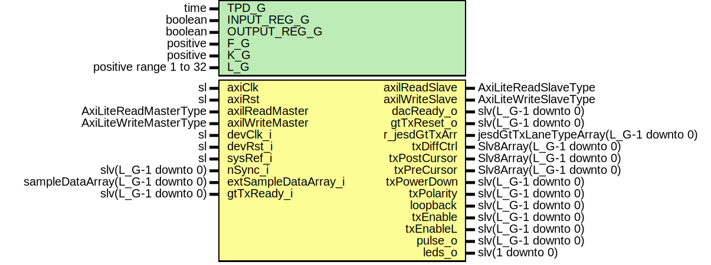

# Entity: Jesd204bTx

## Diagram

## Description

Company    : SLAC National Accelerator Laboratory
Description: JESD204b multi-lane transmitter module
             Transmitter JESD204b module.
             Supports a subset of features from JESD204b standard.
             Supports sub-class 1 deterministic latency.
             Supports sub-class 0 non deterministic latency.
             Features:
             - Synchronization of LMFC to SYSREF
             - Multi-lane operation (L_G: 1-32)
         Warning: Scrambling support has not been tested on the TX module yet.
         Note: extSampleDataArray_i should be little endian and not byte swapped
               First sample in time:  sampleData_i(15 downto 0)
               Second sample in time: sampleData_i(31 downto 16)
This file is part of 'SLAC Firmware Standard Library'.
It is subject to the license terms in the LICENSE.txt file found in the
top-level directory of this distribution and at:
   https://confluence.slac.stanford.edu/display/ppareg/LICENSE.html.
No part of 'SLAC Firmware Standard Library', including this file,
may be copied, modified, propagated, or distributed except according to
the terms contained in the LICENSE.txt file.
## Generics

| Generic name | Type                   | Value | Description                                  |
| ------------ | ---------------------- | ----- | -------------------------------------------- |
| TPD_G        | time                   | 1 ns  |                                              |
| INPUT_REG_G  | boolean                | false | Register sample data at input and/or output  |
| OUTPUT_REG_G | boolean                | false |                                              |
| F_G          | positive               | 2     | Number of bytes in a frame                   |
| K_G          | positive               | 32    | Number of frames in a multi frame            |
| L_G          | positive range 1 to 32 | 2     | Number of TX lanes (1 to 32)                 |
## Ports

| Port name            | Direction | Type                                  | Description                                       |
| -------------------- | --------- | ------------------------------------- | ------------------------------------------------- |
| axiClk               | in        | sl                                    | AXI interfaceClocks and Resets                    |
| axiRst               | in        | sl                                    |                                                   |
| axilReadMaster       | in        | AxiLiteReadMasterType                 | AXI-Lite Register Interface                       |
| axilReadSlave        | out       | AxiLiteReadSlaveType                  |                                                   |
| axilWriteMaster      | in        | AxiLiteWriteMasterType                |                                                   |
| axilWriteSlave       | out       | AxiLiteWriteSlaveType                 |                                                   |
| devClk_i             | in        | sl                                    | JESDClocks and Resets                             |
| devRst_i             | in        | sl                                    |                                                   |
| sysRef_i             | in        | sl                                    | SYSREF for subclass 1 fixed latency               |
| nSync_i              | in        | slv(L_G-1 downto 0)                   | Synchronization input combined from all receivers |
| extSampleDataArray_i | in        | sampleDataArray(L_G-1 downto 0)       | External sample data input                        |
| dacReady_o           | out       | slv(L_G-1 downto 0)                   |                                                   |
| gtTxReset_o          | out       | slv(L_G-1 downto 0)                   | GT is ready to transmit data after reset          |
| gtTxReady_i          | in        | slv(L_G-1 downto 0)                   |                                                   |
| r_jesdGtTxArr        | out       | jesdGtTxLaneTypeArray(L_G-1 downto 0) | Data and character inputs from GT (transceivers)  |
| txDiffCtrl           | out       | Slv8Array(L_G-1 downto 0)             | TX Configurable Driver Ports                      |
| txPostCursor         | out       | Slv8Array(L_G-1 downto 0)             |                                                   |
| txPreCursor          | out       | Slv8Array(L_G-1 downto 0)             |                                                   |
| txPowerDown          | out       | slv(L_G-1 downto 0)                   |                                                   |
| txPolarity           | out       | slv(L_G-1 downto 0)                   |                                                   |
| loopback             | out       | slv(L_G-1 downto 0)                   |                                                   |
| txEnable             | out       | slv(L_G-1 downto 0)                   |                                                   |
| txEnableL            | out       | slv(L_G-1 downto 0)                   |                                                   |
| pulse_o              | out       | slv(L_G-1 downto 0)                   | Debug signals                                     |
| leds_o               | out       | slv(1 downto 0)                       |                                                   |
## Signals

| Name               | Type                                  | Description                                      |
| ------------------ | ------------------------------------- | ------------------------------------------------ |
| s_lmfc             | slv(L_G-1 downto 0)                   |                                                  |
| s_sysrefDlyTx      | slv(SYSRF_DLY_WIDTH_C-1 downto 0)     |                                                  |
| s_enableTx         | slv(L_G-1 downto 0)                   |                                                  |
| s_replEnable       | sl                                    |                                                  |
| s_scrEnable        | sl                                    |                                                  |
| s_statusTxArr      | txStatuRegisterArray(L_G-1 downto 0)  |                                                  |
| s_dataValid        | slv(L_G-1 downto 0)                   |                                                  |
| s_invertData       | slv(L_G-1 downto 0)                   |                                                  |
| s_subClass         | sl                                    | JESD subclass selection (from AXI lite register) |
| s_gtReset          | sl                                    | User reset (from AXI lite register)              |
| s_clearErr         | sl                                    |                                                  |
| s_sigTypeArr       | Slv2Array(L_G-1 downto 0)             |                                                  |
| s_rampStep         | slv(PER_STEP_WIDTH_C-1 downto 0)      | Test signal control                              |
| s_squarePeriod     | slv(PER_STEP_WIDTH_C-1 downto 0)      |                                                  |
| s_posAmplitude     | slv(F_G*8-1 downto 0)                 |                                                  |
| s_negAmplitude     | slv(F_G*8-1 downto 0)                 |                                                  |
| s_testDataArr      | sampleDataArray(L_G-1 downto 0)       | Data out multiplexer                             |
| s_extDataArraySwap | sampleDataArray(L_G-1 downto 0)       |                                                  |
| s_regSampleDataIn  | sampleDataArray(L_G-1 downto 0)       |                                                  |
| s_regSampleDataOut | sampleDataArray(L_G-1 downto 0)       |                                                  |
| s_sampleDataArr    | sampleDataArray(L_G-1 downto 0)       |                                                  |
| s_sysrefSync       | sl                                    | Sysref conditioning                              |
| s_sysrefRe         | slv(L_G-1 downto 0)                   |                                                  |
| s_sysrefD          | sl                                    |                                                  |
| s_nSync            | slv(L_G-1 downto 0)                   | Sync conditioning                                |
| s_invertSync       | sl                                    |                                                  |
| s_nSyncSync        | slv(L_G-1 downto 0)                   |                                                  |
| s_muxOutSelArr     | Slv3Array(L_G-1 downto 0)             | Select output                                    |
| s_jesdGtTxArr      | jesdGtTxLaneTypeArray(L_G-1 downto 0) |                                                  |
## Instantiations

- U_Reg: surf.JesdTxReg
**Description**
AXI-Lite registers

- Synchronizer_sysref_INST: surf.Synchronizer
**Description**
SYSREF, SYNC, and LMFC
Synchronize SYSREF input to devClk_i

- Synchronizer_nsync_INST: surf.SynchronizerVector
**Description**
Synchronize nSync input to devClk_i

- U_SysrefDly: surf.SlvDelay
**Description**
Delay SYSREF input (for 1 to 256 c-c)

