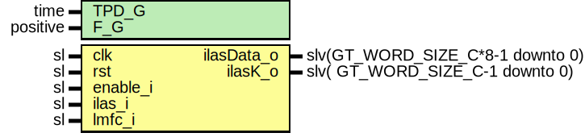

# Entity: JesdIlasGen

- **File**: JesdIlasGen.vhd
## Diagram

## Description

-----------------------------------------------------------------------------
 Company    : SLAC National Accelerator Laboratory
-----------------------------------------------------------------------------
 Description: Initial lane alignment sequence Generator
              Adds A na R characters at the LMFC borders.
-----------------------------------------------------------------------------
 This file is part of 'SLAC Firmware Standard Library'.
 It is subject to the license terms in the LICENSE.txt file found in the
 top-level directory of this distribution and at:
    https://confluence.slac.stanford.edu/display/ppareg/LICENSE.html.
 No part of 'SLAC Firmware Standard Library', including this file,
 may be copied, modified, propagated, or distributed except according to
 the terms contained in the LICENSE.txt file.
-----------------------------------------------------------------------------
## Generics

| Generic name | Type     | Value | Description |
| ------------ | -------- | ----- | ----------- |
| TPD_G        | time     | 1 ns  |             |
| F_G          | positive | 2     |             |
## Ports

| Port name  | Direction | Type                             | Description      |
| ---------- | --------- | -------------------------------- | ---------------- |
| clk        | in        | sl                               |                  |
| rst        | in        | sl                               |                  |
| enable_i   | in        | sl                               | Enable counter   |
| ilas_i     | in        | sl                               | Increase counter |
| lmfc_i     | in        | sl                               | Increase counter |
| ilasData_o | out       | slv(GT_WORD_SIZE_C*8-1 downto 0) | Outs             |
| ilasK_o    | out       | slv(  GT_WORD_SIZE_C-1 downto 0) |                  |
## Signals

| Name | Type    | Description |
| ---- | ------- | ----------- |
| r    | RegType |             |
| rin  | RegType |             |
## Constants

| Name       | Type    | Value                                                                                            | Description |
| ---------- | ------- | ------------------------------------------------------------------------------------------------ | ----------- |
| REG_INIT_C | RegType |  (       lmfcD1       => '0',        lmfcD2       => '0'    ) |             |
## Types

| Name    | Type | Description |
| ------- | ---- | ----------- |
| RegType |      |             |
## Processes
- comb: ( r, rst,lmfc_i,enable_i, ilas_i )
- seq: ( clk )
