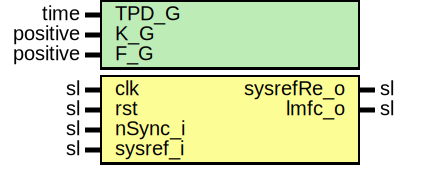

# Entity: JesdLmfcGen

## Diagram

## Description

Company    : SLAC National Accelerator Laboratory
Description: LMFC Generator
             Local Multi Frame Clock Generator
             Periodically outputs one clock cycle pulse (LMFC).
             Synchronizes with the rising edge of sysref_i if sync is requested
             by any of the on-board JESD receivers.
             Outputs first pulse 2 c-c after sysref_i='1'
             Period determined by F_G*K_G/GT_WORD_SIZE_C.
             (Example: 2*32/4 = 16)
This file is part of 'SLAC Firmware Standard Library'.
It is subject to the license terms in the LICENSE.txt file found in the
top-level directory of this distribution and at:
   https://confluence.slac.stanford.edu/display/ppareg/LICENSE.html.
No part of 'SLAC Firmware Standard Library', including this file,
may be copied, modified, propagated, or distributed except according to
the terms contained in the LICENSE.txt file.
## Generics

| Generic name | Type     | Value | Description |
| ------------ | -------- | ----- | ----------- |
| TPD_G        | time     | 1 ns  |             |
| K_G          | positive | 32    |             |
| F_G          | positive | 2     |             |
## Ports

| Port name  | Direction | Type | Description            |
| ---------- | --------- | ---- | ---------------------- |
| clk        | in        | sl   |                        |
| rst        | in        | sl   |                        |
| nSync_i    | in        | sl   | Synchronization inputs |
| sysref_i   | in        | sl   |                        |
| sysrefRe_o | out       | sl   | Outs                   |
| lmfc_o     | out       | sl   |                        |
## Signals

| Name | Type    | Description |
| ---- | ------- | ----------- |
| r    | RegType |             |
| rin  | RegType |             |
## Constants

| Name        | Type     | Value                                                                                                                                                                                                                          | Description |
| ----------- | -------- | ------------------------------------------------------------------------------------------------------------------------------------------------------------------------------------------------------------------------------ | ----------- |
| PERIOD_C    | positive |  ((K_G * F_G)/GT_WORD_SIZE_C)-1                                                                                                                                                                                                |             |
| CNT_WIDTH_C | positive |  bitSize(PERIOD_C)                                                                                                                                                                                                             |             |
| REG_INIT_C  | RegType  |  (       sysrefD1  => '0',        cnt       => (others => '0'),        lmfc      => '0',        sysrefRe  => '0'    ) |             |
## Types

| Name    | Type | Description |
| ------- | ---- | ----------- |
| RegType |      |             |
## Processes
- comb: ( r, rst,sysref_i,nSync_i )
- seq: ( clk )
