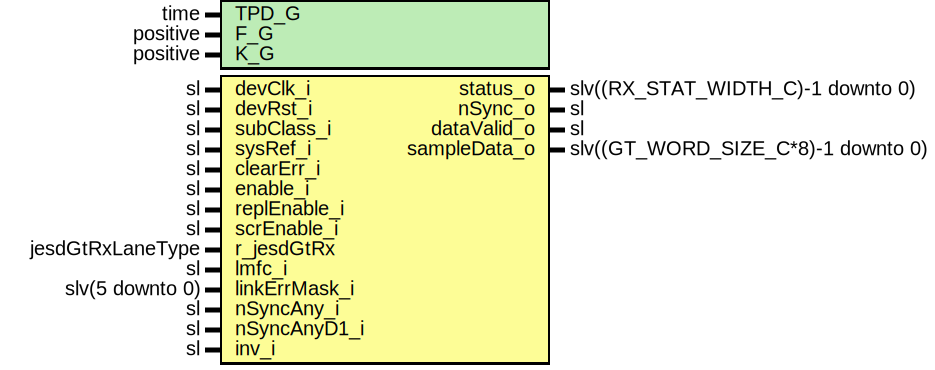

# Entity: JesdRxLane

## Diagram

## Description

Company    : SLAC National Accelerator Laboratory
Description: JesdRx single lane module
             Receiver JESD204b standard.
             Supports sub-class 1 deterministic latency.
             Supports sub-class 0 non deterministic latency
             Features:
             - Comma synchronization
             - Internal buffer to align the lanes.
             - Sample data alignment (Sample extraction from GT word - barrel shifter).
             - Alignment character replacement.
             - Scrambling support
            Status register encoding:
               bit 0: GT Reset done
               bit 1: Received data valid
               bit 2: Received data is misaligned
               bit 3: Synchronization output status
               bit 4: Rx buffer overflow
               bit 5: Rx buffer underflow
               bit 6: Comma position not as expected during alignment
               bit 7: RX module enabled status
               bit 8: SysRef detected (active only when the lane is enabled)
               bit 9: Comma (K28.5) detected
               bit 10-13: Disparity error
               bit 14-17: Not in table Error
               bit 18-25: 8-bit buffer latency
               bit 26: CDR Status of the GTH (Not used in yaml)
         Note: sampleData_o is little endian and not byte swapped
               First sample in time:  sampleData_o(15 downto 0)
               Second sample in time: sampleData_o(31 downto 16)
         Note: The output ADC sample data can be inverted.
                    inv_i:     '1' Inverted,      '0' Normal
               If inverted the mode can be chosen:
                    invMode_i: '1' Offset binary, '0' Twos complement
This file is part of 'SLAC Firmware Standard Library'.
It is subject to the license terms in the LICENSE.txt file found in the
top-level directory of this distribution and at:
   https://confluence.slac.stanford.edu/display/ppareg/LICENSE.html.
No part of 'SLAC Firmware Standard Library', including this file,
may be copied, modified, propagated, or distributed except according to
the terms contained in the LICENSE.txt file.
## Generics

| Generic name | Type     | Value | Description                        |
| ------------ | -------- | ----- | ---------------------------------- |
| TPD_G        | time     | 1 ns  |                                    |
| F_G          | positive | 2     | Number of bytes in a frame         |
| K_G          | positive | 32    | Number of frames in a multi frame  |
## Ports

| Port name     | Direction | Type                               | Description                                           |
| ------------- | --------- | ---------------------------------- | ----------------------------------------------------- |
| devClk_i      | in        | sl                                 | Clocks and Resets                                     |
| devRst_i      | in        | sl                                 |                                                       |
| subClass_i    | in        | sl                                 | JESD subclass selection: '0' or '1'(default)          |
| sysRef_i      | in        | sl                                 | SYSREF for subclass 1 fixed latency                   |
| clearErr_i    | in        | sl                                 | Clear registered errors                               |
| enable_i      | in        | sl                                 | Control register                                      |
| replEnable_i  | in        | sl                                 |                                                       |
| scrEnable_i   | in        | sl                                 |                                                       |
| status_o      | out       | slv((RX_STAT_WIDTH_C)-1 downto 0)  |                                                       |
| r_jesdGtRx    | in        | jesdGtRxLaneType                   | Data and character inputs from GT (transceivers)      |
| lmfc_i        | in        | sl                                 | Local multi frame clock                               |
| linkErrMask_i | in        | slv(5 downto 0)                    | Error mask                                            |
| nSyncAny_i    | in        | sl                                 | One or more RX modules requested synchronization      |
| nSyncAnyD1_i  | in        | sl                                 |                                                       |
| inv_i         | in        | sl                                 | Invert ADC data                                       |
| nSync_o       | out       | sl                                 | Synchronization request output                        |
| dataValid_o   | out       | sl                                 | Synchronization process is complete and data is valid |
| sampleData_o  | out       | slv((GT_WORD_SIZE_C*8)-1 downto 0) |                                                       |
## Signals

| Name                  | Type                                                | Description              |
| --------------------- | --------------------------------------------------- | ------------------------ |
| r                     | RegType                                             |                          |
| rin                   | RegType                                             |                          |
| s_nSync               | sl                                                  | Control signals from FSM |
| s_readBuff            | sl                                                  |                          |
| s_alignFrame          | sl                                                  |                          |
| s_alignFrameDly1      | sl                                                  |                          |
| s_alignFrameDly0      | sl                                                  |                          |
| s_ila                 | sl                                                  |                          |
| s_dataValid           | sl                                                  |                          |
| s_dataValidDly1       | sl                                                  |                          |
| s_dataValidDly0       | sl                                                  |                          |
| s_bufRst              | sl                                                  | Buffer control           |
| s_bufWe               | sl                                                  |                          |
| s_bufRe               | sl                                                  |                          |
| s_charAndData         | slv(((GT_WORD_SIZE_C*8)+GT_WORD_SIZE_C)-1 downto 0) | Data path                |
| s_charAndDataBuff     | slv(s_charAndData'range)                            |                          |
| s_charAndDataBuffDly1 | slv(s_charAndData'range)                            |                          |
| s_charAndDataBuffDly0 | slv(s_charAndData'range)                            |                          |
| s_sampleData          | slv(sampleData_o'range)                             |                          |
| s_sampleDataValid     | sl                                                  |                          |
| s_bufOvf              | sl                                                  | Statuses                 |
| s_bufUnf              | sl                                                  |                          |
| s_bufFull             | sl                                                  |                          |
| s_alignErr            | sl                                                  |                          |
| s_positionErr         | sl                                                  |                          |
| s_linkErrVec          | slv(5 downto 0)                                     |                          |
| s_linkErr             | sl                                                  |                          |
| s_kDetected           | sl                                                  |                          |
| s_refDetected         | sl                                                  |                          |
| s_errComb             | slv(ERR_REG_WIDTH_C-1 downto 0)                     |                          |
| s_buffLatency         | slv(7 downto 0)                                     |                          |
## Constants

| Name            | Type     | Value                                                                                                                                                                                                                                                                                                                                               | Description |
| --------------- | -------- | --------------------------------------------------------------------------------------------------------------------------------------------------------------------------------------------------------------------------------------------------------------------------------------------------------------------------------------------------- | ----------- |
| ERR_REG_WIDTH_C | positive |  4+2*GT_WORD_SIZE_C                                                                                                                                                                                                                                                                                                                                 |             |
| REG_INIT_C      | RegType  |  (       bufWeD1         => '0',        errReg          => (others => '0'),        sampleData      => (others => '0'),        sampleDataValid => '0',        jesdGtRx        => JESD_GT_RX_LANE_INIT_C) |             |
## Types

| Name    | Type | Description |
| ------- | ---- | ----------- |
| RegType |      |             |
## Processes
- unnamed: ( devClk_i )
- comb: ( clearErr_i, enable_i, inv_i, r, r_jesdGtRx, s_bufWe,
                   s_buffLatency, s_dataValidDly1, s_errComb, s_kDetected,
                   s_nSync, s_refDetected, s_sampleData, s_sampleDataValid )
- seq: ( devClk_i )
## Instantiations

- RX_buffer_fifo_INST: surf.FifoSync
**Description**
Buffer samples between first data and LMFC Min size one LMFC period

- syncFSM_INST: surf.JesdSyncFsmRx
**Description**
Synchronization FSM

- alignFrRepCh_INST: surf.JesdAlignFrRepCh
**Description**
Align the rx data within the GT word and replace the characters

