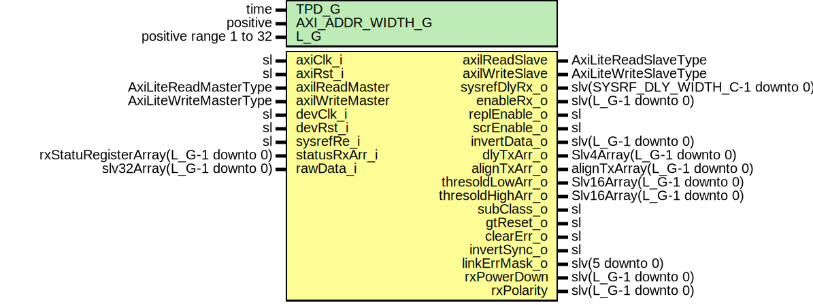

# Entity: JesdRxReg

## Diagram

## Description

Company    : SLAC National Accelerator Laboratory
Description:  AXI-Lite interface for register access
This file is part of 'SLAC Firmware Standard Library'.
It is subject to the license terms in the LICENSE.txt file found in the
top-level directory of this distribution and at:
   https://confluence.slac.stanford.edu/display/ppareg/LICENSE.html.
No part of 'SLAC Firmware Standard Library', including this file,
may be copied, modified, propagated, or distributed except according to
the terms contained in the LICENSE.txt file.
## Generics

| Generic name     | Type                   | Value | Description                        |
| ---------------- | ---------------------- | ----- | ---------------------------------- |
| TPD_G            | time                   | 1 ns  | General Configurations             |
| AXI_ADDR_WIDTH_G | positive               | 10    |                                    |
| L_G              | positive range 1 to 32 | 2     | JESD Number of RX lanes (1 to 32)  |
## Ports

| Port name         | Direction | Type                                 | Description                                 |
| ----------------- | --------- | ------------------------------------ | ------------------------------------------- |
| axiClk_i          | in        | sl                                   | AXI Clk                                     |
| axiRst_i          | in        | sl                                   |                                             |
| axilReadMaster    | in        | AxiLiteReadMasterType                | Axi-Lite Register Interface (locClk domain) |
| axilReadSlave     | out       | AxiLiteReadSlaveType                 |                                             |
| axilWriteMaster   | in        | AxiLiteWriteMasterType               |                                             |
| axilWriteSlave    | out       | AxiLiteWriteSlaveType                |                                             |
| devClk_i          | in        | sl                                   | JESD devClk                                 |
| devRst_i          | in        | sl                                   |                                             |
| sysrefRe_i        | in        | sl                                   | JESD registersStatus                        |
| statusRxArr_i     | in        | rxStatuRegisterArray(L_G-1 downto 0) |                                             |
| rawData_i         | in        | slv32Array(L_G-1 downto 0)           |                                             |
| sysrefDlyRx_o     | out       | slv(SYSRF_DLY_WIDTH_C-1 downto 0)    | Control                                     |
| enableRx_o        | out       | slv(L_G-1 downto 0)                  |                                             |
| replEnable_o      | out       | sl                                   |                                             |
| scrEnable_o       | out       | sl                                   |                                             |
| invertData_o      | out       | slv(L_G-1 downto 0)                  |                                             |
| dlyTxArr_o        | out       | Slv4Array(L_G-1 downto 0)            | 1 to 16 clock cycles                        |
| alignTxArr_o      | out       | alignTxArray(L_G-1 downto 0)         | 0001, 0010, 0100, 1000                      |
| thresoldLowArr_o  | out       | Slv16Array(L_G-1 downto 0)           | Test signal threshold low                   |
| thresoldHighArr_o | out       | Slv16Array(L_G-1 downto 0)           | Test signal threshold high                  |
| subClass_o        | out       | sl                                   |                                             |
| gtReset_o         | out       | sl                                   |                                             |
| clearErr_o        | out       | sl                                   |                                             |
| invertSync_o      | out       | sl                                   |                                             |
| linkErrMask_o     | out       | slv(5 downto 0)                      |                                             |
| rxPowerDown       | out       | slv(L_G-1 downto 0)                  |                                             |
| rxPolarity        | out       | slv(L_G-1 downto 0)                  |                                             |
## Signals

| Name            | Type                                                                           | Description           |
| --------------- | ------------------------------------------------------------------------------ | --------------------- |
| r               | RegType                                                                        |                       |
| rin             | RegType                                                                        |                       |
| s_RdAddr        | natural                                                                        | Integer address       |
| s_WrAddr        | natural                                                                        |                       |
| s_statusRxArr   | rxStatuRegisterArray(L_G-1 downto 0)                                           | Synced status signals |
| s_rawData       | slv32Array(L_G-1 downto 0)                                                     |                       |
| s_statusCnt     | SlVectorArray(L_G-1 downto 0,  31 downto 0) |                       |
| s_adcValids     | slv(L_G-1 downto 0)                                                            |                       |
| sysrefDlyRx     | slv(SYSRF_DLY_WIDTH_C-1 downto 0)                                              |                       |
| enableRx        | slv(L_G-1 downto 0)                                                            |                       |
| replEnable      | sl                                                                             |                       |
| scrEnable       | sl                                                                             |                       |
| invertData      | slv(L_G-1 downto 0)                                                            |                       |
| dlyTxArr        | Slv4Array(L_G-1 downto 0)                                                      |                       |
| alignTxArr      | alignTxArray(L_G-1 downto 0)                                                   |                       |
| thresoldLowArr  | Slv16Array(L_G-1 downto 0)                                                     |                       |
| thresoldHighArr | Slv16Array(L_G-1 downto 0)                                                     |                       |
| subClass        | sl                                                                             |                       |
| gtReset         | sl                                                                             |                       |
| clearErr        | sl                                                                             |                       |
| invertSync      | sl                                                                             |                       |
| linkErrMask     | slv(5 downto 0)                                                                |                       |
| sysRefPeriodmin | slv(15 downto 0)                                                               |                       |
| sysRefPeriodmax | slv(15 downto 0)                                                               |                       |
## Constants

| Name       | Type    | Value                                                                                                                                                                                                                                                                                                                                                                                                                                                                                                                                                                                                                                                                                                                                                                                                                                                                                                            | Description |
| ---------- | ------- | ---------------------------------------------------------------------------------------------------------------------------------------------------------------------------------------------------------------------------------------------------------------------------------------------------------------------------------------------------------------------------------------------------------------------------------------------------------------------------------------------------------------------------------------------------------------------------------------------------------------------------------------------------------------------------------------------------------------------------------------------------------------------------------------------------------------------------------------------------------------------------------------------------------------- | ----------- |
| REG_INIT_C | RegType |  (       -- JESD Control (RW)       enableRx       => (others => '0'),        invertData     => (others => '0'),        commonCtrl     => "010111",        linkErrMask    => "111111",        sysrefDlyRx    => (others => '0'),        testTXItf      => (others => x"0000"),        testSigThr     => (others => x"A000_5000"),        rxPolarity     => (others => '0'),        rxPowerDown    => (others => '0'),        -- AXI lite       axilReadSlave  => AXI_LITE_READ_SLAVE_INIT_C,        axilWriteSlave => AXI_LITE_WRITE_SLAVE_INIT_C) |             |
## Types

| Name    | Type | Description |
| ------- | ---- | ----------- |
| RegType |      |             |
## Processes
- comb: ( axiRst_i, axilReadMaster, axilWriteMaster, r, s_RdAddr,
                   s_WrAddr, s_rawData, s_statusCnt, s_statusRxArr,
                   sysRefPeriodmax, sysRefPeriodmin )
- seq: ( axiClk_i )
## Instantiations

- U_JesdSysrefMon: surf.JesdSysrefMon
- U_SyncStatusVector: surf.SyncStatusVector
- U_sysrefDlyRx: surf.SynchronizerVector
**Description**
Output assignment and synchronization

- U_sysrefDlyRx_Pipeline: surf.RstPipelineVector
- U_enableRx: surf.SynchronizerVector
- U_enableRx_Pipeline: surf.RstPipelineVector
- U_subClass: surf.Synchronizer
- U_subClass_Pipeline: surf.RstPipeline
- U_replEnable: surf.Synchronizer
- U_replEnable_Pipeline: surf.RstPipeline
- U_gtReset: surf.Synchronizer
- U_gtReset_Pipeline: surf.RstPipeline
- U_clearErr: surf.Synchronizer
- U_clearErr_Pipeline: surf.RstPipeline
- U_invertSync: surf.Synchronizer
- U_invertSync_Pipeline: surf.RstPipeline
- U_scrEnable: surf.Synchronizer
- U_scrEnable_Pipeline: surf.RstPipeline
- U_linkErrMask: surf.SynchronizerVector
- U_linkErrMask_Pipeline: surf.RstPipelineVector
- U_invertData: surf.SynchronizerVector
- U_invertData_Pipeline: surf.RstPipelineVector
