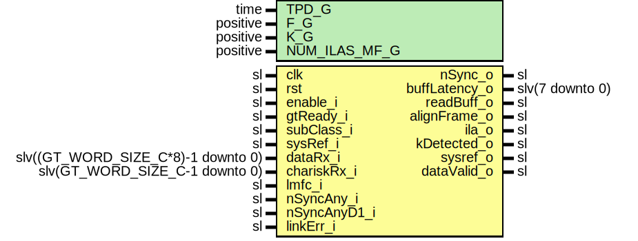

# Entity: JesdSyncFsmRx

- **File**: JesdSyncFsmRx.vhd
## Diagram

## Description

Company    : SLAC National Accelerator Laboratory
Description: Synchronizer Finite state machine
             Finite state machine for sub-class 1 deterministic latency
             lane synchronization.
             It also supports sub-class 0 non deterministic mode.
This file is part of 'SLAC Firmware Standard Library'.
It is subject to the license terms in the LICENSE.txt file found in the
top-level directory of this distribution and at:
   https://confluence.slac.stanford.edu/display/ppareg/LICENSE.html.
No part of 'SLAC Firmware Standard Library', including this file,
may be copied, modified, propagated, or distributed except according to
the terms contained in the LICENSE.txt file.
## Generics

| Generic name  | Type     | Value | Description                                     |
| ------------- | -------- | ----- | ----------------------------------------------- |
| TPD_G         | time     | 1 ns  |                                                 |
| F_G           | positive | 2     | Number of bytes in a frame                      |
| K_G           | positive | 32    | Number of frames in a multi frame               |
| NUM_ILAS_MF_G | positive | 4     | Number of multi-frames in ILA sequence (4-255)  |
## Ports

| Port name     | Direction | Type                               | Description                                                                                   |
| ------------- | --------- | ---------------------------------- | --------------------------------------------------------------------------------------------- |
| clk           | in        | sl                                 | Clocks and Resets                                                                             |
| rst           | in        | sl                                 |                                                                                               |
| enable_i      | in        | sl                                 | Enable the module                                                                             |
| gtReady_i     | in        | sl                                 |                                                                                               |
| subClass_i    | in        | sl                                 | JESD subclass selection: '0' or '1'(default)                                                  |
| sysRef_i      | in        | sl                                 | SYSREF for subcalss 1 fixed latency                                                           |
| dataRx_i      | in        | slv((GT_WORD_SIZE_C*8)-1 downto 0) | Data and character inputs from GT (transceivers)                                              |
| chariskRx_i   | in        | slv(GT_WORD_SIZE_C-1 downto 0)     |                                                                                               |
| lmfc_i        | in        | sl                                 | Local multi frame clock                                                                       |
| nSyncAny_i    | in        | sl                                 | One or more RX modules requested synchronization                                              |
| nSyncAnyD1_i  | in        | sl                                 |                                                                                               |
| linkErr_i     | in        | sl                                 | Combined link errors                                                                          |
| nSync_o       | out       | sl                                 | Synchronous FSM control outputsSynchronization request                                        |
| buffLatency_o | out       | slv(7 downto 0)                    | Elastic buffer latency in clock cycles                                                        |
| readBuff_o    | out       | sl                                 | Read enable for Rx Buffer.Holds buffers between first data and LMFC                           |
| alignFrame_o  | out       | sl                                 | First non comma (K) character detected.To indicate when to realign sample within the dataRx.  |
| ila_o         | out       | sl                                 | Ila frames are being received                                                                 |
| kDetected_o   | out       | sl                                 | K detected                                                                                    |
| sysref_o      | out       | sl                                 | sysref received                                                                               |
| dataValid_o   | out       | sl                                 | Synchronisation process is complete and data is valid                                         |
## Signals

| Name        | Type    | Description |
| ----------- | ------- | ----------- |
| r           | RegType |             |
| rin         | RegType |             |
| s_kDetected | sl      |             |
| s_kStable   | sl      |             |
## Constants

| Name       | Type    | Value                                                                                                                                                                                                                                                                                                                                                                                                                                                                                                                                                                                                                                                                                                                                                                                                                                                                        | Description |
| ---------- | ------- | ---------------------------------------------------------------------------------------------------------------------------------------------------------------------------------------------------------------------------------------------------------------------------------------------------------------------------------------------------------------------------------------------------------------------------------------------------------------------------------------------------------------------------------------------------------------------------------------------------------------------------------------------------------------------------------------------------------------------------------------------------------------------------------------------------------------------------------------------------------------------------- | ----------- |
| REG_INIT_C | RegType |  (       kDetectRegD1 => '0',        kDetectRegD2 => '0',        kDetectRegD3 => '0',         linkErr      => '0',        nSync        => '0',        readBuff     => '0',        alignFrame   => '0',        Ila          => '0',        dataValid    => '0',        sysref       => '0',        cnt          =>  (others => '0'),        cntLatency   =>  (others => '0'),         -- Status Machine       state        => IDLE_S    ) |             |
## Types

| Name      | Type                                                                                                                                                                                                                                                                                  | Description |
| --------- | ------------------------------------------------------------------------------------------------------------------------------------------------------------------------------------------------------------------------------------------------------------------------------------- | ----------- |
| stateType | ( IDLE_S,  SYSREF_S,  SYNC_S,  HOLD_S,  ALIGN_S,  ILA_S,  DATA_S )  |             |
| RegType   |                                                                                                                                                                                                                                                                                       |             |
## Processes
- comb: ( rst, r, enable_i,sysRef_i, dataRx_i,subClass_i, chariskRx_i, lmfc_i, nSyncAnyD1_i, nSyncAny_i, linkErr_i, gtReady_i, s_kDetected, s_kStable )
**Description**
State machine

- seq: ( clk )
