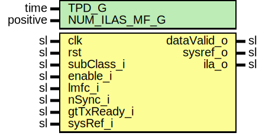

# Entity: JesdSyncFsmTx

## Diagram

## Description

Company    : SLAC National Accelerator Laboratory
Description: Synchronizer TX Finite state machine
             Finite state machine for sub-class 1 and sub-class 0 deterministic latency
             lane synchronization.
This file is part of 'SLAC Firmware Standard Library'.
It is subject to the license terms in the LICENSE.txt file found in the
top-level directory of this distribution and at:
   https://confluence.slac.stanford.edu/display/ppareg/LICENSE.html.
No part of 'SLAC Firmware Standard Library', including this file,
may be copied, modified, propagated, or distributed except according to
the terms contained in the LICENSE.txt file.
## Generics

| Generic name  | Type     | Value | Description                                     |
| ------------- | -------- | ----- | ----------------------------------------------- |
| TPD_G         | time     | 1 ns  |                                                 |
| NUM_ILAS_MF_G | positive | 4     | Number of multi-frames in ILA sequence (4-255)  |
## Ports

| Port name   | Direction | Type | Description                                            |
| ----------- | --------- | ---- | ------------------------------------------------------ |
| clk         | in        | sl   | Clocks and Resets                                      |
| rst         | in        | sl   |                                                        |
| subClass_i  | in        | sl   | JESD subclass selection: '0' or '1'(default)           |
| enable_i    | in        | sl   | Enable the module                                      |
| lmfc_i      | in        | sl   | Local multi frame clock                                |
| nSync_i     | in        | sl   | Synchronization request                                |
| gtTxReady_i | in        | sl   | GT is ready to transmit data after reset               |
| sysRef_i    | in        | sl   | SYSREF for subclass 1 fixed latency                    |
| dataValid_o | out       | sl   | Synchronization process is complete start sending data |
| sysref_o    | out       | sl   | sysref received                                        |
| ila_o       | out       | sl   | Initial lane synchronization sequence indicator        |
## Signals

| Name | Type    | Description |
| ---- | ------- | ----------- |
| r    | RegType |             |
| rin  | RegType |             |
## Constants

| Name       | Type    | Value                                                                                                                                                                                                                                                                                                                                  | Description |
| ---------- | ------- | -------------------------------------------------------------------------------------------------------------------------------------------------------------------------------------------------------------------------------------------------------------------------------------------------------------------------------------- | ----------- |
| REG_INIT_C | RegType |  (       dataValid    => '0',        ila          => '0',        sysref       => '0',        cnt          =>  (others => '0'),         -- Status Machine       state        => IDLE_S    ) |             |
## Types

| Name      | Type                                                                                                                                           | Description |
| --------- | ---------------------------------------------------------------------------------------------------------------------------------------------- | ----------- |
| stateType | ( IDLE_S,  SYNC_S,  ILA_S,  DATA_S )  |             |
| RegType   |                                                                                                                                                |             |
## Processes
- comb: ( rst, r, enable_i, lmfc_i, nSync_i, gtTxReady_i, sysRef_i, subClass_i )
- seq: ( clk )
