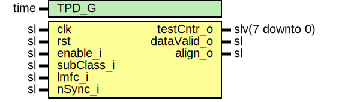

# Entity: JesdSyncFsmTxTest

- **File**: JesdSyncFsmTxTest.vhd
## Diagram

## Description

Company    : SLAC National Accelerator Laboratory
Description: Synchronizer for simple TX Finite state machine
             Finite state machine for sub-class 1 deterministic latency
             lane synchronization.
This file is part of 'SLAC Firmware Standard Library'.
It is subject to the license terms in the LICENSE.txt file found in the
top-level directory of this distribution and at:
   https://confluence.slac.stanford.edu/display/ppareg/LICENSE.html.
No part of 'SLAC Firmware Standard Library', including this file,
may be copied, modified, propagated, or distributed except according to
the terms contained in the LICENSE.txt file.
## Generics

| Generic name | Type | Value | Description |
| ------------ | ---- | ----- | ----------- |
| TPD_G        | time | 1 ns  |             |
## Ports

| Port name   | Direction | Type            | Description                                            |
| ----------- | --------- | --------------- | ------------------------------------------------------ |
| clk         | in        | sl              | Clocks and Resets                                      |
| rst         | in        | sl              |                                                        |
| enable_i    | in        | sl              | Enable the module                                      |
| subClass_i  | in        | sl              | JESD subclass selection: '0' or '1'(default)           |
| lmfc_i      | in        | sl              | Local multi frame clock                                |
| nSync_i     | in        | sl              | Synchronization request                                |
| testCntr_o  | out       | slv(7 downto 0) |                                                        |
| dataValid_o | out       | sl              | Synchronization process is complete start sending data |
| align_o     | out       | sl              | First data                                             |
## Signals

| Name | Type    | Description |
| ---- | ------- | ----------- |
| r    | RegType |             |
| rin  | RegType |             |
## Constants

| Name       | Type    | Value                                                                                                                                                                                                                                                     | Description |
| ---------- | ------- | --------------------------------------------------------------------------------------------------------------------------------------------------------------------------------------------------------------------------------------------------------- | ----------- |
| REG_INIT_C | RegType |  (       dataValid => '0',        align     => '0',        cnt       => (others => '0'),         -- Status Machine       state => IDLE_S       ) |             |
## Types

| Name      | Type                                                                                                                                             | Description |
| --------- | ------------------------------------------------------------------------------------------------------------------------------------------------ | ----------- |
| stateType | ( IDLE_S,  SYNC_S,  ALIGN_S,  DATA_S )  |             |
| RegType   |                                                                                                                                                  |             |
## Processes
- comb: ( enable_i, lmfc_i, nSync_i, r, rst, subClass_i )
- seq: ( clk )
