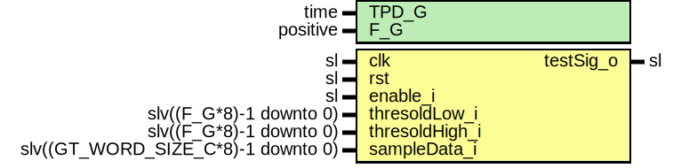

# Entity: JesdTestSigGen

- **File**: JesdTestSigGen.vhd
## Diagram

## Description

-----------------------------------------------------------------------------
 Company    : SLAC National Accelerator Laboratory
-----------------------------------------------------------------------------
 Description: Outputs a digital signal depending on thresholds
              This is a test module so only F_G = 2
              and is GT_WORD_SIZE_C = 4 is supported.
-----------------------------------------------------------------------------
 This file is part of 'SLAC Firmware Standard Library'.
 It is subject to the license terms in the LICENSE.txt file found in the
 top-level directory of this distribution and at:
    https://confluence.slac.stanford.edu/display/ppareg/LICENSE.html.
 No part of 'SLAC Firmware Standard Library', including this file,
 may be copied, modified, propagated, or distributed except according to
 the terms contained in the LICENSE.txt file.
-----------------------------------------------------------------------------
## Generics

| Generic name | Type     | Value | Description                 |
| ------------ | -------- | ----- | --------------------------- |
| TPD_G        | time     | 1 ns  |                             |
| F_G          | positive | 2     | Number of bytes in a frame  |
## Ports

| Port name      | Direction | Type                               | Description                         |
| -------------- | --------- | ---------------------------------- | ----------------------------------- |
| clk            | in        | sl                                 |                                     |
| rst            | in        | sl                                 |                                     |
| enable_i       | in        | sl                                 | Enable pulser                       |
| thresoldLow_i  | in        | slv((F_G*8)-1 downto 0)            | Threshold for Rising edge detection |
| thresoldHigh_i | in        | slv((F_G*8)-1 downto 0)            |                                     |
| sampleData_i   | in        | slv((GT_WORD_SIZE_C*8)-1 downto 0) | Sample data input                   |
| testSig_o      | out       | sl                                 | Test signal                         |
## Signals

| Name           | Type                    | Description |
| -------------- | ----------------------- | ----------- |
| r              | RegType                 |             |
| rin            | RegType                 |             |
| s_sampleDataBr | slv(sampleData_i'range) |             |
## Constants

| Name       | Type    | Value                                 | Description |
| ---------- | ------- | ------------------------------------- | ----------- |
| REG_INIT_C | RegType |  (       sig              => '0'    ) |             |
## Types

| Name    | Type | Description |
| ------- | ---- | ----------- |
| RegType |      |             |
## Processes
- comb: ( r, rst,s_sampleDataBr, thresoldLow_i, thresoldHigh_i, enable_i )
 **Description**
 Buffer two GT words. And compare previous and current samples to threshold.  If the difference between the previous and current sample is higher than threshold  output a pulse. ------------------------------------------------------------------- ------------------------------------------------------------------- 
- seq: ( clk )
