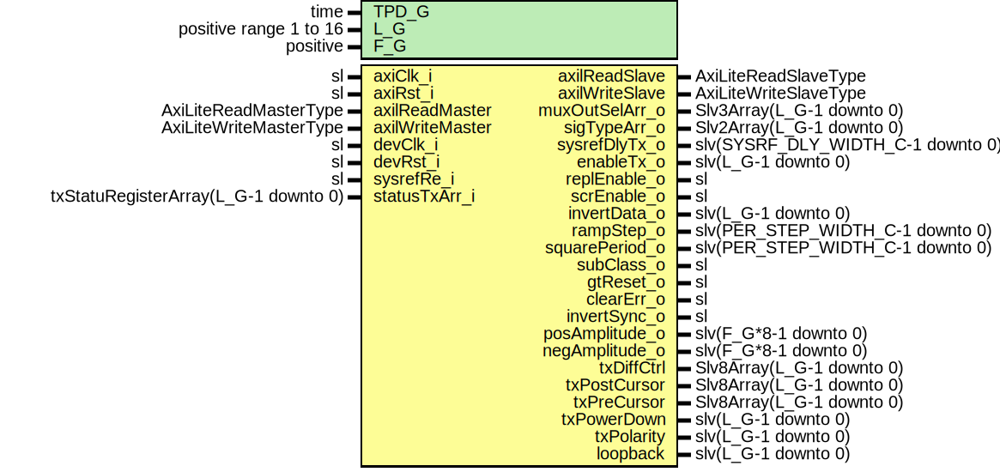

# Entity: JesdTxReg

## Diagram

## Description

Company    : SLAC National Accelerator Laboratory
Description: AXI-Lite interface for register access
This file is part of 'SLAC Firmware Standard Library'.
It is subject to the license terms in the LICENSE.txt file found in the
top-level directory of this distribution and at:
   https://confluence.slac.stanford.edu/display/ppareg/LICENSE.html.
No part of 'SLAC Firmware Standard Library', includataIng this file,
may be copied, modified, propagated, or distributed except accordataIng to
the terms contained in the LICENSE.txt file.
## Generics

| Generic name | Type                   | Value | Description             |
| ------------ | ---------------------- | ----- | ----------------------- |
| TPD_G        | time                   | 1 ns  | General Configurations  |
| L_G          | positive range 1 to 16 | 2     | JESD                    |
| F_G          | positive               | 2     |                         |
## Ports

| Port name       | Direction | Type                                 | Description                                 |
| --------------- | --------- | ------------------------------------ | ------------------------------------------- |
| axiClk_i        | in        | sl                                   | JESD axiClk                                 |
| axiRst_i        | in        | sl                                   |                                             |
| axilReadMaster  | in        | AxiLiteReadMasterType                | Axi-Lite Register Interface (locClk domain) |
| axilReadSlave   | out       | AxiLiteReadSlaveType                 |                                             |
| axilWriteMaster | in        | AxiLiteWriteMasterType               |                                             |
| axilWriteSlave  | out       | AxiLiteWriteSlaveType                |                                             |
| devClk_i        | in        | sl                                   | JESD devClk                                 |
| devRst_i        | in        | sl                                   |                                             |
| sysrefRe_i      | in        | sl                                   | JESD registersStatus                        |
| statusTxArr_i   | in        | txStatuRegisterArray(L_G-1 downto 0) |                                             |
| muxOutSelArr_o  | out       | Slv3Array(L_G-1 downto 0)            | Control                                     |
| sigTypeArr_o    | out       | Slv2Array(L_G-1 downto 0)            |                                             |
| sysrefDlyTx_o   | out       | slv(SYSRF_DLY_WIDTH_C-1 downto 0)    |                                             |
| enableTx_o      | out       | slv(L_G-1 downto 0)                  |                                             |
| replEnable_o    | out       | sl                                   |                                             |
| scrEnable_o     | out       | sl                                   |                                             |
| invertData_o    | out       | slv(L_G-1 downto 0)                  |                                             |
| rampStep_o      | out       | slv(PER_STEP_WIDTH_C-1 downto 0)     |                                             |
| squarePeriod_o  | out       | slv(PER_STEP_WIDTH_C-1 downto 0)     |                                             |
| subClass_o      | out       | sl                                   |                                             |
| gtReset_o       | out       | sl                                   |                                             |
| clearErr_o      | out       | sl                                   |                                             |
| invertSync_o    | out       | sl                                   |                                             |
| posAmplitude_o  | out       | slv(F_G*8-1 downto 0)                |                                             |
| negAmplitude_o  | out       | slv(F_G*8-1 downto 0)                |                                             |
| txDiffCtrl      | out       | Slv8Array(L_G-1 downto 0)            | TX Configurable Driver Ports                |
| txPostCursor    | out       | Slv8Array(L_G-1 downto 0)            |                                             |
| txPreCursor     | out       | Slv8Array(L_G-1 downto 0)            |                                             |
| txPowerDown     | out       | slv(L_G-1 downto 0)                  |                                             |
| txPolarity      | out       | slv(L_G-1 downto 0)                  |                                             |
| loopback        | out       | slv(L_G-1 downto 0)                  |                                             |
## Signals

| Name            | Type                                                                           | Description           |
| --------------- | ------------------------------------------------------------------------------ | --------------------- |
| r               | RegType                                                                        |                       |
| rin             | RegType                                                                        |                       |
| s_RdAddr        | natural                                                                        | Integer address       |
| s_WrAddr        | natural                                                                        |                       |
| s_statusTxArr   | txStatuRegisterArray(L_G-1 downto 0)                                           | Synced status signals |
| s_statusCnt     | SlVectorArray(L_G-1 downto 0,  31 downto 0) |                       |
| s_adcValids     | slv(L_G-1 downto 0)                                                            |                       |
| muxOutSelArr    | Slv3Array(L_G-1 downto 0)                                                      |                       |
| sigTypeArr      | Slv2Array(L_G-1 downto 0)                                                      |                       |
| sysrefDlyTx     | slv(SYSRF_DLY_WIDTH_C-1 downto 0)                                              |                       |
| enableTx        | slv(L_G-1 downto 0)                                                            |                       |
| replEnable      | sl                                                                             |                       |
| scrEnable       | sl                                                                             |                       |
| invertData      | slv(L_G-1 downto 0)                                                            |                       |
| rampStep        | slv(PER_STEP_WIDTH_C-1 downto 0)                                               |                       |
| squarePeriod    | slv(PER_STEP_WIDTH_C-1 downto 0)                                               |                       |
| subClass        | sl                                                                             |                       |
| gtReset         | sl                                                                             |                       |
| clearErr        | sl                                                                             |                       |
| invertSync      | sl                                                                             |                       |
| enableTestSig   | sl                                                                             |                       |
| posAmplitude    | slv(F_G*8-1 downto 0)                                                          |                       |
| negAmplitude    | slv(F_G*8-1 downto 0)                                                          |                       |
| sysRefPeriodmin | slv(15 downto 0)                                                               |                       |
| sysRefPeriodmax | slv(15 downto 0)                                                               |                       |
## Constants

| Name       | Type    | Value                                                                                                                                                                                                                                                                                                                                                                                                                                                                                                                                                                                                                                                                                                                                                                                                                                                                                                                                                                                                                                                                                                                                                                                                                                                                                                                                                                                                                                                                                                                                                                                                                                                                                                                                                                                                                                                                                                                                                                                                                                          | Description |
| ---------- | ------- | ---------------------------------------------------------------------------------------------------------------------------------------------------------------------------------------------------------------------------------------------------------------------------------------------------------------------------------------------------------------------------------------------------------------------------------------------------------------------------------------------------------------------------------------------------------------------------------------------------------------------------------------------------------------------------------------------------------------------------------------------------------------------------------------------------------------------------------------------------------------------------------------------------------------------------------------------------------------------------------------------------------------------------------------------------------------------------------------------------------------------------------------------------------------------------------------------------------------------------------------------------------------------------------------------------------------------------------------------------------------------------------------------------------------------------------------------------------------------------------------------------------------------------------------------------------------------------------------------------------------------------------------------------------------------------------------------------------------------------------------------------------------------------------------------------------------------------------------------------------------------------------------------------------------------------------------------------------------------------------------------------------------------------------------------- | ----------- |
| REG_INIT_C | RegType |  (       enableTx        => (others => '0'),        invertData      => (others => '0'),        commonCtrl      => "0110011",        sysrefDlyTx     => (others => '0'),        --signalSelectArr=> (others => b"0010_0011"),  -- Set to squarewave       --periodStep     => intToSlv(1, PER_STEP_WIDTH_C) & intToSlv(4096, PER_STEP_WIDTH_C),        signalSelectArr => (others => b"0000_0001"),   -- Set to external       periodStep      => intToSlv(1,  PER_STEP_WIDTH_C) & intToSlv(1,  PER_STEP_WIDTH_C),        --signalSelectArr=> (others => b"0001_0011"),  -- Set to ramp       --periodStep     => intToSlv(1, PER_STEP_WIDTH_C) & intToSlv(1, PER_STEP_WIDTH_C),         posAmplitude => (others => '1'),        negAmplitude => (others => '0'),         txDiffCtrl   => (others => x"FF"),        txPostCursor => (others => x"00"),        txPreCursor  => (others => x"00"),        txPowerDown  => (others => '0'),        txPolarity   => (others => '0'),        loopback     => (others => '0'),         axilReadSlave  => AXI_LITE_READ_SLAVE_INIT_C,        axilWriteSlave => AXI_LITE_WRITE_SLAVE_INIT_C) |             |
## Types

| Name    | Type | Description |
| ------- | ---- | ----------- |
| RegType |      |             |
## Processes
- comb: ( axiRst_i, axilReadMaster, axilWriteMaster, r, s_RdAddr,
                   s_WrAddr, s_statusCnt, s_statusTxArr, sysRefPeriodmax,
                   sysRefPeriodmin )
- seq: ( axiClk_i )
## Instantiations

- U_JesdSysrefMon: surf.JesdSysrefMon
- U_SyncStatusVector: surf.SyncStatusVector
- U_sysrefDlyTx: surf.SynchronizerVector
**Description**
Output assignment and synchronization

- U_sysrefDlyTx_Pipeline: surf.RstPipelineVector
- U_enableTx: surf.SynchronizerVector
- U_enableTx_Pipeline: surf.RstPipelineVector
- U_subClass: surf.Synchronizer
- U_subClass_Pipeline: surf.RstPipeline
- U_replEnable: surf.Synchronizer
- U_replEnable_Pipeline: surf.RstPipeline
- U_gtReset: surf.Synchronizer
- U_gtReset_Pipeline: surf.RstPipeline
- U_clearErr: surf.Synchronizer
- U_clearErr_Pipeline: surf.RstPipeline
- U_invertSync: surf.Synchronizer
- U_invertSync_Pipeline: surf.RstPipeline
- U_scrEnable: surf.Synchronizer
- U_scrEnable_Pipeline: surf.RstPipeline
- U_rampStep_A: surf.SynchronizerVector
- U_rampStep_Pipeline: surf.RstPipelineVector
- U_squarePeriod: surf.SynchronizerVector
- U_squarePeriod_Pipeline: surf.RstPipelineVector
- U_posAmplitude: surf.SynchronizerVector
- U_posAmplitude_Pipeline: surf.RstPipelineVector
- U_negAmplitude: surf.SynchronizerVector
- U_negAmplitude_Pipeline: surf.RstPipelineVector
- U_invertData: surf.SynchronizerVector
- U_invertData_Pipeline: surf.RstPipelineVector
