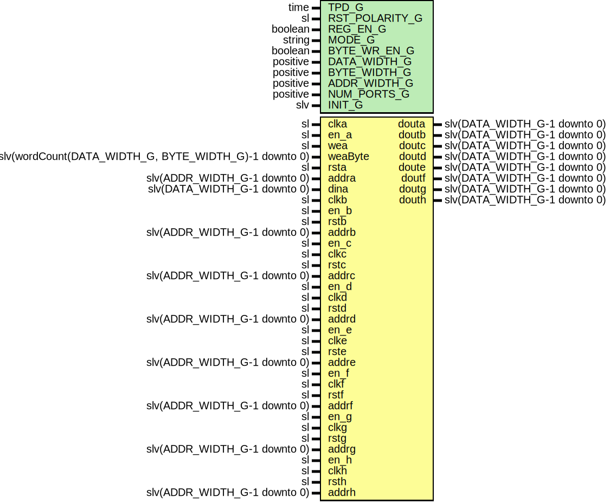

# Entity: LutRam

- **File**: LutRam.vhd
## Diagram

## Description

Company    : SLAC National Accelerator Laboratory
Description:   This module infers distributed RAM
               with configurable number of outputs
This file is part of 'SLAC Firmware Standard Library'.
It is subject to the license terms in the LICENSE.txt file found in the
top-level directory of this distribution and at:
   https://confluence.slac.stanford.edu/display/ppareg/LICENSE.html.
No part of 'SLAC Firmware Standard Library', including this file,
may be copied, modified, propagated, or distributed except according to
the terms contained in the LICENSE.txt file.
## Generics

| Generic name   | Type     | Value       | Description                                 |
| -------------- | -------- | ----------- | ------------------------------------------- |
| TPD_G          | time     | 1 ns        |                                             |
| RST_POLARITY_G | sl       | '1'         | '1' for active high rst, '0' for active low |
| REG_EN_G       | boolean  | true        |                                             |
| MODE_G         | string   | "no-change" |                                             |
| BYTE_WR_EN_G   | boolean  | false       |                                             |
| DATA_WIDTH_G   | positive | 16          |                                             |
| BYTE_WIDTH_G   | positive | 8           |                                             |
| ADDR_WIDTH_G   | positive | 4           |                                             |
| NUM_PORTS_G    | positive |             |                                             |
| INIT_G         | slv      | "0"         |                                             |
## Ports

| Port name | Direction | Type                                                  | Description                        |
| --------- | --------- | ----------------------------------------------------- | ---------------------------------- |
| clka      | in        | sl                                                    | Port A (Read/Write)                |
| en_a      | in        | sl                                                    |                                    |
| wea       | in        | sl                                                    |                                    |
| weaByte   | in        | slv(wordCount(DATA_WIDTH_G, BYTE_WIDTH_G)-1 downto 0) |                                    |
| rsta      | in        | sl                                                    |                                    |
| addra     | in        | slv(ADDR_WIDTH_G-1 downto 0)                          |                                    |
| dina      | in        | slv(DATA_WIDTH_G-1 downto 0)                          |                                    |
| douta     | out       | slv(DATA_WIDTH_G-1 downto 0)                          |                                    |
| clkb      | in        | sl                                                    | Port B (Read Only, NUM_PORTS_G>=2) |
| en_b      | in        | sl                                                    |                                    |
| rstb      | in        | sl                                                    |                                    |
| addrb     | in        | slv(ADDR_WIDTH_G-1 downto 0)                          |                                    |
| doutb     | out       | slv(DATA_WIDTH_G-1 downto 0)                          |                                    |
| en_c      | in        | sl                                                    | Port C (Read Only, NUM_PORTS_G>=3) |
| clkc      | in        | sl                                                    |                                    |
| rstc      | in        | sl                                                    |                                    |
| addrc     | in        | slv(ADDR_WIDTH_G-1 downto 0)                          |                                    |
| doutc     | out       | slv(DATA_WIDTH_G-1 downto 0)                          |                                    |
| en_d      | in        | sl                                                    | Port D (Read Only, NUM_PORTS_G>=4) |
| clkd      | in        | sl                                                    |                                    |
| rstd      | in        | sl                                                    |                                    |
| addrd     | in        | slv(ADDR_WIDTH_G-1 downto 0)                          |                                    |
| doutd     | out       | slv(DATA_WIDTH_G-1 downto 0)                          |                                    |
| en_e      | in        | sl                                                    | Port E (Read Only, NUM_PORTS_G>=5) |
| clke      | in        | sl                                                    |                                    |
| rste      | in        | sl                                                    |                                    |
| addre     | in        | slv(ADDR_WIDTH_G-1 downto 0)                          |                                    |
| doute     | out       | slv(DATA_WIDTH_G-1 downto 0)                          |                                    |
| en_f      | in        | sl                                                    | Port F (Read Only, NUM_PORTS_G>=6) |
| clkf      | in        | sl                                                    |                                    |
| rstf      | in        | sl                                                    |                                    |
| addrf     | in        | slv(ADDR_WIDTH_G-1 downto 0)                          |                                    |
| doutf     | out       | slv(DATA_WIDTH_G-1 downto 0)                          |                                    |
| en_g      | in        | sl                                                    | Port G (Read Only, NUM_PORTS_G>=7) |
| clkg      | in        | sl                                                    |                                    |
| rstg      | in        | sl                                                    |                                    |
| addrg     | in        | slv(ADDR_WIDTH_G-1 downto 0)                          |                                    |
| doutg     | out       | slv(DATA_WIDTH_G-1 downto 0)                          |                                    |
| en_h      | in        | sl                                                    | Port H (Read Only, NUM_PORTS_G>=8) |
| clkh      | in        | sl                                                    |                                    |
| rsth      | in        | sl                                                    |                                    |
| addrh     | in        | slv(ADDR_WIDTH_G-1 downto 0)                          |                                    |
| douth     | out       | slv(DATA_WIDTH_G-1 downto 0)                          |                                    |
## Signals

| Name       | Type               | Description |
| ---------- | ------------------ | ----------- |
| mem        | mem_type           |             |
| weaByteInt | slv(weaByte'range) |             |
## Constants

| Name              | Type                         | Value                                                                                                                     | Description |
| ----------------- | ---------------------------- | ------------------------------------------------------------------------------------------------------------------------- | ----------- |
| NUM_BYTES_C       | natural                      |  wordCount(DATA_WIDTH_G,  BYTE_WIDTH_G)                                                |             |
| FULL_DATA_WIDTH_C | natural                      |  NUM_BYTES_C*BYTE_WIDTH_G                                                                                                 |             |
| INIT_C            | slv(DATA_WIDTH_G-1 downto 0) |  ite(INIT_G = "0",  slvZero(DATA_WIDTH_G),  INIT_G) |             |
## Types

| Name     | Type | Description   |
| -------- | ---- | ------------- |
| mem_type |      | Shared memory |
