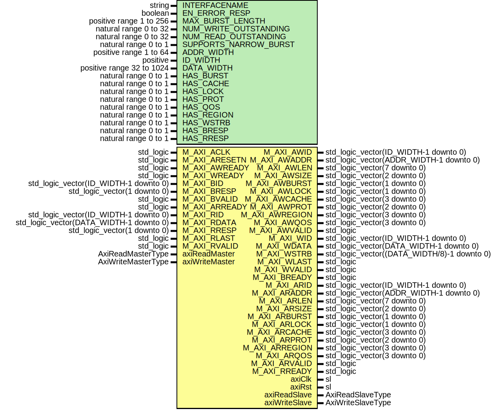

# Entity: MasterAxiIpIntegrator

- **File**: MasterAxiIpIntegrator.vhd
## Diagram

## Description

-----------------------------------------------------------------------------
 Company    : SLAC National Accelerator Laboratory
-----------------------------------------------------------------------------
 Description: Common shim layer between IP Integrator interface and surf AXI interface
-----------------------------------------------------------------------------
 This file is part of 'SLAC Firmware Standard Library'.
 It is subject to the license terms in the LICENSE.txt file found in the
 top-level directory of this distribution and at:
    https://confluence.slac.stanford.edu/display/ppareg/LICENSE.html.
 No part of 'SLAC Firmware Standard Library', including this file,
 may be copied, modified, propagated, or distributed except according to
 the terms contained in the LICENSE.txt file.
-----------------------------------------------------------------------------
## Generics

| Generic name          | Type                      | Value   | Description               |
| --------------------- | ------------------------- | ------- | ------------------------- |
| INTERFACENAME         | string                    | "M_AXI" |                           |
| EN_ERROR_RESP         | boolean                   | false   |                           |
| MAX_BURST_LENGTH      | positive range 1 to 256   | 256     |  [1, 256]                 |
| NUM_WRITE_OUTSTANDING | natural range 0 to 32     | 1       |  [0, 32]                  |
| NUM_READ_OUTSTANDING  | natural range 0 to 32     | 1       |  [0, 32]                  |
| SUPPORTS_NARROW_BURST | natural range 0 to 1      | 1       |                           |
| ADDR_WIDTH            | positive range 1 to 64    | 32      |  [1, 64]                  |
| ID_WIDTH              | positive                  | 1       |                           |
| DATA_WIDTH            | positive range 32 to 1024 | 32      |  [32,64,128,256,512,1024] |
| HAS_BURST             | natural range 0 to 1      | 1       |                           |
| HAS_CACHE             | natural range 0 to 1      | 1       |                           |
| HAS_LOCK              | natural range 0 to 1      | 1       |                           |
| HAS_PROT              | natural range 0 to 1      | 1       |                           |
| HAS_QOS               | natural range 0 to 1      | 1       |                           |
| HAS_REGION            | natural range 0 to 1      | 1       |                           |
| HAS_WSTRB             | natural range 0 to 1      | 1       |                           |
| HAS_BRESP             | natural range 0 to 1      | 1       |                           |
| HAS_RRESP             | natural range 0 to 1      | 1       |                           |
## Ports

| Port name      | Direction | Type                                        | Description                                                          |
| -------------- | --------- | ------------------------------------------- | -------------------------------------------------------------------- |
| M_AXI_ACLK     | in        | std_logic                                   | IP Integrator AXI-Lite Interface                                     |
| M_AXI_ARESETN  | in        | std_logic                                   |                                                                      |
| M_AXI_AWID     | out       | std_logic_vector(ID_WIDTH-1 downto 0)       |                                                                      |
| M_AXI_AWADDR   | out       | std_logic_vector(ADDR_WIDTH-1 downto 0)     |                                                                      |
| M_AXI_AWLEN    | out       | std_logic_vector(7 downto 0)                |                                                                      |
| M_AXI_AWSIZE   | out       | std_logic_vector(2 downto 0)                |                                                                      |
| M_AXI_AWBURST  | out       | std_logic_vector(1 downto 0)                |                                                                      |
| M_AXI_AWLOCK   | out       | std_logic_vector(1 downto 0)                |                                                                      |
| M_AXI_AWCACHE  | out       | std_logic_vector(3 downto 0)                |                                                                      |
| M_AXI_AWPROT   | out       | std_logic_vector(2 downto 0)                |                                                                      |
| M_AXI_AWREGION | out       | std_logic_vector(3 downto 0)                |                                                                      |
| M_AXI_AWQOS    | out       | std_logic_vector(3 downto 0)                |                                                                      |
| M_AXI_AWVALID  | out       | std_logic                                   |      M_AXI_AWUSER   : out std_logic_vector(AWUSER_WIDTH-1 downto 0); |
| M_AXI_AWREADY  | in        | std_logic                                   |                                                                      |
| M_AXI_WID      | out       | std_logic_vector(ID_WIDTH-1 downto 0)       |                                                                      |
| M_AXI_WDATA    | out       | std_logic_vector(DATA_WIDTH-1 downto 0)     |                                                                      |
| M_AXI_WSTRB    | out       | std_logic_vector((DATA_WIDTH/8)-1 downto 0) |                                                                      |
| M_AXI_WLAST    | out       | std_logic                                   |                                                                      |
| M_AXI_WVALID   | out       | std_logic                                   |      M_AXI_WUSER    : out std_logic_vector(WUSER_WIDTH-1 downto 0);  |
| M_AXI_WREADY   | in        | std_logic                                   |                                                                      |
| M_AXI_BID      | in        | std_logic_vector(ID_WIDTH-1 downto 0)       |                                                                      |
| M_AXI_BRESP    | in        | std_logic_vector(1 downto 0)                |                                                                      |
| M_AXI_BVALID   | in        | std_logic                                   |      M_AXI_BUSER    : in  std_logic_vector(BUSER_WIDTH downto 0);    |
| M_AXI_BREADY   | out       | std_logic                                   |                                                                      |
| M_AXI_ARID     | out       | std_logic_vector(ID_WIDTH-1 downto 0)       |                                                                      |
| M_AXI_ARADDR   | out       | std_logic_vector(ADDR_WIDTH-1 downto 0)     |                                                                      |
| M_AXI_ARLEN    | out       | std_logic_vector(7 downto 0)                |                                                                      |
| M_AXI_ARSIZE   | out       | std_logic_vector(2 downto 0)                |                                                                      |
| M_AXI_ARBURST  | out       | std_logic_vector(1 downto 0)                |                                                                      |
| M_AXI_ARLOCK   | out       | std_logic_vector(1 downto 0)                |                                                                      |
| M_AXI_ARCACHE  | out       | std_logic_vector(3 downto 0)                |                                                                      |
| M_AXI_ARPROT   | out       | std_logic_vector(2 downto 0)                |                                                                      |
| M_AXI_ARREGION | out       | std_logic_vector(3 downto 0)                |                                                                      |
| M_AXI_ARQOS    | out       | std_logic_vector(3 downto 0)                |                                                                      |
| M_AXI_ARVALID  | out       | std_logic                                   |      M_AXI_ARUSER   : out std_logic_vector(ARUSER_WIDTH-1 downto 0); |
| M_AXI_ARREADY  | in        | std_logic                                   |                                                                      |
| M_AXI_RID      | in        | std_logic_vector(ID_WIDTH-1 downto 0)       |                                                                      |
| M_AXI_RDATA    | in        | std_logic_vector(DATA_WIDTH-1 downto 0)     |                                                                      |
| M_AXI_RRESP    | in        | std_logic_vector(1 downto 0)                |                                                                      |
| M_AXI_RLAST    | in        | std_logic                                   |                                                                      |
| M_AXI_RVALID   | in        | std_logic                                   |      M_AXI_RUSER    : in  std_logic_vector(RUSER_WIDTH-1 downto 0);  |
| M_AXI_RREADY   | out       | std_logic                                   |                                                                      |
| axiClk         | out       | sl                                          | SURF AXI Interface                                                   |
| axiRst         | out       | sl                                          |                                                                      |
| axiReadMaster  | in        | AxiReadMasterType                           |                                                                      |
| axiReadSlave   | out       | AxiReadSlaveType                            |                                                                      |
| axiWriteMaster | in        | AxiWriteMasterType                          |                                                                      |
| axiWriteSlave  | out       | AxiWriteSlaveType                           |                                                                      |
## Signals

| Name              | Type               | Description |
| ----------------- | ------------------ | ----------- |
| M_AXI_ReadMaster  | AxiReadMasterType  |             |
| M_AXI_ReadSlave   | AxiReadSlaveType   |             |
| M_AXI_WriteMaster | AxiWriteMasterType |             |
| M_AXI_WriteSlave  | AxiWriteSlaveType  |             |
## Instantiations

- U_RstSync: surf.RstSync
