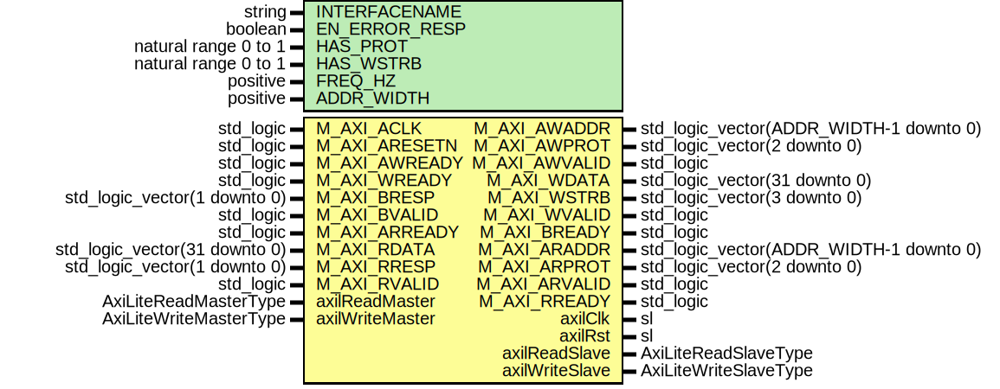

# Entity: MasterAxiLiteIpIntegrator

## Diagram

## Description

Company    : SLAC National Accelerator Laboratory
Description: Common shim layer between IP Integrator interface and surf AXI-Lite interface
This file is part of 'SLAC Firmware Standard Library'.
It is subject to the license terms in the LICENSE.txt file found in the
top-level directory of this distribution and at:
   https://confluence.slac.stanford.edu/display/ppareg/LICENSE.html.
No part of 'SLAC Firmware Standard Library', including this file,
may be copied, modified, propagated, or distributed except according to
the terms contained in the LICENSE.txt file.
## Generics

| Generic name  | Type                 | Value     | Description |
| ------------- | -------------------- | --------- | ----------- |
| INTERFACENAME | string               | "M_AXI"   |             |
| EN_ERROR_RESP | boolean              | false     |             |
| HAS_PROT      | natural range 0 to 1 | 0         |             |
| HAS_WSTRB     | natural range 0 to 1 | 0         |             |
| FREQ_HZ       | positive             | 100000000 |             |
| ADDR_WIDTH    | positive             | 12        |             |
## Ports

| Port name       | Direction | Type                                    | Description                      |
| --------------- | --------- | --------------------------------------- | -------------------------------- |
| M_AXI_ACLK      | in        | std_logic                               | IP Integrator AXI-Lite Interface |
| M_AXI_ARESETN   | in        | std_logic                               |                                  |
| M_AXI_AWADDR    | out       | std_logic_vector(ADDR_WIDTH-1 downto 0) |                                  |
| M_AXI_AWPROT    | out       | std_logic_vector(2 downto 0)            |                                  |
| M_AXI_AWVALID   | out       | std_logic                               |                                  |
| M_AXI_AWREADY   | in        | std_logic                               |                                  |
| M_AXI_WDATA     | out       | std_logic_vector(31 downto 0)           |                                  |
| M_AXI_WSTRB     | out       | std_logic_vector(3 downto 0)            |                                  |
| M_AXI_WVALID    | out       | std_logic                               |                                  |
| M_AXI_WREADY    | in        | std_logic                               |                                  |
| M_AXI_BRESP     | in        | std_logic_vector(1 downto 0)            |                                  |
| M_AXI_BVALID    | in        | std_logic                               |                                  |
| M_AXI_BREADY    | out       | std_logic                               |                                  |
| M_AXI_ARADDR    | out       | std_logic_vector(ADDR_WIDTH-1 downto 0) |                                  |
| M_AXI_ARPROT    | out       | std_logic_vector(2 downto 0)            |                                  |
| M_AXI_ARVALID   | out       | std_logic                               |                                  |
| M_AXI_ARREADY   | in        | std_logic                               |                                  |
| M_AXI_RDATA     | in        | std_logic_vector(31 downto 0)           |                                  |
| M_AXI_RRESP     | in        | std_logic_vector(1 downto 0)            |                                  |
| M_AXI_RVALID    | in        | std_logic                               |                                  |
| M_AXI_RREADY    | out       | std_logic                               |                                  |
| axilClk         | out       | sl                                      | SURF AXI-Lite Interface          |
| axilRst         | out       | sl                                      |                                  |
| axilReadMaster  | in        | AxiLiteReadMasterType                   |                                  |
| axilReadSlave   | out       | AxiLiteReadSlaveType                    |                                  |
| axilWriteMaster | in        | AxiLiteWriteMasterType                  |                                  |
| axilWriteSlave  | out       | AxiLiteWriteSlaveType                   |                                  |
## Signals

| Name              | Type                   | Description |
| ----------------- | ---------------------- | ----------- |
| M_AXI_ReadMaster  | AxiLiteReadMasterType  |             |
| M_AXI_ReadSlave   | AxiLiteReadSlaveType   |             |
| M_AXI_WriteMaster | AxiLiteWriteMasterType |             |
| M_AXI_WriteSlave  | AxiLiteWriteSlaveType  |             |
## Instantiations

- U_RstSync: surf.RstSync
