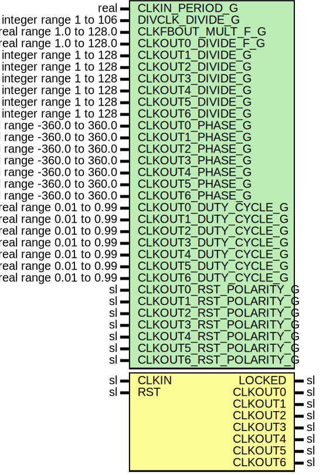

# Entity: MmcmEmulation

- **File**: MmcmEmulation.vhd
## Diagram

## Description

Company    : SLAC National Accelerator Laboratory
Description:
This file is part of 'SLAC Firmware Standard Library'.
It is subject to the license terms in the LICENSE.txt file found in the
top-level directory of this distribution and at:
   https://confluence.slac.stanford.edu/display/ppareg/LICENSE.html.
No part of 'SLAC Firmware Standard Library', including this file,
may be copied, modified, propagated, or distributed except according to
the terms contained in the LICENSE.txt file.
## Generics

| Generic name           | Type                       | Value | Description |
| ---------------------- | -------------------------- | ----- | ----------- |
| CLKIN_PERIOD_G         | real                       | 10.0  |             |
| DIVCLK_DIVIDE_G        | integer range 1 to 106     | 2     |             |
| CLKFBOUT_MULT_F_G      | real range 1.0 to 128.0    | 20.0  |             |
| CLKOUT0_DIVIDE_F_G     | real range 1.0 to 128.0    | 1.0   |             |
| CLKOUT1_DIVIDE_G       | integer range 1 to 128     | 2     |             |
| CLKOUT2_DIVIDE_G       | integer range 1 to 128     | 3     |             |
| CLKOUT3_DIVIDE_G       | integer range 1 to 128     | 4     |             |
| CLKOUT4_DIVIDE_G       | integer range 1 to 128     | 5     |             |
| CLKOUT5_DIVIDE_G       | integer range 1 to 128     | 6     |             |
| CLKOUT6_DIVIDE_G       | integer range 1 to 128     | 7     |             |
| CLKOUT0_PHASE_G        | real range -360.0 to 360.0 | 0.0   |             |
| CLKOUT1_PHASE_G        | real range -360.0 to 360.0 | 0.0   |             |
| CLKOUT2_PHASE_G        | real range -360.0 to 360.0 | 0.0   |             |
| CLKOUT3_PHASE_G        | real range -360.0 to 360.0 | 0.0   |             |
| CLKOUT4_PHASE_G        | real range -360.0 to 360.0 | 0.0   |             |
| CLKOUT5_PHASE_G        | real range -360.0 to 360.0 | 0.0   |             |
| CLKOUT6_PHASE_G        | real range -360.0 to 360.0 | 0.0   |             |
| CLKOUT0_DUTY_CYCLE_G   | real range 0.01 to 0.99    | 0.5   |             |
| CLKOUT1_DUTY_CYCLE_G   | real range 0.01 to 0.99    | 0.5   |             |
| CLKOUT2_DUTY_CYCLE_G   | real range 0.01 to 0.99    | 0.5   |             |
| CLKOUT3_DUTY_CYCLE_G   | real range 0.01 to 0.99    | 0.5   |             |
| CLKOUT4_DUTY_CYCLE_G   | real range 0.01 to 0.99    | 0.5   |             |
| CLKOUT5_DUTY_CYCLE_G   | real range 0.01 to 0.99    | 0.5   |             |
| CLKOUT6_DUTY_CYCLE_G   | real range 0.01 to 0.99    | 0.5   |             |
| CLKOUT0_RST_POLARITY_G | sl                         | '1'   |             |
| CLKOUT1_RST_POLARITY_G | sl                         | '1'   |             |
| CLKOUT2_RST_POLARITY_G | sl                         | '1'   |             |
| CLKOUT3_RST_POLARITY_G | sl                         | '1'   |             |
| CLKOUT4_RST_POLARITY_G | sl                         | '1'   |             |
| CLKOUT5_RST_POLARITY_G | sl                         | '1'   |             |
| CLKOUT6_RST_POLARITY_G | sl                         | '1'   |             |
## Ports

| Port name | Direction | Type | Description |
| --------- | --------- | ---- | ----------- |
| CLKIN     | in        | sl   |             |
| RST       | in        | sl   |             |
| LOCKED    | out       | sl   |             |
| CLKOUT0   | out       | sl   |             |
| CLKOUT1   | out       | sl   |             |
| CLKOUT2   | out       | sl   |             |
| CLKOUT3   | out       | sl   |             |
| CLKOUT4   | out       | sl   |             |
| CLKOUT5   | out       | sl   |             |
| CLKOUT6   | out       | sl   |             |
## Signals

| Name     | Type            | Description |
| -------- | --------------- | ----------- |
| phasedUp | slv(6 downto 0) |             |
| clkOut   | slv(6 downto 0) |             |
## Constants

| Name                  | Type                  | Value                                                                                                                                                                                                                                                                                                                                                                                                                                                                                                                                                                                                                | Description                             |
| --------------------- | --------------------- | -------------------------------------------------------------------------------------------------------------------------------------------------------------------------------------------------------------------------------------------------------------------------------------------------------------------------------------------------------------------------------------------------------------------------------------------------------------------------------------------------------------------------------------------------------------------------------------------------------------------- | --------------------------------------- |
| VCO_PERIOD_REAL_C     | real                  |  (real(DIVCLK_DIVIDE_G)*CLKIN_PERIOD_G)/(CLKFBOUT_MULT_F_G)                                                                                                                                                                                                                                                                                                                                                                                                                                                                                                                                                          |                                         |
| CLKOUT_PERIOD_REAL_C  | RealArray             |  (       0 => (VCO_PERIOD_REAL_C*CLKOUT0_DIVIDE_F_G),        1 => (VCO_PERIOD_REAL_C*CLKOUT1_DIVIDE_G),        2 => (VCO_PERIOD_REAL_C*CLKOUT2_DIVIDE_G),        3 => (VCO_PERIOD_REAL_C*CLKOUT3_DIVIDE_G),        4 => (VCO_PERIOD_REAL_C*CLKOUT4_DIVIDE_G),        5 => (VCO_PERIOD_REAL_C*CLKOUT5_DIVIDE_G),        6 => (VCO_PERIOD_REAL_C*CLKOUT6_DIVIDE_G))                                  |                                         |
| CLKOUT_PERIOD_C       | TimeArray             |  (       0 => (CLKOUT_PERIOD_REAL_C(0)*(1 ns)),        1 => (CLKOUT_PERIOD_REAL_C(1)*(1 ns)),        2 => (CLKOUT_PERIOD_REAL_C(2)*(1 ns)),        3 => (CLKOUT_PERIOD_REAL_C(3)*(1 ns)),        4 => (CLKOUT_PERIOD_REAL_C(4)*(1 ns)),        5 => (CLKOUT_PERIOD_REAL_C(5)*(1 ns)),        6 => (CLKOUT_PERIOD_REAL_C(6)*(1 ns)))                                                                |                                         |
| PHASE_OFFSET_C        | TimeArray(6 downto 0) |  (others => (1 ps))                                                                                                                                                                                                                                                                                                                                                                                                                                                                                                                                                                                                  | place holder for future feature support |
| CLK_HI_CYCLE_C        | TimeArray             |  (       0 => (CLKOUT_PERIOD_C(0)*CLKOUT0_DUTY_CYCLE_G),        1 => (CLKOUT_PERIOD_C(1)*CLKOUT1_DUTY_CYCLE_G),        2 => (CLKOUT_PERIOD_C(2)*CLKOUT2_DUTY_CYCLE_G),        3 => (CLKOUT_PERIOD_C(3)*CLKOUT3_DUTY_CYCLE_G),        4 => (CLKOUT_PERIOD_C(4)*CLKOUT4_DUTY_CYCLE_G),        5 => (CLKOUT_PERIOD_C(5)*CLKOUT5_DUTY_CYCLE_G),        6 => (CLKOUT_PERIOD_C(6)*CLKOUT6_DUTY_CYCLE_G)) |                                         |
| CLK_LO_CYCLE_C        | TimeArray             |  (       0 => (CLKOUT_PERIOD_C(0)-CLK_HI_CYCLE_C(0)),        1 => (CLKOUT_PERIOD_C(1)-CLK_HI_CYCLE_C(1)),        2 => (CLKOUT_PERIOD_C(2)-CLK_HI_CYCLE_C(2)),        3 => (CLKOUT_PERIOD_C(3)-CLK_HI_CYCLE_C(3)),        4 => (CLKOUT_PERIOD_C(4)-CLK_HI_CYCLE_C(4)),        5 => (CLKOUT_PERIOD_C(5)-CLK_HI_CYCLE_C(5)),        6 => (CLKOUT_PERIOD_C(6)-CLK_HI_CYCLE_C(6)))                      |                                         |
| CLKOUT_RST_POLARITY_C | slv(6 downto 0)       |  (CLKOUT6_RST_POLARITY_G & CLKOUT5_RST_POLARITY_G & CLKOUT4_RST_POLARITY_G & CLKOUT3_RST_POLARITY_G & CLKOUT2_RST_POLARITY_G & CLKOUT1_RST_POLARITY_G & CLKOUT0_RST_POLARITY_G)                                                                                                                                                                                                                                                                                                                                                                                                                                      |                                         |
