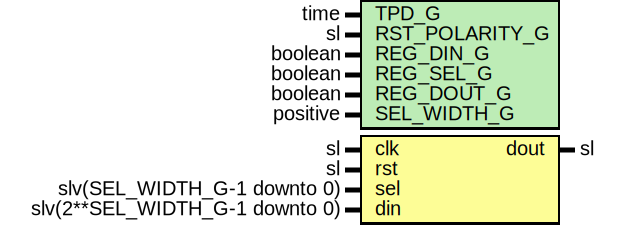

# Entity: Mux

- **File**: Mux.vhd
## Diagram

## Description

-----------------------------------------------------------------------------
 Company    : SLAC National Accelerator Laboratory
-----------------------------------------------------------------------------
 Description: General Purpose MUX designed.
       Useful if you want "All the LUTs in a slice can be combined
       together as a 32:1 MUX in one level of logic." (UG574, v1.5, page7)
-----------------------------------------------------------------------------
 This file is part of 'SLAC Firmware Standard Library'.
 It is subject to the license terms in the LICENSE.txt file found in the
 top-level directory of this distribution and at:
    https://confluence.slac.stanford.edu/display/ppareg/LICENSE.html.
 No part of 'SLAC Firmware Standard Library', including this file,
 may be copied, modified, propagated, or distributed except according to
 the terms contained in the LICENSE.txt file.
-----------------------------------------------------------------------------
## Generics

| Generic name   | Type     | Value | Description                                  |
| -------------- | -------- | ----- | -------------------------------------------- |
| TPD_G          | time     | 1 ns  |                                              |
| RST_POLARITY_G | sl       | '1'   |  '1' for active high rst, '0' for active low |
| REG_DIN_G      | boolean  | true  |                                              |
| REG_SEL_G      | boolean  | true  |                                              |
| REG_DOUT_G     | boolean  | true  |                                              |
| SEL_WIDTH_G    | positive | 5     |                                              |
## Ports

| Port name | Direction | Type                           | Description |
| --------- | --------- | ------------------------------ | ----------- |
| clk       | in        | sl                             |             |
| rst       | in        | sl                             |             |
| sel       | in        | slv(SEL_WIDTH_G-1 downto 0)    |             |
| din       | in        | slv(2**SEL_WIDTH_G-1 downto 0) |             |
| dout      | out       | sl                             |             |
## Signals

| Name | Type    | Description |
| ---- | ------- | ----------- |
| r    | RegType |             |
| rin  | RegType |             |
## Constants

| Name       | Type    | Value                                                                                                                                                       | Description |
| ---------- | ------- | ----------------------------------------------------------------------------------------------------------------------------------------------------------- | ----------- |
| REG_INIT_C | RegType |  (       sel  => (others => '0'),        din  => (others => '0'),        dout => '0') |             |
## Types

| Name    | Type | Description |
| ------- | ---- | ----------- |
| RegType |      |             |
## Processes
- comb: ( din, r, rst, sel )
- seq: ( clk )
