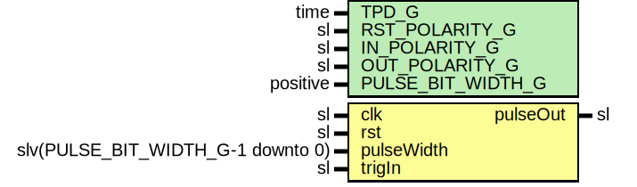

# Entity: OneShot

## Diagram

## Description

Company    : SLAC National Accelerator Laboratory
Description: Programmable One-Shot Module
This file is part of 'SLAC Firmware Standard Library'.
It is subject to the license terms in the LICENSE.txt file found in the
top-level directory of this distribution and at:
   https://confluence.slac.stanford.edu/display/ppareg/LICENSE.html.
No part of 'SLAC Firmware Standard Library', including this file,
may be copied, modified, propagated, or distributed except according to
the terms contained in the LICENSE.txt file.
## Generics

| Generic name      | Type     | Value | Description                                         |
| ----------------- | -------- | ----- | --------------------------------------------------- |
| TPD_G             | time     | 1 ns  | Simulation FF output delay                          |
| RST_POLARITY_G    | sl       | '1'   | '1' for active HIGH reset, '0' for active LOW reset |
| IN_POLARITY_G     | sl       | '1'   | 0 for active LOW, 1 for active HIGH                 |
| OUT_POLARITY_G    | sl       | '1'   | 0 for active LOW, 1 for active HIGH                 |
| PULSE_BIT_WIDTH_G | positive | 4     |                                                     |
## Ports

| Port name  | Direction | Type                              | Description                                |
| ---------- | --------- | --------------------------------- | ------------------------------------------ |
| clk        | in        | sl                                | Clock                                      |
| rst        | in        | sl                                | Optional reset                             |
| pulseWidth | in        | slv(PULSE_BIT_WIDTH_G-1 downto 0) | Pulse width configuration (zero inclusive) |
| trigIn     | in        | sl                                | Trigger Input                              |
| pulseOut   | out       | sl                                |                                            |
## Signals

| Name | Type    | Description |
| ---- | ------- | ----------- |
| r    | RegType |             |
| rin  | RegType |             |
## Constants

| Name       | Type    | Value                                                                                                                                                                          | Description |
| ---------- | ------- | ------------------------------------------------------------------------------------------------------------------------------------------------------------------------------ | ----------- |
| REG_INIT_C | RegType |  (       cnt      => (others => '0'),        pulseOut => not(OUT_POLARITY_G),        state    => IDLE_S) |             |
## Types

| Name      | Type                                                                                              | Description |
| --------- | ------------------------------------------------------------------------------------------------- | ----------- |
| StateType | ( IDLE_S,  CNT_S,  WAIT_S)  |             |
| RegType   |                                                                                                   |             |
## Processes
- comb: ( pulseWidth, r, rst, trigIn )
- seq: ( clk )
