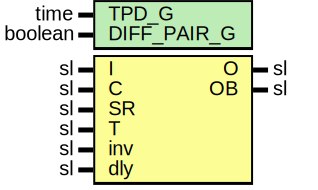

# Entity: OutputBufferReg

- **File**: OutputBufferReg.vhd
## Diagram

## Description

-----------------------------------------------------------------------------
 Company    : SLAC National Accelerator Laboratory
-----------------------------------------------------------------------------
 Description: Output Registers
-----------------------------------------------------------------------------
 This file is part of 'SLAC Firmware Standard Library'.
 It is subject to the license terms in the LICENSE.txt file found in the
 top-level directory of this distribution and at:
    https://confluence.slac.stanford.edu/display/ppareg/LICENSE.html.
 No part of 'SLAC Firmware Standard Library', including this file,
 may be copied, modified, propagated, or distributed except according to
 the terms contained in the LICENSE.txt file.
-----------------------------------------------------------------------------
## Generics

| Generic name | Type    | Value | Description |
| ------------ | ------- | ----- | ----------- |
| TPD_G        | time    | 1 ns  |             |
| DIFF_PAIR_G  | boolean | false |             |
## Ports

| Port name | Direction | Type | Description                                         |
| --------- | --------- | ---- | --------------------------------------------------- |
| I         | in        | sl   |                                                     |
| C         | in        | sl   |                                                     |
| SR        | in        | sl   |                                                     |
| T         | in        | sl   |  optional tristate (0 = enabled, 1 = high z output) |
| inv       | in        | sl   |                                                     |
| dly       | in        | sl   |                                                     |
| O         | out       | sl   |                                                     |
| OB        | out       | sl   |                                                     |
## Signals

| Name      | Type | Description |
| --------- | ---- | ----------- |
| mask      | sl   |             |
| maskDly   | sl   |             |
| D1        | sl   |             |
| D2        | sl   |             |
| outputSig | sl   |             |
## Processes
- unnamed: ( C )
 **Description**
------------------------  Generate a delayed copy ------------------------ 
## Instantiations

- U_ODDR: ODDRE1
