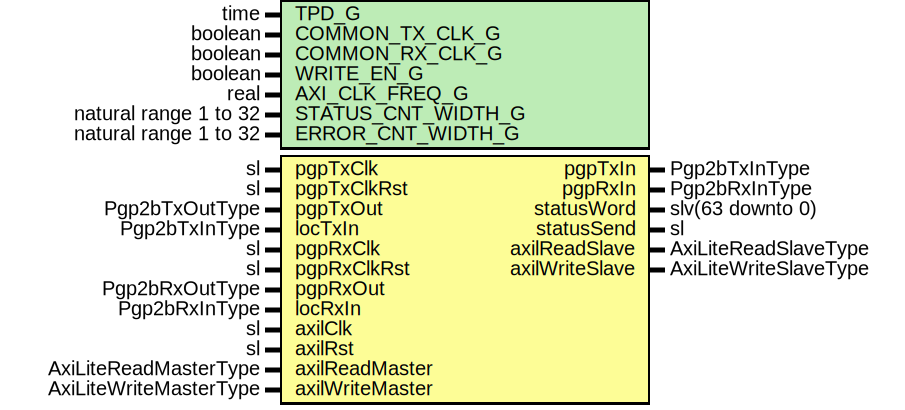

# Entity: Pgp2bAxi

- **File**: Pgp2bAxi.vhd
## Diagram

## Description

-----------------------------------------------------------------------------
 Title      : PGPv2b: https://confluence.slac.stanford.edu/x/q86fD
-----------------------------------------------------------------------------
 Company    : SLAC National Accelerator Laboratory
-----------------------------------------------------------------------------
 Description:
 AXI-Lite block to manage the PGP interface.

 Address map (offset from base):
    0x00 = Read/Write
       Bits 0 = Count Reset
    0x04 = Read/Write
       Bits 0 = Reset Rx
    0x08 = Read/Write
       Bits 0 = Flush
    0x0C = Read/Write
       Bits 1:0 = Loop Back
    0x10 = Read/Write
       Bits 7:0 = Sideband data to transmit
       Bits 8   = Sideband data enable
    0x14 = Read/Write
       Bits 0 = Auto Status Send Enable (PPI)
    0x18 = Read/Write
       Bits 0 = Disable Flow Control
    0x20 = Read Only
       Bits 0     = Rx Phy Ready
       Bits 1     = Tx Phy Ready
       Bits 2     = Local Link Ready
       Bits 3     = Remote Link Ready
       Bits 4     = Transmit Ready
       Bits 9:8   = Receive Link Polarity
       Bits 15:12 = Remote Pause Status
       Bits 19:16 = Local Pause Status
       Bits 23:20 = Remote Overflow Status
       Bits 27:24 = Local Overflow Status
    0x24 = Read Only
       Bits 7:0 = Remote Link Data
    0x28 = Read Only
       Bits ?:0 = Cell Error Count
    0x2C = Read Only
       Bits ?:0 = Link Down Count
    0x30 = Read Only
       Bits ?:0 = Link Error Count
    0x34 = Read Only
       Bits ?:0 = Remote Overflow VC 0 Count
    0x38 = Read Only
       Bits ?:0 = Remote Overflow VC 1 Count
    0x3C = Read Only
       Bits ?:0 = Remote Overflow VC 2 Count
    0x40 = Read Only
       Bits ?:0 = Remote Overflow VC 3 Count
    0x44 = Read Only
       Bits ?:0 = Receive Frame Error Count
    0x48 = Read Only
       Bits ?:0 = Receive Frame Count
    0x4C = Read Only
       Bits ?:0 = Local Overflow VC 0 Count
    0x50 = Read Only
       Bits ?:0 = Local Overflow VC 1 Count
    0x54 = Read Only
       Bits ?:0 = Local Overflow VC 2 Count
    0x58 = Read Only
       Bits ?:0 = Local Overflow VC 3 Count
    0x5C = Read Only
       Bits ?:0 = Transmit Frame Error Count
    0x60 = Read Only
       Bits ?:0 = Transmit Frame Count
    0x64 = Read Only
       Bits 31:0 = Receive Clock Frequency
    0x68 = Read Only
       Bits 31:0 = Transmit Clock Frequency
    0x70 = Read Only
       Bits 7:0 = Last OpCode Transmitted
    0x74 = Read Only
       Bits 7:0 = Last OpCode Received
    0x78 = Read Only
       Bits ?:0 = OpCode Transmit count
    0x7C = Read Only
       Bits ?:0 = OpCode Received count

 Status vector:
       Bits 31:24 = Rx Link Down Count
       Bits 23:16 = Rx Frame Error Count
       Bits 15:8  = Rx Cell Error Count
       Bits  7:6  = Zeros
       Bits    5  = Remote Link Ready
       Bits    4  = Local Link Ready
       Bits  3:0  = Remote Overflow Status
-----------------------------------------------------------------------------
 This file is part of 'SLAC Firmware Standard Library'.
 It is subject to the license terms in the LICENSE.txt file found in the
 top-level directory of this distribution and at:
    https://confluence.slac.stanford.edu/display/ppareg/LICENSE.html.
 No part of 'SLAC Firmware Standard Library', including this file,
 may be copied, modified, propagated, or distributed except according to
 the terms contained in the LICENSE.txt file.
-----------------------------------------------------------------------------
## Generics

| Generic name       | Type                  | Value    | Description                                            |
| ------------------ | --------------------- | -------- | ------------------------------------------------------ |
| TPD_G              | time                  | 1 ns     |                                                        |
| COMMON_TX_CLK_G    | boolean               | false    |  Set to true if axiClk and pgpTxClk are the same clock |
| COMMON_RX_CLK_G    | boolean               | false    |  Set to true if axiClk and pgpRxClk are the same clock |
| WRITE_EN_G         | boolean               | false    |  Set to false when on remote end of a link             |
| AXI_CLK_FREQ_G     | real                  | 125.0E+6 |                                                        |
| STATUS_CNT_WIDTH_G | natural range 1 to 32 | 32       |                                                        |
| ERROR_CNT_WIDTH_G  | natural range 1 to 32 | 4        |                                                        |
## Ports

| Port name       | Direction | Type                   | Description                                  |
| --------------- | --------- | ---------------------- | -------------------------------------------- |
| pgpTxClk        | in        | sl                     | TX PGP Interface (pgpTxClk)                  |
| pgpTxClkRst     | in        | sl                     |                                              |
| pgpTxIn         | out       | Pgp2bTxInType          |                                              |
| pgpTxOut        | in        | Pgp2bTxOutType         |                                              |
| locTxIn         | in        | Pgp2bTxInType          |                                              |
| pgpRxClk        | in        | sl                     | RX PGP Interface (pgpRxClk)                  |
| pgpRxClkRst     | in        | sl                     |                                              |
| pgpRxIn         | out       | Pgp2bRxInType          |                                              |
| pgpRxOut        | in        | Pgp2bRxOutType         |                                              |
| locRxIn         | in        | Pgp2bRxInType          |                                              |
| statusWord      | out       | slv(63 downto 0)       | Status Bus (axilClk domain)                  |
| statusSend      | out       | sl                     |                                              |
| axilClk         | in        | sl                     | AXI-Lite Register Interface (axilClk domain) |
| axilRst         | in        | sl                     |                                              |
| axilReadMaster  | in        | AxiLiteReadMasterType  |                                              |
| axilReadSlave   | out       | AxiLiteReadSlaveType   |                                              |
| axilWriteMaster | in        | AxiLiteWriteMasterType |                                              |
| axilWriteSlave  | out       | AxiLiteWriteSlaveType  |                                              |
## Signals

| Name            | Type                                                                                         | Description     |
| --------------- | -------------------------------------------------------------------------------------------- | --------------- |
| rxStatusSend    | sl                                                                                           |  Local signals  |
| rxErrorOut      | slv(17 downto 0)                                                                             |                 |
| rxErrorCntOut   | SlVectorArray(17 downto 0,  ERROR_CNT_WIDTH_G-1 downto 0) |                 |
| rxStatusCntOut  | SlVectorArray(0 downto 0,  STATUS_CNT_WIDTH_G-1 downto 0) |                 |
| txErrorOut      | slv(11 downto 0)                                                                             |                 |
| txErrorCntOut   | SlVectorArray(11 downto 0,  ERROR_CNT_WIDTH_G-1 downto 0) |                 |
| txStatusCntOut  | SlVectorArray(0 downto 0,  STATUS_CNT_WIDTH_G-1 downto 0) |                 |
| rxErrorIrqEn    | slv(17 downto 0)                                                                             |                 |
| locTxDataEn     | sl                                                                                           |                 |
| locTxData       | slv(7 downto 0)                                                                              |                 |
| txFlush         | sl                                                                                           |                 |
| rxFlush         | sl                                                                                           |                 |
| rxReset         | sl                                                                                           |                 |
| txReset         | sl                                                                                           |                 |
| syncFlowCntlDis | sl                                                                                           |                 |
| r               | RegType                                                                                      |                 |
| rin             | RegType                                                                                      |                 |
| rxstatusSync    | RxStatusType                                                                                 |                 |
| txstatusSync    | TxStatusType                                                                                 |                 |
## Constants

| Name             | Type    | Value                                                                                                                                                                                                                                                                                                                                                                                                                                                                                                                                                                                                                                                                                                                                                                                                                                                    | Description |
| ---------------- | ------- | -------------------------------------------------------------------------------------------------------------------------------------------------------------------------------------------------------------------------------------------------------------------------------------------------------------------------------------------------------------------------------------------------------------------------------------------------------------------------------------------------------------------------------------------------------------------------------------------------------------------------------------------------------------------------------------------------------------------------------------------------------------------------------------------------------------------------------------------------------- | ----------- |
| STATUS_OUT_TOP_C | integer |  ite(STATUS_CNT_WIDTH_G > 7,  7,  STATUS_CNT_WIDTH_G-1)                                                                                                                                                                                                                                                                                                                                                                                                                                                                                                                                                                                                                                                                                                                            |             |
| REG_INIT_C       | RegType |  (       flush          => '0',        resetTx        => '0',        resetRx        => '0',        resetGt        => '0',        countReset     => '0',        loopBack       => (others => '0'),        flowCntlDis    => '0',        autoStatus     => '0',        locData        => (others => '0'),        locDataEn      => '0',        axilWriteSlave => AXI_LITE_WRITE_SLAVE_INIT_C,        axilReadSlave  => AXI_LITE_READ_SLAVE_INIT_C       ) |             |
## Types

| Name         | Type | Description |
| ------------ | ---- | ----------- |
| RegType      |      |             |
| RxStatusType |      |             |
| TxStatusType |      |             |
## Processes
- U_RxErrorIrqEn: ( r )
- unnamed: ( axilClk )
 **Description**
----------------------------------  AXI Registers ----------------------------------  Sync 
- unnamed: ( axilRst, axilReadMaster, axilWriteMaster, r, rxStatusSync, txStatusSync )
 **Description**
 Async 
- U_StatusWord: ( rxStatusSync )
## Instantiations

- U_RxOpCodeSync: surf.SynchronizerFifo
- U_RxError: surf.SyncStatusVector
 **Description**
 Errror counters and non counted values

- U_RxStatus: surf.SyncStatusVector
 **Description**
 Status counters

- U_RxClkFreq: surf.SyncClockFreq
- U_TxOpCodeSync: surf.SynchronizerFifo
 **Description**
-------------------------------------
 Transmit Status
-------------------------------------
 OpCode Capture

- U_TxError: surf.SyncStatusVector
 **Description**
 Errror counters and non counted values

- U_TxStatus: surf.SyncStatusVector
 **Description**
 Status counters

- U_TxClkFreq: surf.SyncClockFreq
- U_FlowCntlDis: surf.Synchronizer
 **Description**
 Sync flow cntl disable

