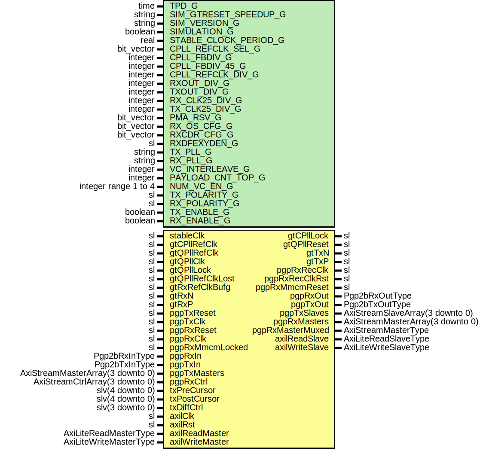

# Entity: Pgp2bGth7Fixedlat

## Diagram

## Description

Title      : PGPv2b: https://confluence.slac.stanford.edu/x/q86fD
Company    : SLAC National Accelerator Laboratory
Description: Gth7 Fixed Latency Module
This file is part of 'SLAC Firmware Standard Library'.
It is subject to the license terms in the LICENSE.txt file found in the
top-level directory of this distribution and at:
   https://confluence.slac.stanford.edu/display/ppareg/LICENSE.html.
No part of 'SLAC Firmware Standard Library', including this file,
may be copied, modified, propagated, or distributed except according to
the terms contained in the LICENSE.txt file.
## Generics

| Generic name          | Type                 | Value                    | Description                                     |
| --------------------- | -------------------- | ------------------------ | ----------------------------------------------- |
| TPD_G                 | time                 | 1 ns                     |                                                 |
| SIM_GTRESET_SPEEDUP_G | string               | "FALSE"                  | GT Settings Sim Generics --                     |
| SIM_VERSION_G         | string               | "2.0"                    |                                                 |
| SIMULATION_G          | boolean              | false                    |                                                 |
| STABLE_CLOCK_PERIOD_G | real                 | 4.0E-9                   |                                                 |
| CPLL_REFCLK_SEL_G     | bit_vector           | "001"                    | CPLL Settings - Defaults to 2.5 Gbps operation  |
| CPLL_FBDIV_G          | integer              | 4                        |                                                 |
| CPLL_FBDIV_45_G       | integer              | 5                        |                                                 |
| CPLL_REFCLK_DIV_G     | integer              | 1                        |                                                 |
| RXOUT_DIV_G           | integer              | 2                        |                                                 |
| TXOUT_DIV_G           | integer              | 2                        |                                                 |
| RX_CLK25_DIV_G        | integer              | 5                        |                                                 |
| TX_CLK25_DIV_G        | integer              | 5                        |                                                 |
| PMA_RSV_G             | bit_vector           | x"00000080"              |                                                 |
| RX_OS_CFG_G           | bit_vector           | "0000010000000"          | Set by wizard                                   |
| RXCDR_CFG_G           | bit_vector           | x"0002007FE1000C2200018" | Set by wizard                                   |
| RXDFEXYDEN_G          | sl                   | '0'                      | Set by wizard                                   |
| TX_PLL_G              | string               | "QPLL"                   | Configure PLL sources                           |
| RX_PLL_G              | string               | "CPLL"                   |                                                 |
| VC_INTERLEAVE_G       | integer              | 0                        | No interleave Frames                            |
| PAYLOAD_CNT_TOP_G     | integer              | 7                        | Top bit for payload counter                     |
| NUM_VC_EN_G           | integer range 1 to 4 | 4                        |                                                 |
| TX_POLARITY_G         | sl                   | '0'                      |                                                 |
| RX_POLARITY_G         | sl                   | '0'                      |                                                 |
| TX_ENABLE_G           | boolean              | true                     | Enable TX direction                             |
| RX_ENABLE_G           | boolean              | true                     |                                                 |
## Ports

| Port name        | Direction | Type                             | Description                                             |
| ---------------- | --------- | -------------------------------- | ------------------------------------------------------- |
| stableClk        | in        | sl                               | GT needs a stable clock to "boot up"                    |
| gtCPllRefClk     | in        | sl                               | Drives CPLL if used                                     |
| gtCPllLock       | out       | sl                               |                                                         |
| gtQPllRefClk     | in        | sl                               | Signals from QPLL if used                               |
| gtQPllClk        | in        | sl                               |                                                         |
| gtQPllLock       | in        | sl                               |                                                         |
| gtQPllRefClkLost | in        | sl                               |                                                         |
| gtQPllReset      | out       | sl                               |                                                         |
| gtRxRefClkBufg   | in        | sl                               | gtrefclk driving rx side, fed through clock buffer      |
| gtRxN            | in        | sl                               | GT Serial Receive Negative                              |
| gtRxP            | in        | sl                               | GT Serial Receive Positive                              |
| gtTxN            | out       | sl                               | GT Serial Transmit Negative                             |
| gtTxP            | out       | sl                               | GT Serial Transmit Positive                             |
| pgpTxReset       | in        | sl                               | Tx Clocking                                             |
| pgpTxClk         | in        | sl                               | ????                                                    |
| pgpRxReset       | in        | sl                               | Rx clocking                                             |
| pgpRxRecClk      | out       | sl                               | rxrecclk basically                                      |
| pgpRxRecClkRst   | out       | sl                               | Reset for recovered clock                               |
| pgpRxClk         | in        | sl                               | Run recClk through external MMCM and sent to this input |
| pgpRxMmcmReset   | out       | sl                               |                                                         |
| pgpRxMmcmLocked  | in        | sl                               |                                                         |
| pgpRxIn          | in        | Pgp2bRxInType                    | Non VC Rx Signals                                       |
| pgpRxOut         | out       | Pgp2bRxOutType                   |                                                         |
| pgpTxIn          | in        | Pgp2bTxInType                    | Non VC Tx Signals                                       |
| pgpTxOut         | out       | Pgp2bTxOutType                   |                                                         |
| pgpTxMasters     | in        | AxiStreamMasterArray(3 downto 0) | Frame Transmit Interface - 1 Lane, Array of 4 VCs       |
| pgpTxSlaves      | out       | AxiStreamSlaveArray(3 downto 0)  |                                                         |
| pgpRxMasters     | out       | AxiStreamMasterArray(3 downto 0) | Frame Receive Interface - 1 Lane, Array of 4 VCs        |
| pgpRxMasterMuxed | out       | AxiStreamMasterType              |                                                         |
| pgpRxCtrl        | in        | AxiStreamCtrlArray(3 downto 0)   |                                                         |
| txPreCursor      | in        | slv(4 downto 0)                  | Debug Interface                                         |
| txPostCursor     | in        | slv(4 downto 0)                  |                                                         |
| txDiffCtrl       | in        | slv(3 downto 0)                  |                                                         |
| axilClk          | in        | sl                               | AXI-Lite Interface                                      |
| axilRst          | in        | sl                               |                                                         |
| axilReadMaster   | in        | AxiLiteReadMasterType            |                                                         |
| axilReadSlave    | out       | AxiLiteReadSlaveType             |                                                         |
| axilWriteMaster  | in        | AxiLiteWriteMasterType           |                                                         |
| axilWriteSlave   | out       | AxiLiteWriteSlaveType            |                                                         |
## Signals

| Name           | Type                           | Description                   |
| -------------- | ------------------------------ | ----------------------------- |
| gtRxResetDone  | sl                             |                               |
| gtRxResetDoneL | sl                             |                               |
| gtRxUserReset  | sl                             |                               |
| gtRxData       | slv(19 downto 0)               | Feed to 8B10B decoder         |
| dataValid      | sl                             | no decode or disparity errors |
| phyRxLanesIn   | Pgp2bRxPhyLaneInArray(0 to 0)  | Output from decoder           |
| phyRxLanesOut  | Pgp2bRxPhyLaneOutArray(0 to 0) | Polarity to GT                |
| phyRxReady     | sl                             | To RxRst                      |
| phyRxInit      | sl                             | To RxRst                      |
| gtTxOutClk     | sl                             |                               |
| gtTxUsrClk     | sl                             |                               |
| gtTxResetDone  | sl                             |                               |
| phyTxLanesOut  | Pgp2bTxPhyLaneOutArray(0 to 0) | PgpTx Signals                 |
| phyTxReady     | sl                             |                               |
| stableRst      | sl                             |                               |
| drpGnt         | sl                             |                               |
| drpRdy         | sl                             |                               |
| drpEn          | sl                             |                               |
| drpWe          | sl                             |                               |
| drpAddr        | slv(8 downto 0)                |                               |
| drpDi          | slv(15 downto 0)               |                               |
| drpDo          | slv(15 downto 0)               |                               |
## Instantiations

- U_Pgp2bLane: surf.Pgp2bLane
- Decoder8b10b_1: surf.Decoder8b10b
- Gth7Core_1: surf.Gth7Core
**Description**
GTX 7 Core in Fixed Latency mode

- U_AxiLiteToDrp: surf.AxiLiteToDrp
- U_RstSync: surf.RstSync
