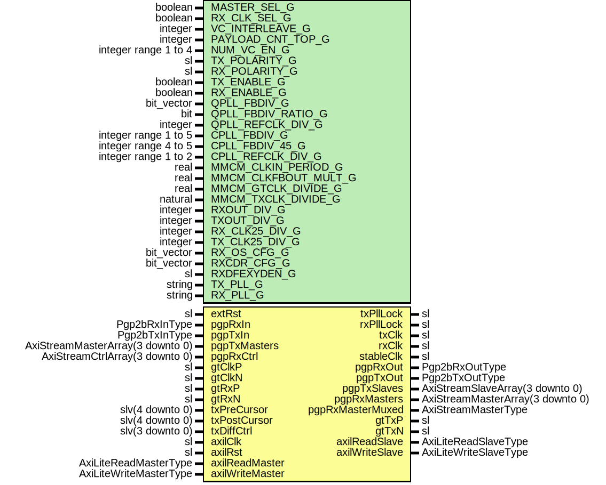

# Entity: Pgp2bGth7FixedLatWrapper

- **File**: Pgp2bGth7FixedLatWrapper.vhd
## Diagram

## Description

Title      : PGPv2b: https://confluence.slac.stanford.edu/x/q86fD
Company    : SLAC National Accelerator Laboratory
Description: Gth7 Fixed Latency Wrapper
This file is part of 'SLAC Firmware Standard Library'.
It is subject to the license terms in the LICENSE.txt file found in the
top-level directory of this distribution and at:
   https://confluence.slac.stanford.edu/display/ppareg/LICENSE.html.
No part of 'SLAC Firmware Standard Library', including this file,
may be copied, modified, propagated, or distributed except according to
the terms contained in the LICENSE.txt file.
## Generics

| Generic name         | Type                 | Value                    | Description                 |
| -------------------- | -------------------- | ------------------------ | --------------------------- |
| MASTER_SEL_G         | boolean              | true                     | Select Master or Slave      |
| RX_CLK_SEL_G         | boolean              | true                     |                             |
| VC_INTERLEAVE_G      | integer              | 0                        | No interleave Frames        |
| PAYLOAD_CNT_TOP_G    | integer              | 7                        | Top bit for payload counter |
| NUM_VC_EN_G          | integer range 1 to 4 | 4                        |                             |
| TX_POLARITY_G        | sl                   | '0'                      |                             |
| RX_POLARITY_G        | sl                   | '0'                      |                             |
| TX_ENABLE_G          | boolean              | true                     | Enable TX direction         |
| RX_ENABLE_G          | boolean              | true                     | Enable RX direction         |
| QPLL_FBDIV_G         | bit_vector           | "0100100000"             | QPLL Configurations         |
| QPLL_FBDIV_RATIO_G   | bit                  | '1'                      |                             |
| QPLL_REFCLK_DIV_G    | integer              | 1                        |                             |
| CPLL_FBDIV_G         | integer range 1 to 5 | 4                        | CPLL Configurations         |
| CPLL_FBDIV_45_G      | integer range 4 to 5 | 5                        |                             |
| CPLL_REFCLK_DIV_G    | integer range 1 to 2 | 1                        |                             |
| MMCM_CLKIN_PERIOD_G  | real                 | 8.000                    | MMCM Configurations         |
| MMCM_CLKFBOUT_MULT_G | real                 | 8.000                    |                             |
| MMCM_GTCLK_DIVIDE_G  | real                 | 8.000                    |                             |
| MMCM_TXCLK_DIVIDE_G  | natural              | 8                        |                             |
| RXOUT_DIV_G          | integer              | 2                        | MGT Configurations          |
| TXOUT_DIV_G          | integer              | 4                        |                             |
| RX_CLK25_DIV_G       | integer              | 5                        | Set by wizard               |
| TX_CLK25_DIV_G       | integer              | 5                        | Set by wizard               |
| RX_OS_CFG_G          | bit_vector           | "0000010000000"          | Set by wizard               |
| RXCDR_CFG_G          | bit_vector           | x"0002007FE1000C2200018" | Set by wizard               |
| RXDFEXYDEN_G         | sl                   | '0'                      | Set by wizard               |
| TX_PLL_G             | string               | "QPLL"                   |                             |
| RX_PLL_G             | string               | "CPLL"                   |                             |
## Ports

| Port name        | Direction | Type                             | Description                                       |
| ---------------- | --------- | -------------------------------- | ------------------------------------------------- |
| extRst           | in        | sl                               | Manual Reset                                      |
| txPllLock        | out       | sl                               | Status and Clock Signals                          |
| rxPllLock        | out       | sl                               |                                                   |
| txClk            | out       | sl                               |                                                   |
| rxClk            | out       | sl                               |                                                   |
| stableClk        | out       | sl                               |                                                   |
| pgpRxIn          | in        | Pgp2bRxInType                    | Non VC Rx Signals                                 |
| pgpRxOut         | out       | Pgp2bRxOutType                   |                                                   |
| pgpTxIn          | in        | Pgp2bTxInType                    | Non VC Tx Signals                                 |
| pgpTxOut         | out       | Pgp2bTxOutType                   |                                                   |
| pgpTxMasters     | in        | AxiStreamMasterArray(3 downto 0) | Frame Transmit Interface - 1 Lane, Array of 4 VCs |
| pgpTxSlaves      | out       | AxiStreamSlaveArray(3 downto 0)  |                                                   |
| pgpRxMasters     | out       | AxiStreamMasterArray(3 downto 0) | Frame Receive Interface - 1 Lane, Array of 4 VCs  |
| pgpRxMasterMuxed | out       | AxiStreamMasterType              |                                                   |
| pgpRxCtrl        | in        | AxiStreamCtrlArray(3 downto 0)   |                                                   |
| gtClkP           | in        | sl                               | GT Pins                                           |
| gtClkN           | in        | sl                               |                                                   |
| gtTxP            | out       | sl                               |                                                   |
| gtTxN            | out       | sl                               |                                                   |
| gtRxP            | in        | sl                               |                                                   |
| gtRxN            | in        | sl                               |                                                   |
| txPreCursor      | in        | slv(4 downto 0)                  | Debug Interface                                   |
| txPostCursor     | in        | slv(4 downto 0)                  |                                                   |
| txDiffCtrl       | in        | slv(3 downto 0)                  |                                                   |
| axilClk          | in        | sl                               | AXI-Lite Interface                                |
| axilRst          | in        | sl                               |                                                   |
| axilReadMaster   | in        | AxiLiteReadMasterType            |                                                   |
| axilReadSlave    | out       | AxiLiteReadSlaveType             |                                                   |
| axilWriteMaster  | in        | AxiLiteWriteMasterType           |                                                   |
| axilWriteSlave   | out       | AxiLiteWriteSlaveType            |                                                   |
## Signals

| Name                  | Type | Description |
| --------------------- | ---- | ----------- |
| gtClk                 | sl   |             |
| 
      gtClkDiv2      | sl   |             |
| 
      stableClock    | sl   |             |
| 
      stableRst      | sl   |             |
| 
      locked         | sl   |             |
| 
      clkIn1         | sl   |             |
| 
      clkOut0        | sl   |             |
| 
      clkOut1        | sl   |             |
| 
      clkFbIn        | sl   |             |
| 
      clkFbOut       | sl   |             |
| 
      txClock        | sl   |             |
| 
      txRst          | sl   |             |
| 
      rxClock        | sl   |             |
| 
      rxRecClk       | sl   |             |
| 
      pllRefClk      | sl   |             |
| 
      gtCPllRefClk   | sl   |             |
| 
      gtCPllLock     | sl   |             |
| 
      qPllOutClk     | sl   |             |
| 
      qPllOutRefClk  | sl   |             |
| 
      qPllLock       | sl   |             |
| 
      pllLockDetClk  | sl   |             |
| 
      qPllRefClkLost | sl   |             |
| 
      qPllReset      | sl   |             |
| 
      gtQPllReset    | sl   |             |
## Instantiations

- IBUFDS_GTE2_Inst: IBUFDS_GTE2
**Description**
GT Reference Clock

- BUFG_G: BUFG
- PwrUpRst_Inst: surf.PwrUpRst
**Description**
Power Up Reset

- mmcm_adv_inst: MMCME2_ADV
- BUFH_1: BUFH
- BUFG_2: BUFG
- BUFG_3: BUFG
- QPllCore_1: surf.Gth7QuadPll
- Pgp2bGth7Fixedlat_Inst: surf.Pgp2bGth7Fixedlat
