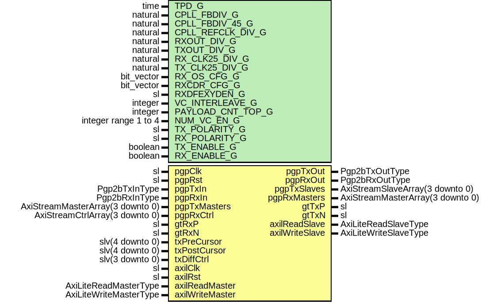

# Entity: Pgp2bGth7VarLatWrapper

## Diagram

## Description

Title      : PGPv2b: https://confluence.slac.stanford.edu/x/q86fD
Company    : SLAC National Accelerator Laboratory
Description: Example PGP 3.125 Gbps front end wrapper
Note: Default generic configurations are for the Diligent NetFPGA-SUME development board
Note: Default uses FPGA fabric clock = 156.25 MHz reference clock
This file is part of 'SLAC Firmware Standard Library'.
It is subject to the license terms in the LICENSE.txt file found in the
top-level directory of this distribution and at:
   https://confluence.slac.stanford.edu/display/ppareg/LICENSE.html.
No part of 'SLAC Firmware Standard Library', including this file,
may be copied, modified, propagated, or distributed except according to
the terms contained in the LICENSE.txt file.
## Generics

| Generic name      | Type                 | Value                    | Description                                                        |
| ----------------- | -------------------- | ------------------------ | ------------------------------------------------------------------ |
| TPD_G             | time                 | 1 ns                     |                                                                    |
| CPLL_FBDIV_G      | natural              | 4                        | CPLL Configurations (Defaults: pgpClk = 156.25 MHz Configuration)  |
| CPLL_FBDIV_45_G   | natural              | 5                        |                                                                    |
| CPLL_REFCLK_DIV_G | natural              | 1                        |                                                                    |
| RXOUT_DIV_G       | natural              | 2                        | MGT Configurations (Defaults: pgpClk = 156.25 MHz Configuration)   |
| TXOUT_DIV_G       | natural              | 2                        |                                                                    |
| RX_CLK25_DIV_G    | natural              | 7                        |                                                                    |
| TX_CLK25_DIV_G    | natural              | 7                        |                                                                    |
| RX_OS_CFG_G       | bit_vector           | "0000010000000"          | Set by wizard                                                      |
| RXCDR_CFG_G       | bit_vector           | x"0002007FE1000C2200018" | Set by wizard                                                      |
| RXDFEXYDEN_G      | sl                   | '1'                      | Set by wizard                                                      |
| VC_INTERLEAVE_G   | integer              | 0                        | No interleave Frames                                               |
| PAYLOAD_CNT_TOP_G | integer              | 7                        | Top bit for payload counter                                        |
| NUM_VC_EN_G       | integer range 1 to 4 | 4                        |                                                                    |
| TX_POLARITY_G     | sl                   | '0'                      |                                                                    |
| RX_POLARITY_G     | sl                   | '0'                      |                                                                    |
| TX_ENABLE_G       | boolean              | true                     | Enable TX direction                                                |
| RX_ENABLE_G       | boolean              | true                     |                                                                    |
## Ports

| Port name       | Direction | Type                             | Description        |
| --------------- | --------- | -------------------------------- | ------------------ |
| pgpClk          | in        | sl                               | Clocks and Reset   |
| pgpRst          | in        | sl                               |                    |
| pgpTxIn         | in        | Pgp2bTxInType                    | Non VC TX Signals  |
| pgpTxOut        | out       | Pgp2bTxOutType                   |                    |
| pgpRxIn         | in        | Pgp2bRxInType                    | Non VC RX Signals  |
| pgpRxOut        | out       | Pgp2bRxOutType                   |                    |
| pgpTxMasters    | in        | AxiStreamMasterArray(3 downto 0) | Frame TX Interface |
| pgpTxSlaves     | out       | AxiStreamSlaveArray(3 downto 0)  |                    |
| pgpRxMasters    | out       | AxiStreamMasterArray(3 downto 0) | Frame RX Interface |
| pgpRxCtrl       | in        | AxiStreamCtrlArray(3 downto 0)   |                    |
| gtTxP           | out       | sl                               | GT Pins            |
| gtTxN           | out       | sl                               |                    |
| gtRxP           | in        | sl                               |                    |
| gtRxN           | in        | sl                               |                    |
| txPreCursor     | in        | slv(4 downto 0)                  | Debug Interface    |
| txPostCursor    | in        | slv(4 downto 0)                  |                    |
| txDiffCtrl      | in        | slv(3 downto 0)                  |                    |
| axilClk         | in        | sl                               | AXI-Lite Interface |
| axilRst         | in        | sl                               |                    |
| axilReadMaster  | in        | AxiLiteReadMasterType            |                    |
| axilReadSlave   | out       | AxiLiteReadSlaveType             |                    |
| axilWriteMaster | in        | AxiLiteWriteMasterType           |                    |
| axilWriteSlave  | out       | AxiLiteWriteSlaveType            |                    |
## Instantiations

- Pgp2bGth7VarLat_Inst: surf.Pgp2bGth7VarLat
