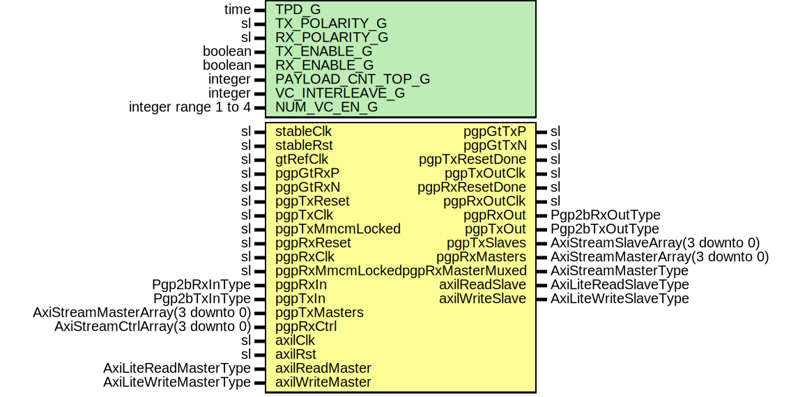

# Entity: Pgp2bGthUltra

- **File**: Pgp2bGthUltra.vhd
## Diagram

## Description

Title      : PGPv2b: https://confluence.slac.stanford.edu/x/q86fD
Company    : SLAC National Accelerator Laboratory
Description: PGPv2b GTH Ultrascale Core Module
This file is part of 'Example Project Firmware'.
It is subject to the license terms in the LICENSE.txt file found in the
top-level directory of this distribution and at:
   https://confluence.slac.stanford.edu/display/ppareg/LICENSE.html.
No part of 'Example Project Firmware', including this file,
may be copied, modified, propagated, or distributed except according to
the terms contained in the LICENSE.txt file.
## Generics

| Generic name      | Type                 | Value | Description                 |
| ----------------- | -------------------- | ----- | --------------------------- |
| TPD_G             | time                 | 1 ns  |                             |
| TX_POLARITY_G     | sl                   | '0'   | PGP Settings                |
| RX_POLARITY_G     | sl                   | '0'   |                             |
| TX_ENABLE_G       | boolean              | true  |                             |
| RX_ENABLE_G       | boolean              | true  |                             |
| PAYLOAD_CNT_TOP_G | integer              | 7     | Top bit for payload counter |
| VC_INTERLEAVE_G   | integer              | 0     | Interleave Frames           |
| NUM_VC_EN_G       | integer range 1 to 4 | 4     |                             |
## Ports

| Port name        | Direction | Type                             | Description                                       |
| ---------------- | --------- | -------------------------------- | ------------------------------------------------- |
| stableClk        | in        | sl                               | GT needs a stable clock to "boot up"              |
| stableRst        | in        | sl                               |                                                   |
| gtRefClk         | in        | sl                               |                                                   |
| pgpGtTxP         | out       | sl                               | Gt Serial IO                                      |
| pgpGtTxN         | out       | sl                               |                                                   |
| pgpGtRxP         | in        | sl                               |                                                   |
| pgpGtRxN         | in        | sl                               |                                                   |
| pgpTxReset       | in        | sl                               | Tx Clocking                                       |
| pgpTxResetDone   | out       | sl                               |                                                   |
| pgpTxOutClk      | out       | sl                               | recovered clock                                   |
| pgpTxClk         | in        | sl                               |                                                   |
| pgpTxMmcmLocked  | in        | sl                               |                                                   |
| pgpRxReset       | in        | sl                               | Rx clocking                                       |
| pgpRxResetDone   | out       | sl                               |                                                   |
| pgpRxOutClk      | out       | sl                               | recovered clock                                   |
| pgpRxClk         | in        | sl                               |                                                   |
| pgpRxMmcmLocked  | in        | sl                               |                                                   |
| pgpRxIn          | in        | Pgp2bRxInType                    | Non VC Rx Signals                                 |
| pgpRxOut         | out       | Pgp2bRxOutType                   |                                                   |
| pgpTxIn          | in        | Pgp2bTxInType                    | Non VC Tx Signals                                 |
| pgpTxOut         | out       | Pgp2bTxOutType                   |                                                   |
| pgpTxMasters     | in        | AxiStreamMasterArray(3 downto 0) | Frame Transmit Interface - 1 Lane, Array of 4 VCs |
| pgpTxSlaves      | out       | AxiStreamSlaveArray(3 downto 0)  |                                                   |
| pgpRxMasters     | out       | AxiStreamMasterArray(3 downto 0) | Frame Receive Interface - 1 Lane, Array of 4 VCs  |
| pgpRxMasterMuxed | out       | AxiStreamMasterType              |                                                   |
| pgpRxCtrl        | in        | AxiStreamCtrlArray(3 downto 0)   |                                                   |
| axilClk          | in        | sl                               | AXI-Lite DRP interface                            |
| axilRst          | in        | sl                               |                                                   |
| axilReadMaster   | in        | AxiLiteReadMasterType            |                                                   |
| axilReadSlave    | out       | AxiLiteReadSlaveType             |                                                   |
| axilWriteMaster  | in        | AxiLiteWriteMasterType           |                                                   |
| axilWriteSlave   | out       | AxiLiteWriteSlaveType            |                                                   |
## Signals

| Name          | Type                  | Description   |
| ------------- | --------------------- | ------------- |
| resetGtSync   | sl                    |               |
| gtHardReset   | sl                    |               |
| resetRxSync   | sl                    | PgpRx Signals |
| gtRxUserReset | sl                    |               |
| phyRxLaneIn   | Pgp2bRxPhyLaneInType  |               |
| phyRxLaneOut  | Pgp2bRxPhyLaneOutType |               |
| phyRxReady    | sl                    |               |
| phyRxInit     | sl                    |               |
| gtTxUserReset | sl                    | PgpTx Signals |
| phyTxLaneOut  | Pgp2bTxPhyLaneOutType |               |
| phyTxReady    | sl                    |               |
| phyRxInitSync | sl                    |               |
## Instantiations

- U_RstSync_1: surf.PwrUpRst
- U_RstSync_4: surf.SynchronizerOneShot
- U_RstSync_2: surf.PwrUpRst
**Description**
[out]
Sync pgpRxIn.rxReset to stableClk and tie to gtRxUserReset

- U_RstSync_3: surf.PwrUpRst
- U_Pgp2bLane: surf.Pgp2bLane
**Description**
[out]

- PgpGthCoreWrapper_1: surf.PgpGthCoreWrapper
**Description**
Wrapper for GTH IP core

